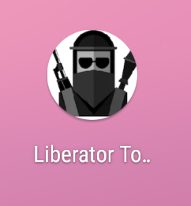

# 2.1_beslag
We start by decompiling the APK with JADX, and find a package named `no.cybertalent.liberatortoolkit`, with the following classes:

```sh
├── ChatActivity.java
├── EditActivity.java
├── helpers
│   ├── ChatHelper.java
│   └── CheckHelper.java
├── MainActivity.java
├── R.java
├── TunerActivity.java
└── VaultActivity.java
```

**Note:** Enabling the `Show Inconsistent code` option in the JADX preference is very helpful.


Looking through the classes we find a found 3 interesting Activity classes: `TunerActivity`, `ChatActivity`, and `VaultActivity`. We also find some helper classes (`ChatHelper` and `CheckHelper`) that check if the application is running in an emulator (`ChatHelper.emu`), and if the Android is rooted (`CheckHelper.is(Context context`).

In addition we find a native library named `libnative-lib.so` with the following functions:
```
ChatHelper.getResponse
VaulActivity.finalize
VaulActivity.undo
```

---

## Installation
Continuing with setting up Android Studio and start an AVD (Android Virtual Device) to install and run the APK. It's important to use an Android image without the Play Store API, as it does not allow us to root. We start the emulator, install the APK, and transfer over the data.


```sh
$ emulator -writable-system -avd cybertalent21_oppdrag -no-snapshot-load -qemu
$ adb devices
List of devices attached
emulator-5554	device
$ adb root
restarting adbd as root
$ adb install lt3000.apk
$ adb push data/* /data/user/0
$ adb push sdcard/* /sdcard
```



When we launch the application we are presented with the following screen.


Each button map to each activity we found earlier in the decompiled APK, we therefore assume that each button corresponds to each challenge (`2.1_beslag_x`).

## [2.1_beslag_1](./1)


We are presented with some form of authentication, and a channel switcher with 9 channels. The channels play various audio, mostly static, but also some music and a radio show.

---

## Reversing
Checking `TunerActivity` there is a function `onValueChange` that is called everytime the channel is changed. There is some form authentication that checks the username and password through a SQLite database.
```java
SQLiteDatabase readableDatabase = new c.a.a.d.b(tunerActivity2).getReadableDatabase();
Cursor query = readableDatabase.query("users", new String[]{"password_hash"}, "username = ?", new String[]{charSequence}, null, null, null);
```

In addition, there is some interesting code that does something different on Channel 7 when the user is authenticated, it calls `c.a.a.d.a.b` with two files, `data.bin`, and `data.mp3`. 
```java
if (this.f1160a.getValue() == 7) {
  if (z) {
    File file = new File(TunerActivity.this.getFilesDir().getAbsolutePath() + "/data.bin");
    File file2 = new File(TunerActivity.this.getFilesDir().getAbsolutePath() + "/data.mp3");
    c.a.a.d.a.b(file, file2, charSequence2.getBytes());
    TunerActivity.this.p = Uri.fromFile(file2);
    TunerActivity.this.o = 0;
  } else {
    tunerActivity = TunerActivity.this;
    i3 = R.raw.static4;
  }
}
```

---

## `data.bin`
Looking back to the files provided with the challenge, we find `data.bin`. It is however containing some form of raw or encrypted data.

```sh
$ file data/data/no.cybertalent.liberatortoolkit/files/data.bin
data/data/no.cybertalent.liberatortoolkit/files/data.bin: data
```

There is however no `data.mp3`, looking closer at the decompiled code we find the following function call.
```java
c.a.a.d.a.b(file, file2, charSequence2.getBytes());
```

The `c.a.a.d.a` class contains various functions, shortly put; it uses the provided password and a static salt to generate a `SecretKey` that is used to AES decrypt `data.bin`.
```java
public static final byte[] f1089a = "saltpaamaten".getBytes();
public static final char[] f1090b = "0123456789ABCDEF".toCharArray();
```

And within the `c.a.a.d.a.b(File, File, byte[])` function
```java
Cipher instance = Cipher.getInstance("AES/CBC/PKCS5Padding");
byte[] readAllBytes = Files.readAllBytes(file.toPath());
byte[] copyOfRange = Arrays.copyOfRange(readAllBytes, 0, 16);
byte[] copyOfRange2 = Arrays.copyOfRange(readAllBytes, 16, readAllBytes.length);
SecretKey c2 = c(bArr);
```

We now know that we need to find the user credentials to decrypt the file.

---

## `users.db`
Knowing that the credentials are stored in a SQLite database, we recall that there is a `users.db` file in the phone dump that we can look closer at.

```sh
$ sqlite3 data/data/no.cybertalent.liberatortoolkit/databases/users.db
SQLite version 3.33.0 2020-08-14 13:23:32
Enter ".help" for usage hints.
sqlite> .tables
users
sqlite> .headers ON
sqlite> SELECT * FROM users;
_id|username|firstname|lastname|password_hash
1|hungry_hippo_123|Frank|Shorius|2034F6E32958647FDFF75D265B455EBF
```

We now have have a username, name and a hashed password. After a quick Google search, we find out that the password is `secretpassword`, giving us: `hungry_hippo_123:2034F6E32958647FDFF75D265B455EBF:secretpassword`.

Plotting the credentials into the app and scrolling through the channels we get some different audio for Channel 7, a robotic woman repeating the phrase:
> Your flag is london underscore calling.

The `data.mp3` file can be found [here](./1/data.mp3).

---

```sh
login@corax:~$ scoreboard london_calling
Kategori: 2. Oppdrag
Oppgave:  2.1_beslag_1
Svar:     london_calling

Bra jobbet!
Det hadde vært praktisk om vi visste hvordan de har kommunisert.
```


## [2.1\_beslag\_2](./2)


Opening the **Chat** we are presented with a view with `Access Denied` and tells us to log in to https://mobile.cybertalent.no/challenge.

* * *

### mobile.cybertalent.no


We re-use the credentials from **2.1\_beslag\_1** (`hungry_hippo_123:secretpassword`) to successfully login, and are now presented with some challenge words. The words are refreshed every 10 seconds. Submitting something random calls a `POST /challenge` and returns `Bad response code`.


Sending the challenge into the application with `/response TroveShrineMarbleBehavior` gives us the following response, which also returns `Bad response code` when submitting.


* * *

### Reversing

#### `ChatActivity.onCreate(Bundle)`

When `ChatActivity` is created the `onCreate` method is called, which again sets up new [`View.OnKeyListener`](https://developer.android.com/reference/android/view/View.OnKeyListener) (via. `new a()`). The public method [`onKey`](https://developer.android.com/reference/android/view/View.OnKeyListener#onKey%28android.view.View,%20int,%20android.view.KeyEvent%29 "https://developer.android.com/reference/android/view/View.OnKeyListener#onKey(android.view.View,%20int,%20android.view.KeyEvent)") in this class listens to the input. Then it loads in the `SharedPreferences` for `ChatActivity`, and finally starts the activity thread with the `new b()` (`Runnable`) class.

```java
public void onCreate(Bundle bundle) {
    // snip...
    this.p.setOnKeyListener(new a());
    SharedPreferences preferences = getPreferences(0);
    // snip...
    Thread thread = new Thread(new b());
    thread.start()
}
```

* * *

#### `ChatActivity.q` (`SharedPreferences`)

The `SharedPreferences` can be found in `data/data/no.cybertalent.liberatortoolkit/shared_prefs/ChatActivity.xml` of the phone dump.

```xml
<?xml version='1.0' encoding='utf-8' standalone='yes' ?>
<map>
    <string name="nick">hungry_hippo_123</string>
    <string name="token">0000</string>
</map>
```

* * *

#### `ChatActivity.b.run()`

As mentioned, `ChatActivity.onCreate` starts the activity thread with a new instance of the `ChatActivity.b` (`Runnable`) class, which contains the following code for the `ChatActivity.b.run()` function.
`ChatHelper.a(String, String)` is a function that handles the communication between the application and the remote chat API. When this is first run it calls `https://mobile.cybertalent.no/chat?token=0000`, which responds with the text seen in the initial chat screenshot above.

```java
ChatActivity.this.o.post(new a(ChatHelper.a("chat", ChatActivity.q.getString("token", "0000"))));
Thread.sleep(1000);
```

* * *

#### `ChatActivity.a.onKey(View, int, KeyEvent)`

The `onKey` only function calls the `ChatActivity.t()` if the input key is `Enter`.

```java
public boolean onKey(View view, int i, KeyEvent keyEvent) {
    if (keyEvent.getAction() != 0 || i != 66) {
        return false;
    }
    ChatActivity chatActivity = ChatActivity.this;
    SharedPreferences sharedPreferences = ChatActivity.q;
    chatActivity.t();
    return true;
}
```

* * *

#### `ChatActivity.t()`

`t()` is a function that handles all the input (general chat) and commands (`/nick`, `/token` and `/response`) from the input field, as shown below.

* * *

##### `/response <challenge>`

The following code is executed when the input matches `/response <challenge>`. `ChatHelper.getResponse(String)` is called with the provided challenge, in addition `a1` is prefixed to the final string if the static boolean `ChatHelper.emu` is `true`.

```java
String response = ChatHelper.getResponse(split[1]);
StringBuilder sb = new StringBuilder();
if (ChatHelper.emu) {
  sb.append("a1");
}
sb.append(response.toLowerCase());
// --- snip ---
```

* * *

##### say

A new thread is started if the input is not a command (begins with a `/`), `ChatActivity.c` is a `Runnable` class.

```java
new Thread(new c(charSequence)).start();
```

* * *

###### `ChatActivity.c.run()`

This function fetches `token` and `nick` from `SharedPreferences`, and then does a `POST https://mobile.cybertalent.no/say` with a simple JSON object:

```json
{
    "content": "<input>",
    "token": "<SharedPreferences.token>",
    "nick": "<SharedPreferences.nick>"
}
```

* * *

#### `ChatHelper.getResponse(String)`

`getResponse` is a native function, that uses functions provided in a provided native library.

```java
public static native String getResponse(String str);
```

Let's take a closer look at the `getResponse` function in the native library that was extracted from the APK.

* * *

##### `libnative-lib.so`

We find that that the native `getResponse` function (`Java_no_cybertalent_liberatortoolkit_helpers_ChatHelper_getResponse`) calls `ChatHelper` and prefixes the return string with `deadbeef` if `CheckHelper.emu` is `true`.

```c
lVar3 = (**(code **)(*param_1 + 0x480))(param_1,param_2,&DAT_00100a8e,&DAT_00100a19); // DAT_00100a8e = emu
if (lVar3 != 0) {
	cVar1 = (**(code **)(*param_1 + 0x490))(param_1,param_2,lVar3);
	local_59 = cVar1 == '\0';
}
// --- snip ---
bVar9 = (local_59 & 1) == 0;
if (bVar9) {
	*(undefined8 *)((long)pvVar5 + 1) = 7378415037781730660; // feebdaed => deadbeef
}
```

* * *

#### `ChatHelper.emu`

`emu` is a static boolean variable, that checks if the application is running within an emulator, we therefore need to find a way to override the results of this variable.

```java
public static final boolean emu;

static {
  boolean z;
  if (!Build.BRAND.startsWith("generic") || !Build.DEVICE.startsWith("generic")) {
    String str = Build.FINGERPRINT;
    if (!str.startsWith("generic") && !str.startsWith("unknown")) {
      String str2 = Build.HARDWARE;
      if (!str2.contains("goldfish") && !str2.contains("ranchu")) {
        String str3 = Build.MODEL;
        if (!str3.contains("google_sdk") && !str3.contains("Emulator") && !str3.contains("Android SDK built for x86") && !Build.MANUFACTURER.contains("Genymotion")) {
          String str4 = Build.PRODUCT;
          if (!str4.contains("sdk_google") && !str4.contains("google_sdk") && !str4.contains("sdk") && !str4.contains("sdk_x86") && !str4.contains("vbox86p") && !str4.contains("emulator") && !str4.contains("simulator")) {
            z = false;
            emu = z;
          }
        }
      }
    }
  }
  z = true;
  emu = z;
}
```

* * *

### Solution flow

We now have everything we need to generate a correct response code and get a token, and we know that every response code is only valid for 10 seconds, our flow will be the following:

1.  Override the `ChatHelper.emu` static variable to return `false`.
2.  Login to the `mobile.cybertalent.no` portal via. `/login` with the credentials `hungry_hippo_123:secretpassword`.
3.  Get a challenge code from `/getchall`.
4.  Pass the challenge code into the `ChatHelper.getResponse()` method.
5.  Submit the generated response code to `/challenge` and get our token.
6.  Fetch the chat from `/chat?token=x` with our token.

* * *

#### Automation

To interact with the Android application we can use [Frida](https://frida.re/), which is a dynamic instrumentation toolkit for developers, reverse-engineers, and security researchers. We need to override the value of `ChatHelper.emu` and then call the `ChatHelper.getResponse` function. The Frida [JavaScript API](https://frida.re/docs/javascript-api/) is well documented and we finish our script.

###### [`frida-chat.js`](./2/frida-chat.js)

```js
console.log("Loaded frida-chat.js");

function getResponse(challenge) {
  setTimeout(function() {
    Java.perform(function () {
      var ChatHelper = Java.use("no.cybertalent.liberatortoolkit.helpers.ChatHelper")
      ChatHelper.emu.value = false;
      send(ChatHelper.getResponse(challenge));
    });
  }, 100);
}

rpc.exports = {
    getresponse: getResponse
};
```

* * *

Combining this with some python code automates this entire solution flow for us, in addition the code also launches / spawns the application. Running the script takes about a second and successfully generates a valid token and extracts the chat.

###### [`extract_chat.py`](./2/extract_chat.py)

```python
import sys
import frida
import requests

s = requests.Session()

def login():
    r = s.post("https://mobile.cybertalent.no/login", json={
        "user": "hungry_hippo_123",
        "pass": "secretpassword"
    });
    r.raise_for_status()
    j = r.json()
    if "success" not in j or j["success"] != "Logged in":
        print("Failed logging in:")
        print(j)
        exit(1)

def get_challenge():
    login()
    r = s.post("https://mobile.cybertalent.no/getchall")
    r.raise_for_status()
    return r.json()["chall"]

def get_token(response):
    r = s.post("https://mobile.cybertalent.no/challenge", json={
        "response": response
    })
    j = r.json()
    return j["success"]

def get_chat(token):
    r = s.get("https://mobile.cybertalent.no/chat?token=" + token)
    return r.content.decode()

def on_message(message, data):
    if "payload" in message:
        response = message["payload"].lower()
        print("Response:", response)
        token = get_token(response)
        print("Token:", token)
        chat = get_chat(token)
        print(chat)
    else:
        print(message)
        print(data)
    exit(0)

with open("frida-chat.js") as f:
    ss = f.read()

device = frida.get_usb_device()
pid = device.spawn(["no.cybertalent.liberatortoolkit"])
session = device.attach(pid)

script = session.create_script(ss)
script.on("message", on_message)
script.load()

challenge = get_challenge()
print("Challenge:", challenge)

script.exports.getResponse(challenge)
device.resume(pid)
sys.stdin.read()
```

* * *

```sh
$ python extract_chat.py > chat.txt
Loaded frida-chat.js
Challenge: GorillaPoloOperatingBreeze
Response: 5fa780b9babab1a6a7baa74786bd80b182b9a4bf5080bdbd88bd
Token: 7c6ccda74458e01ec197
```

Entering the token into the app with `/token 7c6ccda74458e01ec197` gives us the following view:


```sh
$ cat chat.txt | head -n 20
############################################
#      Welcome to the #LT3000 chat.        #
#                                          #
# * Use at own risk.                       #
# * All comms are encrypted.               #
# * Please do not use real names.          #
# * Have fun!                              #
#                                          #
############################################


2 users currently online.

FLAG: 04907eee5386072670b5107b744b2f8481294377

--- Day changed 02 DES 2020 ---

[09:04] B4tCracK: Hi every1, i read that SecureChat was bought by some megacorp, don't think it's safe anymore. let's talk here instead
[09:40] RADAR: willco
[09:46] eireen89: You made this thing all by yourself?
```

The entire chat log can be found [here](./2/chat.txt).

* * *

```shell
login@corax:~$ scoreboard 04907eee5386072670b5107b744b2f8481294377
Kategori: 2. Oppdrag
Oppgave:  2.1_beslag_2
Svar:     04907eee5386072670b5107b744b2f8481294377

Flott! Nå vet vi litt mer om gisseltakerne.
Ligger det noen interessante filer eller tekniske spor her også?
```

---

## [2.1\_beslag\_3](./3)


The **Vault** view has a 4 number input (a PIN), and a list of 4 different items, we recall the items being files found from the initial phone dump.

```sh
└── sdcard
    └── Android
        └── data
            └── no.cybertalent.liberatortoolkit
                └── files
                    ├── !aW1wb3J0YW50X2xpbmtz
                    ├── !c2hvcHBpbmdfbGlzdA==
                    ├── !dG9kbw==
                    └── !ZmxhZw==
```

The names are encoded in base 64, decoding them gives us the following names

```
important_links
shopping_list
todo
flag                           
```

* * *

### Reversing

#### `VaultActivity.onCreate(Bundle)`

When `VaultActivity` is created the `onCreate` method is called, which initializes the 4 NumberPickers and loads in the `SharedPreferences` and checks for the locked state and the hash of the pin. It then ends by creating a new instance of the `c.a.a.d.c` class. The `VaultActivity` has a `onLockerClick` listener that triggers whenever the **UNLOCK**/**LOCK** button is clicked.

```java
// --- snip ---
SharedPreferences preferences = getPreferences(0);
s = preferences;
if (!preferences.contains("locked")) {
    w(false);
}
if (!s.contains("pin_hash")) {
    SharedPreferences.Editor edit = s.edit();
    edit.putString("pin_hash", "null");
    edit.apply();
}
// --- snip ---
new c(this).execute(new Void[0]);
```

* * *

#### `SharedPreferences`

The `SharedPreferences` can be found in `data/data/no.cybertalent.liberatortoolkit/shared_prefs/VaultActivity.xml` of the phone dump.

```xml
<?xml version='1.0' encoding='utf-8' standalone='yes' ?>
<map>
    <boolean name="locked" value="true" />
    <string name="pin_hash">BSzN6uy2dDcolImpMKxffg==</string>
</map>
```

* * *

#### `VaultActivity.onLockerClick(View)`

The function starts by checking `VaultActivity.u()`, which returns `true` if the Vault is in a locked state. It then grabs the value of each number picker (the pin numbers) and first calls `t(pin)`, and then calls the `finalize` function with the result from `t(pin)`.

It then base 64 encodes the first 16 bytes from the `finalize` function, and compares this to the `pin_hash` in our `SharedPreferences`. If it matches, it continues looping through the files above, and passes them to `c.a.a.d.a.b(File, File, byte[])`, with the encoded filename, decoded filename, and the remaining 32 bytes from the `finalize` function, as arguments.

```java
if (u()) {
    r = new StringBuilder();
    Iterator<NumberPicker> it = q.iterator();
    while (it.hasNext()) {
        r.append(it.next().getValue());
    }
    byte[] finalize = finalize(t(r.toString()));
    // --- snip ---
    if (Base64.encodeToString(Arrays.copyOfRange(finalize, 0, 16), 0).trim().equals(s.getString("pin_hash", null).trim())) {
        File[] fileArr = p;
        int length = fileArr.length;
        int i5 = 0;
        while (i5 < length) {
            File file = fileArr[i5];
            if (file.getName().startsWith("!") && u()) {
                c.a.a.d.a.b(file, new File((file.getParent() + "/" + new String(Base64.decode(file.getName().substring(i4), 0))).replace(str4, str3)), Arrays.copyOfRange(finalize, 16, 48));
                // --- snip ---
            }
            i5++;
            i4 = 1;
        }
    }
// --- snip ---
```

### `c.a.a.d.c`

This is a `AsyncTask` class is called at the end of `VaultActivity.onCreate`. It downloads a file from `https://mobile.cybertalent.no/xtra` (a copy can be found [here](./3/xtra)), and once downloaded executes `VaultActivity.undo` with the data, and then sets the `VaulActivity.t` **variable** (not the function) to the result of the `undo` function.

```java
// --- snip ---
InputStream openStream = new URL("https://mobile.cybertalent.no/xtra").openStream();
ByteArrayOutputStream byteArrayOutputStream = new ByteArrayOutputStream();
// --- snip ---
return byteArrayOutputStream.toByteArray();
// --- snip ---
VaultActivity.t = ByteBuffer.wrap(vaultActivity.undo(bArr2));
```

#### `VaultActivity.undo(byte[])`

`undo` is a native function, that uses functions provided in a provided native library.

```java
public native byte[] undo(byte[] bArr);
```

We could take a close look at the `undo` function in the native library that was extracted from the APK earlier, and we could use Frida to read the return data, but we decide to test out [objection](https://github.com/sensepost/objection).

> `objection` is a runtime mobile exploration toolkit, powered by Frida, built to help you assess the security posture of your mobile applications, without needing a jailbreak.

We start objection and start listening to function calls to `undo`.

```sh
$ objection -g no.cybertalent.liberatortoolkit explore
Using USB device `Android Emulator 5556`
Agent injected and responds ok!

     _   _         _   _
 ___| |_|_|___ ___| |_|_|___ ___
| . | . | | -_|  _|  _| | . |   |
|___|___| |___|___|_| |_|___|_|_|
      |___|(object)inject(ion) v1.9.6

     Runtime Mobile Exploration
        by: @leonjza from @sensepost

[tab] for command suggestions
...o.cybertalent.liberatortoolkit on (pwn: 8.0.0) [usb] #
```

```
# android hooking watch class_method no.cybertalent.liberatortoolkit.VaultActivity.undo --dump-args --dump-backtrace --dump-return

(agent) Attempting to watch class no.cybertalent.liberatortoolkit.VaultActivity and method undo.
(agent) Hooking no.cybertalent.liberatortoolkit.VaultActivity.undo([B)
(agent) Registering job 8769892465034. Type: watch-method for: no.cybertalent.liberatortoolkit.VaultActivity.undo

```
And after launching Vault we see that `undo` function has been called:

```

(agent) [8769892465034] Arguments no.cybertalent.liberatortoolkit.VaultActivity.undo([100,120,48,53,79,103,27,-9,92,-72,-93,-75,14,111,54,80,100,0,112,0,120,52,0,0,0,0,-72,0,29,0,112,0,10,0,-28,...)
(agent) [8769892465034] Return Value: [100,101,120,10,48,51,53,0,79,-51,103,-12,27,...]

```
Saving the return bytestream to a file, we get a `Dalvik dex file`, and can now decompile it with JADX. We see that this `extra` class has a `getData` function that accepts a String `str`, it appends the salt `y_so_salty` to the string and then generates a MD5, and a SHA256 hash out of the string. It then returns them both in the same output, in that order. The class and java source files can be found [here](.).

```java
public class extra {
    private static final String SALT = "y_so_salty";
    public static byte[] getData(String str) {
        StringBuilder sb = new StringBuilder();
        sb.append(str);
        sb.append(SALT);
        // --- snip ---
        MessageDigest instance = MessageDigest.getInstance("md5");
        instance.update(sb.toString().getBytes());
        bArr = instance.digest();
        MessageDigest instance2 = MessageDigest.getInstance("sha256");
        // --- snip ---
        return byteArrayOutputStream.toByteArray();
```

* * *

#### `VaultActivity.t(String)`

The argument passed into the function is the PIN (i.e. `"0000"`, `"1337"`). The function attempts to load the `VaultActivity.t` **variable** (not the function) into memory as a class and call the `extra.getData(String)` method.
We now know that the `getData` function returns a MD5 digest, followed by a SHA256 digest, which is exactly what this function (`t(String)`) does as well, it is only a wrapper around the `getData` function call.

```java
public final byte[] t(String str) {
    // --- snip ---
    cls = new InMemoryDexClassLoader(t, getClassLoader()).loadClass("com.example.extra.extra");
    // --- snip ---
    method = cls.getMethod("getData", String.class);
    // --- snip ---
    return (byte[]) method.invoke(null, str);
}
```

* * *

#### `VaulActivity.finalize(byte[])`

`finalize` is a another native function, this time we use Ghidra to take a closer look at the function from the library that was extracted from the APK.

```java
public native byte[] finalize(byte[] bArr);
```

* * *

##### `libnative-lib.so`

We find that that the native method of `finalize` (`Java_no_cybertalent_liberatortoolkit_VaultActivity_finalize`) calls the static boolean method `CheckHelper.is(Context)`, and then checks if the `/proc/self/status` file contains `TracerPid: 0`, to finially return some result back to the caller. `TracerPid` returns the [PID of process tracing this process (0 if not being traced)](https://man7.org/linux/man-pages/man5/proc.5.html).

In other words this function seems to be doing additional checks that we need to bypass.

```c
// --- snip ---
uVar5 = _JNIEnv::CallObjectMethod((_jobject *)param_1,p_Var6,uVar5);
p_Var4 = (_jmethodID *)
       (**(code **)(*param_1 + 0x30))
                 (param_1,"no/cybertalent/liberatortoolkit/helpers/CheckHelper");
uVar7 = (**(code **)(*param_1 + 0x388))
                (param_1,p_Var4,&DAT_00100a92,"(Landroid/content/Context;)Z"); // DAT_00100a92 = "is"
cVar1 = _JNIEnv::CallStaticBooleanMethod((_jclass *)param_1,p_Var4,uVar7,uVar5);
// --- snip ---
__fd = __open_2("/proc/self/status",0);
// --- snip ---
```

* * *

#### `CheckHelper.is(Context)`

The `is` function simply returns `true` if it believes we have a rooted Android device by checking various known directories that a rooted Android device has access to.

```java
public class CheckHelper {
    public static boolean is(Context context) {
        String str = Build.TAGS;
        if (str != null && str.contains("test-keys")) {
            return true;
        }
        String string = context.getString(R.string.su);
        String[] strArr = {"/sbin/", "/system/bin/", "/system/xbin/", "/data/local/xbin/", "/data/local/bin/", "/system/sd/xbin/", "/system/bin/failsafe/", "/data/local/"};
        for (int i = 0; i < 8; i++) {
            if (new File(a.b(strArr[i], string)).exists()) {
                return true;
            }
        }
        return false;
    }
}
```

* * *

#### `c.a.a.d.a.b(File, File, byte[])`

When the correct PIN has been entered in `onLockerClick` it starts looping through all the encrypted files and calls this (`c.a.a.d.a.b`) function. We recall seeing this exact same function being used from the `TunerActivity` challenge, and therefore know that it is used to decrypt files, where the third argument (`byte[]`) is the key. In our case this key would be the SHA256 part of the TODO.

* * *

### Solution flow

We now have everything we need to find the PIN and decrypt the files in the Vault. We can solve this challenge without running the application, but that is no fun. Our flow will be the following:

1.  Override the `CheckHelper.is(Context)` function to return `false`.
2.  Get an instance of `VaultActivity`.
3.  Loop through the numbers 0000 - 9999.
4.  Use the number as PIN and pass it into `VaulActivity.t(String)`
5.  Pass the result to `VaultActivity.finalize()`.
6.  Base 64 encode the first 16 bytes of the resultt and compare it to the `pin_hash` variable from the `SharedPreferences`.
7.  If it matches, stop the bruteforcing and print out the PIN.
8.  Input the PIN and unlock the Vault.

* * *

#### Automation

We now use [Frida](https://frida.re/) again to automate our solution flow. We could go even further with this script by launching the Vault view automatically, and executing the unlock, instead of just outputting the PIN.

###### [`frida-vault.js`](./3/frida-vault.py)

```js
const zeroPad = (num, places) => String(num).padStart(places, '0')
console.log("Loaded frida-vault.js");
setTimeout(function() {
  Java.perform(function () {
    // Override the `CheckHelper.is` function.
    var CheckHelper = Java.use("no.cybertalent.liberatortoolkit.helpers.CheckHelper");
    CheckHelper.is.implementation = function() {
      return false;
    }

    // For checking pin_hash
    var base64 = Java.use('android.util.Base64');

    // Find the VaultActivity
    Java.choose("no.cybertalent.liberatortoolkit.VaultActivity", {
      onMatch: function (instance) {
        console.log("Found VaultActivity object instance: " + instance);
        console.log("Starting bruteforce...");
        for (var i = 0; i <= 9999; i++) {
          let pin = zeroPad(i, 4);
          var t_result = instance.t(pin);
          var finalize_result = instance.finalize(t_result);

          var base = [];
          for (var a = 0; a < 16; a++) {
            base.push(finalize_result[a]);
          }
          var b64 = base64.encodeToString(base, 0).trim();
          if (b64 === "BSzN6uy2dDcolImpMKxffg==") {
            console.log("Found PIN:", pin);
            return;
          }
        }
      },
      onComplete: function () { }
    });
  });
}, 5000);
```

###### [`unlock_vault.py`](./3/unlock_vault.py)

```python
import frida
import sys

PACKAGE_NAME = "no.cybertalent.liberatortoolkit"

def on_message(message, data):
    print(message)


with open("frida-vault.js") as f:
    ss = f.read()

# Get our emulator
device = frida.get_usb_device()

# 1118  Liberator Toolkit 3000                  no.cybertalent.liberatortoolkit
pid = device.spawn([PACKAGE_NAME])
session = device.attach(pid)

script = session.create_script(ss)
script.on("message", on_message)
script.load()
device.resume(pid)
sys.stdin.read()
```

* * *

Executing the script and letting it run for a few seconds results with the PIN `5693`, and we can now open the various files.

```sh
$ python unlock_vault.py
Loaded frida-vault.js
Found VaultActivity object instance: no.cybertalent.liberatortoolkit.VaultActivity@d097244
Starting bruteforce...
Found PIN: 5693
```

* * *

###### Todo

```
Buy xmas presents
Find an xmas tree
Order airline tickets
```

###### Flag

```
d025828e7d38c133d3224154ae7785b344536761
```

###### Shopping list
```
1 Milk
1 Bread
6 Eggs
1000 rounds 7.76mm
10 HE grenades
4 Yoghurt
1 Butter
```

###### Important links

```
Hidden service URL:
http://fileserver/files/onion_name.txt
 
Scada client binary:
http://fileserver/files/082391170510954df0c28af1ebb9380a
Rembember this only works on the internal network, not from the outside.
```

* * *

```sh
login@corax:~$ scoreboard d025828e7d38c133d3224154ae7785b344536761
Kategori: 2. Oppdrag
Oppgave:  2.1_beslag_3
Svar:     d025828e7d38c133d3224154ae7785b344536761

Kanskje det ligger noen interessante filer her?
```

