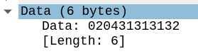

# 2.3_scada_gissel

With the help of the extracted `Important links` file from the Vault in the Android application, we find a URL to a `Scada client binary` and proceed with downloading it.
```
Scada client binary:
http://fileserver/files/082391170510954df0c28af1ebb9380a
```
---

## Scada client binary
Taking a closer look at the binary we see that it attempts to send instructions to a server.

```sh
login@corax:~$ file 082391170510954df0c28af1ebb9380a
082391170510954df0c28af1ebb9380a: ELF 64-bit LSB pie executable, x86-64, version 1 (SYSV), dynamically linked, interpreter /lib64/ld-linux-x86-64.so.2, for GNU/Linux 3.2.0, BuildID[sha1]=394244046241254d7f237474592c3c135d078290, not stripped
```

```sh
$ ./082391170510954df0c28af1ebb9380a scada 1339
Sending instruction number 000
Sending instruction number 001
Sending instruction number 002
Sending instruction number 003
Sending instruction number 004
Sending instruction number 005
```

---

### Network packets

We proceed with starting Wireshark and forward the port to our local machine and attempt to execute the binary again. We notice a packet with the data `020431313132` being sent every time the binary prints a `Sending instruction number`, the data never changes. Transforming this data `02 04 31 31 31 32` gives us the following `? ? 1 1 1 2`.



---

### Reversing

Opening the binary in Ghidra we see that the logic in the `main` function calls a `make_instruction` function with the parameter `2`, `11`, and `12`, and then sends it to the specified host. 

We notice that the first parameter, `2`, matches the first value in our packet data `02`, and in addition, the ASCII hex code for the number `1` is `31`, and `2` for `32`. Giving us ``2 ? 11 12`` as our data, matching the arguments sent to `make_instruction(2,11,12...`. We also assume that the 2nd value in the packet data is the length of the following data `len(1112) = 4`, thus we have `2 4 11 12`.

The `local_c` variable is simply a loop increment counter, which is the number printed when running the binary. We also take a mental note of the `sleep(5)`, as this will be important for later.

```c
 while( true ) {
    local_10 = connect_to_server(param_2[1],param_2[2],param_2[2]);
    local_14 = make_instruction(2,11,12,&local_20,&local_28);
    // --- snip ---
    printf("Sending instruction number %03d\n",(ulong)local_c);
    sVar1 = write(local_10,local_20,local_28);
    // --- snip ---
    sleep(5);
    local_c = local_c + 1;
  }

```

Furthermore, we double check what we found below by looking in the `make_instruction` function. And confirm that the binary generates an identical instruction that is sent for each loop increment. This is why we never saw the packet data change in the network traffic. 
```c
make_instruction(undefined param_1,byte param_2,byte param_3,void **param_4,long *param_5)
  local_1d = 0;
  local_19 = 0;
  iVar1 = snprintf((char *)&local_1d,5,"%02d%02d",(ulong)param_2,(ulong)param_3);
  if (iVar1 == 4) {
  // --- snip ---
```

Knowing now that the client library sends some kind of instructions to the backdoor, we need to figure out what these instructions mean.

---

## Scada frontend
Going back to the frontend and, we notice that the red box moves around, and some of the "walls" are changing colors.


Taking a closer look at the network tab of the browser developer tools we see WebSocket communication between the frontend and a server running on port `1339`. Notice also that the data in these packet contain of some ID (`0005`) and the word `locked`.


---

### Files
We continue by quickly downloading the web application files with `wget -r scada`, and notice that the web application is in fact a [Vue.js](https://vuejs.org/) application and **the [source maps](https://developer.mozilla.org/en-US/docs/Tools/Debugger/How_to/Use_a_source_map) are available**. Put shortly, source maps are there mainly for developers, but it also allows visitors to view the "source code" of your web application, instead of having to deobfuscate/unminify it first.

You can find an example where I used the same technique for PST's (Norwegian Police Security Service) NPST 2020 competition [here](https://github.com/mklarz/npst2020-src).

After downloading everything, we have the following files (they can be found [here](./scada_frontend/packed)):


```sh
├── css
│   └── app.62e869b4.css
├── favicon.ico
├── index.html
├── js
│   ├── app.0459ce51.js
│   ├── app.0459ce51.js.map
│   ├── chunk-vendors.c7adce26.js
│   └── chunk-vendors.c7adce26.js.map
└── map
    ├── cell.png
	--- snip ---
```

### Unpacking the source code
As we are only interested in the web application, we ignore the chunk-vendors, and continue with unpacking.

```sh
$ unpack ./unpacked app.0459ce51.js.map
--- snip ---
🎉  All done! Enjoy exploring your code 💻
```

And are yet again presented with new files (they can be found [here](./scada_frontend/unpacked)), and continue to dig deeper.

```sh
├── src
│   ├── App.vue
│   ├── App.vue?3f7e
│   ├── App.vue?dfb6
│   ├── components
│   │   ├── Map.vue
│   │   ├── Map.vue?00e3
│   │   ├── Map.vue?e750
│   │   ├── Scada.vue
│   │   ├── Scada.vue?2f42
│   │   ├── Scada.vue?3e35
│   │   ├── Tile.vue
│   │   ├── Tile.vue?25f1
│   │   └── Tile.vue?f0b9
│   └── main.js
└── webpack
    └── bootstrap

3 directories, 14 files
```

---

### Scada frontend source code

Looking at `src/components/Scada.vue` we find the following HTML, which passes the current data into a `Map` component, and then prints the flag if it is set. We can also see how the web application connects with to the WebSocket we found earlier. If the WebSocket data packet includes the word `flag`, the data is parsed and the variable is set, thus printing out the flag.  

```html
<template>
	<div class="scada">
		<Map v-if="this.json_data !== ''" v-bind:data='JSON.parse(this.json_data)'/>
		<h1 v-else>Currently no SCADA data</h1>
	</div>
	<footer class="flag" v-if="this.flag !== ''">
	  <pre>Prisoner managed to escape. Flag: "{{ flag }}"</pre>
	</footer>
</template>
```

```js
// snip
let sock = self.ws ? self.ws : new WebSocket(`ws://${location.hostname}:1339/`);
let magic_message = "POm8HLEmXJ1L2b1EhaXvdg==";
sock.onopen = function() {
	self.ws = sock;
	//console.log("[open] Conn established");
	//console.log(`Sending to server ${magic_message}`);
	sock.send(magic_message);
};
sock.onmessage = function(e) {
	//console.log(`[message] Data from server ${e.data}`);
	if (e.data.includes("flag")) {
		self.flag = JSON.parse(e.data)["flag"]
	}
	self.json_data = e.data;
};
// snip
},
```

Continuing with our treasure hunt, we look at the data passed to the `Map` (`src/components/Map.vue`) component, and see that the component uses [the data](./scada_frontend/websocket.json), which we found earlier in the WebSocket connection. We look for the number we found in the binary, `1112`, and see that it's here as well. As the value of these keys are either `locked` or `unlocked`, we assume that they are doors in map.

```html
--- snip ---
<Tile v-bind:state='"sensor-"+data["motion-sensor-13"]'/>
<Tile v-bind:state='"ver-"+data["0005"]'/>
<Tile v-bind:state='"hor-"+data["1112"]'/>
--- snip ---
```

Knowing this, we try to execute our binary once again, and notice one of the doors (door ID `1112`, see map below) changing colors from red to green.

Having the source code of the frontend it was very feasible to generate a map with each door ID mapped.


Looking at the animated picture of the map from earlier, we can see that the doors change their states from red, to green, to yellow, and finially back to red. Each of the 4 corners in the map have doors opening and closing, all except of the top right corner, where the hostage is located within a cell. We therefore assume that the terrorists patrol each their own corner.

----

## Custom Scada client
After some quick testing, we map the possible door states to their own ID.
| ID | State    | 
| -- | -------- |
| 00 | Locked   |
| 01 | Unlocked |
| 02 | Open     |

Going back to the network packet for the original Scada Client Library, we recall the data being in the format `020431313132` or `241112`, and we now have a complete overview of how to open and close each door

| State ID | Length | Door ID  |
| -------- | ------ | -------- |
| 02       | 04     | 31313132 |
| 2        | 4      | 1112     |

Continuing with our progress, we decide to create our [own version](./scada_client.py) of the Scada Client. Ideally it should use the data from the websocket to decide which door to open and close, but doing it manually works fine.

---

## Rescue operation

We can finially start our rescue operation and only need to find a path that we want to use, and be careful to not step into the view of either the motion detector, or the patrols.


Starting the client and recalling from earlier, that the instruction had a sleep time of 5 seconds (`sleep(5)`), we wait for each door to close (about 5 seconds), before continuing to the next door. This is assuming that the hostage needs time to move between the doors.

```
$ python scada_client.py scada 1338
--- snip ---
>>>>>>>>>>>>>>>> OPEN DOORS <<<<<<<<<<<<<<<<
(press 'q' to go back to the menu)
Door ID: 0005
[*] Done!
--- snip ---
>>>>>>>>>>>>>>>> OPEN DOORS <<<<<<<<<<<<<<<<
(press 'q' to go back to the menu)
Door ID: 3499
[*] Done!
```


---

```
login@corax:~$ scoreboard edf5691e9a719cf5d7c23954ef90f94e
Kategori: 2. Oppdrag
Oppgave:  2.3_scada_gissel
Svar:     edf5691e9a719cf5d7c23954ef90f94e

Gratulerer! Du klarte å frigi gisselet, og har løst årets oppdrag!
I en jobb i Etterretningstjenesten vil du få mulighet til å bidra til å løse
et viktig samfunnsoppdrag med ekte situasjoner og "skarpe" oppdrag.

Vi har laget denne CTF-en for å tiltrekke oss søkere til vårt talentprogram
i 2021.

Talentprogram cyberoperasjoner er et unikt kursopplegg som tilbys kandidater
med riktig motivasjon, kompetanse og personlige egenskaper.
Ved å løse dette oppdraget har du bevist at du har motivasjon og
kompetanse som vi trenger. Du trenger ikke kunne alt fra før - gjennom
talentprogrammet blir du skikkelig god. Vi oppfordrer deg til å søke!

Talentprogrammet er bare én av mange veier inn i tjenesten. Vi har behov
for medarbeidere med et bredt spekter av bakgrunn og kompetanse. Vil du vite
mer om hvilke muligheter som finnes for en karriere i Etterretningstjenesten,
så kan du sende en e-post til karriere@etj.no. Vi håper å høre fra deg!
```
