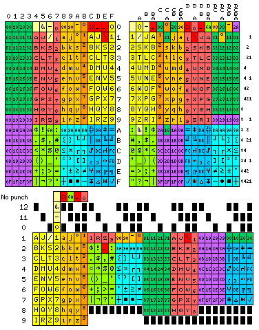
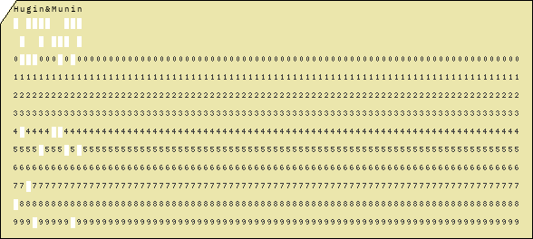

# 3.1.8_punchcard

**Note:** I solved this challenge after the CTF.

From the Norwegian Armed Force's page about the [Cybertalent Program](https://www.forsvaret.no/jobb/talentprogram-cyberoperasjoner) we find the following image, and notice the dots on the horse, which look like old [punch cards](https://en.wikipedia.org/wiki/Punched_card).


---

## Highlighting
After performing some image manipulation as an attempt to highlight the boxes even more, we notice very similar boxes to the left of the horse.


---

## Pattern
There seemed to be a repeating pattern, and when drawing columns and rows we see that there are 12 rows, and repeating pattern every 11 column.


---

## Big
Attempting to do the same to the boxes on the horse, we see that the same pattern exists there, albeit the last rows are offset a bit.


---

## Grid
Further processing gives us the following grid.

 

|   	    | 1 | 2 | 3 | 4 | 5 | 6 | 7 | 8 | 9 | 10 | 11	|
|--------|---|---|---|---|---|---|---|---|---|----|----|
| **12** | X |   | X | X | X | X |   |   | X | X  | X 	|
| **11** |   | X	|   |   | X |   | X | X | X |    | X 	|
| **0**  |   | X	| X | X |   |   |   | X |   | X  |   	|
| **1**  |   |  	|   |   |   |   |   |   |   |    |   	|
| **2**  |   |  	|   |   |   |   |   |   |   |    |   	|
| **3**  |   |  	|   |   |   |   |   |   |   |    |   	|
| **4**  |   | X	|   |   |   |   | X | X |   |    |   	|
| **5**  |   |  	|   |   | X |   |   |   | X |    | X  |
| **6**  |   |  	|   |   |   |   |   |   |   |    |   	|
| **7**  |   |  	| X |   |   |   |   |   |   |    |   	|
| **8** 	| X |  	|   |   |   |   |   |   |   |    |   	|
| **9** 	|   |  	|   | X |   |   |   |   |   | X  |   	|

## IBM-EBCDIC

We find that this pattern matches the IBM-EBCDIC punch cards.

> Before ASCII became the standard, many of the internal codes used to represent characters within computers were strongly influenced by the punched card code for characters. One of the most famous of such codes, and one that has persisted in use the longest, is, of course, EBCDIC (Extended Binary-Coded Decimal Interchange Code). The diagram below illustrates the relationship between EBCDIC and punched card code:
>
> 
> 
> [Source](http://quadibloc.com/comp/cardint.htm)

Now map the columns and rows to 0s and 1s, depending on where it's punched (X).

|   	    | 1 | 2 | 3 | 4 | 5 | 6 | 7 | 8 | 9 | 10 | 11	|
|--------|---|---|---|---|---|---|---|---|---|----|----|
| **12** | 1 | 0 | 1 | 1 | 1 | 1 | 0 | 0 | 1 | 1  | 1 	|
| **11** | 0 | 1	| 0 | 0 | 1 | 0 | 1 | 1 | 1 | 0  | 1 	|
| **0**  | 0 | 1	| 1 | 1 | 0 | 0 | 0 | 1 | 0 | 1  | 0 	|
| **1**  | 0 | 0 | 0 | 0 | 0 | 0 | 0 | 0 | 0 | 0  | 0 	|
| **2**  | 0 | 0 | 0 | 0 | 0 | 0 | 0 | 0 | 0 | 0  | 0 	|
| **3**  | 0 | 0 | 0 | 0 | 0 | 0 | 0 | 0 | 0 | 0  | 0 	|
| **4**  | 0 | 0	| 0 | 0 | 0 | 0 | 1 | 1 | 0 | 0  | 0 	|
| **5**  | 0 | 0 | 0 | 0 | 1 | 0 | 0 | 0 | 1 | 0  | 1  |
| **6**  | 0 | 0 | 0 | 0 | 0 | 0 | 0 | 0 | 0 | 0  | 0 	|
| **7**  | 0 | 0 | 1 | 0 | 0 | 0 | 0 | 0 | 0 | 0  | 0 	|
| **8** 	| 1 | 0	| 0 | 0 | 0 | 0 | 0 | 0 | 0 | 0  | 0 	|
| **9** 	| 0 | 0 | 0 | 1 | 0 | 0 | 0 | 0 | 0 | 1  | 0 	|

Extracting each column into a list gives us the following:
```
1.  100000000010
2.  011000100000
3.  101000000100
4.  101000000001
5.  110000010000
6.  100000000000
7.  010000100000
8.  011000100000
9.  110000010000
10. 101000000001
11. 110000010000
```

Adding them togheter gives us this string: `100000000010011000100000101000000100101000000001110000010000100000000000010000100000011000100000110000010000101000000001110000010000`

It should now be easy to map the column and rows to their characters, we therefore write a parser that does this for us and with that solve the challenge. We also see that the generated card matches the grid we found in the horse.

```sh
$ python parse_ibm-ebcdic.py code --generate-card 100000000010011000100000101000000100101000000001110000010000100000000000010000100000011000100000110000010000101000000001110000010000
Output: Hugin&Munin
```


[Huginn and Muninn](https://en.wikipedia.org/wiki/Huginn_and_Muninn) are two ravens that brought information to the most powerful Norse god, Odin. They can see every little movement on the earth, they hear every sound, and then they report back to Odin. That's the reason we can find the ravens in the Coat of Arms for the Norwegian Intelligence Service (Etteretningstjenesten).


You can also find them on the [frontpage of the CTF](https://ctf.cybertalent.no/).


```
login@corax:~$ scoreboard 'Hugin&Munin'
Kategori: 3.1. Utfordringer lett
Oppgave:  3.1.8_punchcard
Svar:     Hugin&Munin

Gratulerer, korrekt svar!
```

### More fun
The script also allows us the create our own cards.

```sh
$ python parse_ibm-ebcdic.py --generate-card text 'Hello, thi$ is IBM-EBCDIC punch c@rd from [2021]'

100000000010101000010000110001000000110001000000110000001000001001000010000000000000011001000000101000000010101000000001010001000010000000000000101000000001011010000000000000000000100000000001100010000000010000100000010000000000100000010000100010000000100001000000100000100000100000000001100001000000000000000000110000000100011000100000110000010000101001000000101000000010000000000000101001000000000000100010110000000001101000100000000000000000101000001000110000000001110000001000110000100000000000000000100010000010000010000000001000000000000010000000000100000000001010000010
```


```
$ python parse_ibm-ebcdic.py --generate-card text klarz
Output: 110010000000110001000000101100000000110000000001011000000001


$ python parse_ibm-ebcdic.py code 110010000000110001000000101100000000110000000001011000000001
Output: klarz
```


###### [`parse_ibm-ebcdic.py`](./parse_ibm-ebcdic.py)
```python
import argparse

# Simple parser for IBM-EBCDIC punchcards (missing a bunch of characters)
# See more:
# https://homepage.divms.uiowa.edu/~jones/cards/codes.html
# http://quadibloc.com/comp/cardint.htm
# http://www.kloth.net/services/cardpunch.php
# https://en.wikipedia.org/wiki/EBCDIC
# https://www.ibm.com/support/knowledgecenter/zosbasics/com.ibm.zos.zappldev/zappldev_14.htm

PARSER_MODE_TEXT = 1
PARSER_MODE_CODE = 2
PARSER_MODES = {
    "text": PARSER_MODE_TEXT,
    "code": PARSER_MODE_CODE,
}

"""
We just need the headers (12, 11, [1]0) here
as their "body" (1-9) are identical, we will generate
the body below.
"""
BLOCKS = {
# 12 11 10 1  2  3  4  5  6  7  8  9
#  12110
    "101": ["a", "b", "c", "d", "e", "f", "g", "h", "i"],
    "110": ["j", "k", "l", "m", "n", "o", "p", "q", "r"],
    "011": ["s", "t", "u", "v", "w", "x", "y", "z"],
    "100": ["A", "B", "C", "D", "E", "F", "G", "H", "I"],
    "010": ["J", "K", "L", "M", "N", "O", "P", "Q", "R"],
    "001": ["S", "T", "U", "V", "W", "X", "Y", "Z"],
}
EMPTY = ["0", "0", "0", "0", "0", "0", "0", "0", "0"]

# Digits have 10 columns instead of the standard 9 blocks (and 8 blocks)
DIGITS = {
    "001000000000": "0",
    "000100000000": "1",
    "000010000000": "2",
    "000001000000": "3",
    "000000100000": "4",
    "000000010000": "5",
    "000000001000": "6",
    "000000000100": "7",
    "000000000010": "8",
    "000000000001": "9",
}

# IBM-EBCDIC has support for symbols, let's add them
SPECIAL_SYMBOLS = {
# 12 11 10 1  2  3  4  5  6  7  8  9
#  12110123456789
    "000000000000": " ",
    "011100000000": "~",
    "010010000010": "!",
    "000000000110": "\"",
    "010001000010": "#",
    "010001000010": "$",
    "000000100010": "%",
    "100000000000": "&",
    "000000010010": "'",
    "100000010010": "(",
    "010000010010": ")",
    "010000100010": "*",
    "100000001010": "+",
    "001001000010": ",",
    "010000000000": "-",
    "100001000010": ".",
    "001100000000": "/",
    "000010000010": ":",
    "010000001010": ";",
    "100000100010": "<",
    "000000001010": "=",
    "001000001010": ">",
    "001000000110": "?",
    "000000100010": "@",
    "100010000010": "[",
    "010000000110": "\\",
    "001010000010": "]",
    "100000000110": "^",
    "001000010010": "_",
    "100000100001": "",
    "100000010001": "	",
}

IGNORE_UKNOWN = "▮"

# From https://stackoverflow.com/a/312464
def chunks(lst, n):
    """Yield successive n-sized chunks from lst."""
    for i in range(0, len(lst), n):
        yield lst[i:i + n]

# Initialize the code mapping with the symbols and digits
code_mapping = {**SPECIAL_SYMBOLS.copy(), **DIGITS.copy()}

# Invert the mapping so we get character => code mapping instead
character_mapping = {v: k for k, v in code_mapping.items()}

# Generate the generic mapping for the blocks we created above
#         1    2    3    4    5    6    7    8    9
for header, characters in BLOCKS.items():
    # Some blocks have a body that has 8 characters, we need to offset them.
    # For example: "stuvwxyz" and "STUVWXYZ"
    if len(characters) == 8:
        offset = 1
    else:
        offset = 0

    for i, c in enumerate(characters):
        code = EMPTY.copy()
        code[i + offset] = "1"
        code = header + "".join(code)
        if code in code_mapping:
            print(f"ERROR: Code already exists in mapping: {code} (Mapped char: '{mapping[code]}'. Current char: {c})")
            exit(1)
        code_mapping[code] = c
        character_mapping[c] = code

parser = argparse.ArgumentParser(description="Parse IBM-EBCDIC punchcard code or generate code from text, and in addition, create punchcards based on input data.")
parser.add_argument(
    "mode",
    help="parser mode. options: 'text' or 'code'"
)
parser.add_argument(
    "input",
    help="input data, either the text or code"
)
parser.add_argument(
    "--generate-card", "-gc", default=False, action="store_true",
    help="generate a punch card based on input data"
)
parser.add_argument(
    "--ignore-unknowns", "-iu", default=False, action="store_true",
    help="ignore unknown characters"
)
args = parser.parse_args()

mode = args.mode.lower()
if mode not in PARSER_MODES:
    print(f"ERROR: {mode} is not a valid mode. Available modes:")
    for mode in PARSER_MODES:
        print(f"- {mode}")
    exit(1)
mode_id = PARSER_MODES[mode]

user_input = args.input

output = ""
characters = ""
codes = []
if mode_id == PARSER_MODE_TEXT:
    for c in user_input:
        if c not in character_mapping:
            if not args.ignore_unknowns:
                print(f"ERROR: The character '{c}' does not exist in the character mapping, add the --ignore-unknown flag to ignore it")
                exit(1)
            else:
                output += IGNORE_UKNOWN 
                characters += IGNORE_UNKNOWN
        else:
            code = character_mapping[c]
            codes.append(code)
            characters += c
            output += code
elif mode_id == PARSER_MODE_CODE:
    # Codes need to have 12 rows, let's check that the input matches
    if len(user_input) % 12 != 0:
        print("ERROR: IBM-EBCDIC needs 12 rows per character, the input does not have a matching number of rows")
        print("Example (5 rows): 110010000000110001000000101100000000110000000001011000000001")
        print("Output: klarz")
        exit(1)
    elif any(c not in "01" for c in user_input):
        print("ERROR: Parser only accepts '1' and '0' as input for code. 1=punched, 0=not punched")
        print("Example (5 rows): 110010000000110001000000101100000000110000000001011000000001")
        print("Output: klarz")
        exit(1)

    codes = list(chunks(user_input, 12))
    for code in codes:
        if code not in code_mapping:
            if not args.ignore_unknowns:
                print(f"ERROR: '{code}' does not exist in the code mapping, add the --ignore-unknown flag to ignore it")
                exit(1)
            else:
                output += IGNORE_UKNOWN 
                characters += IGNORE_UNKNOWN
        else:
            c = code_mapping[code]
            output += c
            characters += c

print("Output:", output)

if args.generate_card:
    if len(characters) > 80:
        print(f"WARNING: The card only supports 80 columns, and will therefore cut out the following characters: '{characters[80:]}'")


    from PIL import Image, ImageFont, ImageDraw
    PUNCH_SIZE = (5, 12)
    PUNCH_PADDING_X = 7
    PUNCH_PADDING_Y = 20
    PUNCH_START_X = 15
    PUNCH_START_Y = 20
    PUNCH_START_POS = (PUNCH_START_X, PUNCH_START_Y)
    pos = PUNCH_START_POS

    PUNCH = Image.new("RGBA", PUNCH_SIZE, (255, 255, 255, 0))
    FONT_SIZE = 9
    FONT = ImageFont.truetype("IBMPlexMono-Regular.ttf", FONT_SIZE)
    FONT_Y = 3

    image = Image.open("./card_template.png").convert("RGBA")

    for i, code in enumerate(codes):
        c = characters[i]
        draw = ImageDraw.Draw(image)
        draw.text((pos[0], FONT_Y), c, font=FONT, fill="black")
        for b in code:
            if b == "1":
                image.paste(PUNCH, pos)
            pos = (pos[0], pos[1] + PUNCH_PADDING_Y)
        pos = (pos[0] + PUNCH_PADDING_X, PUNCH_START_Y)
    image.show()
    image.save("card.png")
```

## Reading materials
- https://homepage.divms.uiowa.edu/~jones/cards/codes.html
- http://quadibloc.com/comp/cardint.htm
- http://www.kloth.net/services/cardpunch.php
- https://en.wikipedia.org/wiki/EBCDIC
- https://www.ibm.com/support/knowledgecenter/zosbasics/com.ibm.zos.zappldev/zappldev_14.htm

## Failed attempts

### Decoding

We notice that column `8`, `9`, `10`, and `11` are identical to column `2`, `5`, `4`, `5` respectively. We use this information and map each unique column to their own character (`1=A, 2=B, 3=C, etc.`), resulting in the following string: `ABCDEFGBEDE`.

| 1 | 2 | 3	| 4	| 5 | 6	| 7	| 8	| 9	| 10	| 11	|
|---|---|---|---|---|---|---|---|---|----|----|
| 1 | 2	| 3	| 4 | 5	| 6	| 7 | 2 | 5	| 4  | 5  |
| A | B	| C	| D | E	| F	| G | B | E	| D  | E  |
 
 ---
 
### Bruteforcing
We write the following Python script to attempt to find a word that match these characteristics.

##### find_word.py
```python
import sys

# 0 1 2 3 4 5 6 7 8 9 10
# A B C D E F G B E D E

ignored_indexes = (1, 3, 4, 7, 8, 9, 10)

with open(sys.argv[1], "rb") as f:
    wordlist = f.read().splitlines()

for word in wordlist:
    if len(word) != 11:
        continue

    B = word[1]
    D = word[3]
    E = word[4]
    chars = (B, D, E)

    if (word[7] != B) \
    or (word[9] != D) \
    or (word[8] != E or word[10] != E) \
    or (word[7] == E or word[7] == D) \
    or (word[8] == B or word[8] == D) \
    or (word[10] == B or word[7] == D) \
    or (word[9] == E or word[9] == B): \
        continue

    used_chars = set()
    for i, c in enumerate(word):
        if i in ignored_indexes:
            continue
        if c in chars or c in used_chars:
            break
        used_chars.add(c)
    else:
        print(word.decode(errors="ignore"))

```

Using the Norwegian Scrabble Association's  [2020 wordlist](https://www2.scrabbleforbundet.no/?p=4527) results with the following words:
```sh
$ python find_word.py nsf2020.txt
bakerivarer
brunevarene
magnesiaene
moderatorer
```

Doing the same with `rockyou` results with the following words:
```sh
$ python find_word.py rockyou.txt
roylichoili
primextreme
carlospaolo
```

**Note:** `CYBERTALENT` has a length of `11` characters, but does not fit the characteristics that we have found above.

---

### Desperation

In a last-ditch effort, we color each cell, based on if they have a box or not, and finially remove the rows with no boxes.

