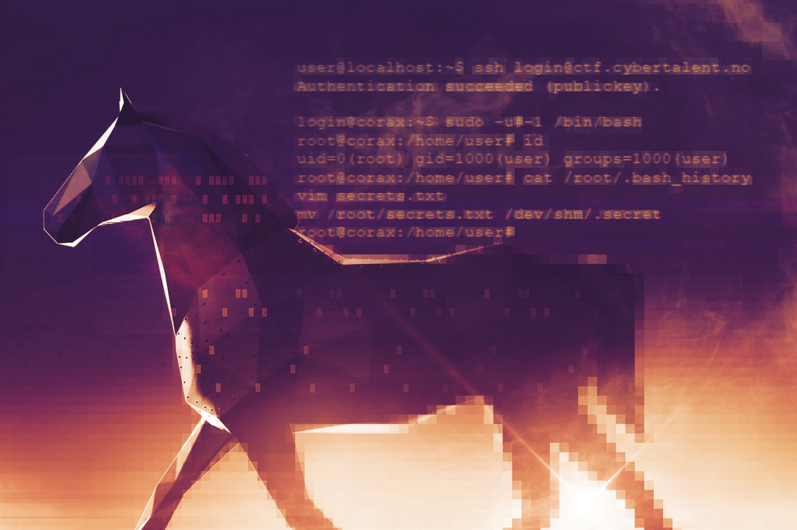

# 3.1.9_secret

**Note:** I solved this "challenge" after the CTF.

From the Norwegian Armed Force's page about the [Cybertalent Program](https://www.forsvaret.no/jobb/talentprogram-cyberoperasjoner) we find the following image, that contains some shell commands. We see that a file was moved to /dev/shm, and find the secret there.



```
login@corax:~$ ls -altr /dev/shm/
total 4
drwxr-xr-x 5 root root 340 Jan 21 15:45 ..
-rw-r--r-- 1 root root  33 Jan 21 15:45 .secret
drwxrwxrwt 2 root root  60 Jan 21 15:45 .
login@corax:~$ cat /dev/shm/.secret
7238876002abdfd7f091fa8978cbadee
login@corax:~$ scoreboard 7238876002abdfd7f091fa8978cbadee
Kategori: 3.1. Utfordringer lett
Oppgave:  3.1.9_secret
Svar:     7238876002abdfd7f091fa8978cbadee

Gratulerer, korrekt svar!
```
