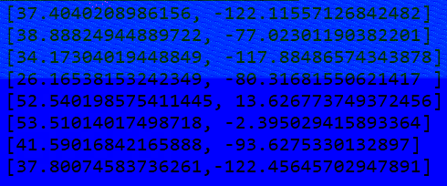

# 3.2. Utfordringer middels ([Simple version](./README.md))

## [3.2.1_coordinate](./coordinate)

We are given the following image.



Using `zsteg` we find interesting data in the `green` and `blue` layer of the image, and assume that each of the sub-challenges are related to their own layer (`r`, `g`, `b`, `a` => `red`, `green`, `blue`, `alpha`)

```shell
$ zsteg -a
b8,g,lsb,xy         .. text: "[ X, Y, Z ] =\r\n[[ 4.46951449e+00, 2.56443868e+01, 4.82221609e+01, 2.75919604e+00,\r\n   6.39779539e+00, 5.82768924e+00, 4.59417363e+01, 1.02990843e+01,\r\n   9.02752721e+00, 2.95875663e+01, 5.21653404e+01, 7.40382644e+00,\r\n   1.87583859e+01, 4.15926138e+00, 2."
b8,b,lsb,xy         .. text: "[37.4040208986156, -122.11557126842482]\r\n[38.88824944889722, -77.02301190382201]\r\n[34.17304019448849, -117.88486574343878]\r\n[26.16538153242349, -80.31681550621417 ]\r\n[52.540198575411445, 13.626773749372456]\r\n[53.51014017498718, -2.395029415893364]\r\n[41.590"
```


### [3.2.1_coordinate_r](./coordinate/r)

The red layer has 8 red pixels.


We check the positioning of the pixels with a small script, and find the pixels at the following coordinates.

```
x	y
98	3
101	7
105	5
108	8
112	4
115	1
117	2
120	6
```

The x coordinates are within the decimal ASCII range and transform them as such.

##### [solve_r.py](./coordinate/r/solve_r.py)

```python
from PIL import Image
image = Image.open("coordinates_red.png")
pixels = {}
for x in range(image.size[0]):
    for y in range(image.size[1]):
        p = image.getpixel((x, y))
        if p != 0:
            # print(x, y, sep="\t")
            pixels[y] = x
pixels = dict(sorted(pixels.items()))
print("Flag:", "".join([chr(x) for x in pixels.values()]))
```

```sh
$ python3 solve_r.py
Flag: subpixel
```

```sh
login@corax:~$ scoreboard subpixel
Kategori: 3.2. Utfordringer middels
Oppgave:  3.2.1_coordinate_r
Svar:     subpixel

Gratulerer, korrekt svar!
```


### [3.2.1_coordinate_g](./coordinate/g)

From our initial checking, we know that the green layer contains embedded XYZ coordinates.

```sh
$ zsteg coordinate.png -e b8,g,lsb,xy > b8_g.txt
$ cat b8_g.txt | head
[ X, Y, Z ] =
[[ 4.46951449e+00, 2.56443868e+01, 4.82221609e+01, 2.75919604e+00,
   6.39779539e+00, 5.82768924e+00, 4.59417363e+01, 1.02990843e+01,
   9.02752721e+00, 2.95875663e+01, 5.21653404e+01, 7.40382644e+00,
   1.87583859e+01, 4.15926138e+00, 2.18268791e+01, 1.19171121e+01,
   4.43151990e+01, 7.97109610e+00, 2.98474193e+01, 4.33063315e+01,
   4.83478327e+01, 1.10814799e+01, 4.48824687e+01, 2.39702859e+01,
   3.95335509e+01, 5.43953649e+01, 1.31411056e+01, 3.44025955e+01,
   3.10266857e+01, 3.60681869e+01, 1.70946907e+01, 1.44202318e+01,
   2.36704385e+01, 2.66075870e+01, 4.00664992e+01, 1.56470618e+01,
```

Plotting this with `matplotlib` and its `scatter(X, Y, Z)` function, we get the following image.

`$ python solve_g.py`


##### [`solve_g.py`](./coordinate/g/solve_g.py)
```python
import re
import matplotlib.pyplot as plt
from mpl_toolkits.mplot3d import axes3d

# Quick messy data parsing
with open("b8_g.txt") as f:
    data = f.read().replace("[ X, Y, Z ] =", "").replace("\n", "").replace(" ", "").strip()
	XYZ = []
	for positions in data.split("]")[:-2]:
		positions = positions.replace("]", "").replace("[", "")
		XYZ.append([float(value) for value in positions.split(",") if value])

X, Y, Z = XYZ
fig = plt.figure()
ax = fig.add_subplot(111, projection='3d')
ax.scatter(X, Y, Z)
plt.show()
```

```sh
login@corax:~$ scoreboard focal point
Kategori: 3.2. Utfordringer middels
Oppgave:  3.2.1_coordinate_g
Svar:     focal point

Gratulerer, korrekt svar!
```


### [3.2.1_coordinate_b](./coordinate/b)

Instead of writing down the number manually, we extract the embedded data.
```shell
$ zsteg coordinate.png -e b8,b,lsb,xy > b8_b.txt
[37.4040208986156, -122.11557126842482]
[38.88824944889722, -77.02301190382201]
[34.17304019448849, -117.88486574343878]
[26.16538153242349, -80.31681550621417 ]
[52.540198575411445, 13.626773749372456]
[53.51014017498718, -2.395029415893364]
[41.59016842165888, -93.6275330132897]
[37.80074583736261,-122.45645702947891]
```

The data look like GPS coordinates, and when plotting them into Google Maps we see that they are coordinates to streets/rivers/buildings that are supposed to look like letters, giving us the following:

* `37.4040208986156, -122.11557126842482`


**F**

**Flag:** `F`

* `38.88824944889722, -77.02301190382201`


**O**

**Flag:** `FO`

* `34.17304019448849, -117.88486574343878`
This one initially didn't make sense, but after checking the satellite map, we see that it's supposed to be the letter `N`.


**N**

**Flag:** `FON`

* `26.16538153242349, -80.31681550621417`


**T**

**Flag:** `FONT`

* `52.540198575411445, 13.626773749372456`


**S**

**Flag:** `FONTS`

* `53.51014017498718, -2.395029415893364`


**I**

**Flag:** `FONTSI`

* `41.59016842165888, -93.6275330132897`


**Z**

**Flag:** `FONTSIZ`


* `37.80074583736261,-122.45645702947891`


**E**

**Flag:** `FONTSIZE`

```sh
login@corax:~$ scoreboard FONTSIZE
Kategori: 3.2. Utfordringer middels
Oppgave:  3.2.1_coordinate_b
Svar:     FONTSIZE

Gratulerer, korrekt svar!
```

### [3.2.1_coordinate_a](./coordinate/a)

This was solved easily with `stegosolve`, we find the following QR code in **Alpha plane 1**. 


Scanning the QR code gives us `w3w:///daytime.hacking.above` and finially coordinates to the lake named `Lutvannet`.

https://what3words.com/daytime.hacking.above


```shell
login@corax:~/3_utfordringer/2_middels/coordinate$ scoreboard Lutvannet
Kategori: 3.2. Utfordringer middels
Oppgave:  3.2.1_coordinate_a
Svar:     Lutvannet

Gratulerer, korrekt svar!
```


## [3.2.2_minesweeper](./minesweeper)
We are supposed to create a [Minesweeper](https://en.wikipedia.org/wiki/Minesweeper_(video_game)) client that communicates with a server over [gRPC](https://grpc.io/).

The challenge is seperated into 3 levels, where we have to solve each level within x amount of seconds:
- **Easy**: 1 board, max 1 hour.
- **Medium**: 7 boards, max 10 seconds per board.
- **Hard**: 2 boards, max 5 seconds per board.

The [README](./minesweeper/LESMEG.md) also recommends writing the client in a compiled language, due to the time limitations and optimizations vs. a scripted language.

Having never touched neither **gRPC** nor a Minesweeper board solver, I had to spend some time searching for various sources, see **Reading material** below.

My thoughts were to write the client in [Golang](https://golang.org/), as I have never touched it and want to learn it one day. After spending some time with Golang I decided to go back to Python, which I am very familiar with. 


### Client

```shell
$ python -m grpc_tools.protoc \
-I./ \
--python_out=. \
--grpc_python_out=. \
./minesweeper.proto
```

I started writing my own solver based on the research I did above, however halfway there I decided to go another route, and use [another solver](https://github.com/madewokherd/mines) as a helper to my solver.

You can find my solver [here](./minesweeper/client.py).

### Flags

To somewhat mitigate the slow and unoptimized solver, I decided to setup a port forward with `socat` (another option is [`shuttle`](https://github.com/sshuttle/sshuttle)) and run the solver locally.

```shell
$ python client.py localhost 1989
Starting client...
Fetching new game...
Starting level
<Game started=True, level_id=JXh1eG9KId73wn5F>
<Board row_count=5, column_count=5, mine_count=1>
0	-	-	-	-
-	-	-	-	-
-	-	-	-	-
-	-	-	-	-
-	-	-	-	-
</Board>
</Game>
Finding solution
Solved level ID JXh1eG9KId73wn5F
Got flag for level ID JXh1eG9KId73wn5F: 0b5408469e617df0e380b7364cdc1d27
--- snip ---
```


```shell
login@corax:~$ scoreboard 0b5408469e617df0e380b7364cdc1d27
Kategori: 3.2. Utfordringer middels
Oppgave:  3.2.2_minesweeper_easy
Svar:     0b5408469e617df0e380b7364cdc1d27

Gratulerer, korrekt svar!
```
```shell
login@corax:~$ scoreboard 5315005b2ad1fbfc2ceaa9a20d646383
Kategori: 3.2. Utfordringer middels
Oppgave:  3.2.2_minesweeper_medium
Svar:     5315005b2ad1fbfc2ceaa9a20d646383

Gratulerer, korrekt svar!
```
```shell
login@corax:~$ scoreboard f94148481b7e295ebfb74490838f5c57
Kategori: 3.2. Utfordringer middels
Oppgave:  3.2.2_minesweeper_hard
Svar:     f94148481b7e295ebfb74490838f5c57

Gratulerer, korrekt svar!
```

### Reading materials
- [Minesweeper strategy](http://www.minesweeper.info/wiki/Strategy)
- [Minesweeper and NP-completeness](http://web.mat.bham.ac.uk/R.W.Kaye/minesw/ordmsw.htm)
- [Write an AI to play Minesweeper](https://cs50.harvard.edu/ai/2020/projects/1/minesweeper/)
- [Solving minesweeper](https://danamlund.dk/minesweeper_solver/#org836c750)


## [3.2.3_transfer](./transfer)

We are provided with a README (`LESMEG.md`, seen below), some documentation, which has been heavily redacted, and a network traffic capture file (`capture.pcapng`).

```
# Transfer
 
### Del 1
Vi har funnet denne nettverksdumpen som benytter en ukjent protokoll.
Kan du å tilbakevikle protokollen for å forstå hva slags data som overføres?
 
Fil: capture.pcapng
 
### Del 2
Vi kan nå serveren som var i nettverksdumpen. Kan du Koble til serveren og finne noe interessant på serveren?
 
Adresse: tcp://transfer:1334'
```

##### documentation.pdf


### [3.2.3_transfer_easy](./transfer/easy)

The documentation provides information in regards to the transfer protocol. We finish skimming through it and continue by opening the `pcapng` in Wireshark and extract every "transfer" packet and start splitting up the data in the packets as noted in the documentation. 

---

#### Transport packets
In the table below the `DIRECTION` column is referring to the directo of the packet (from or to the server).

| # | DIRECTION | MAGIC         | SEQ NUM       | I*    | LENGTH | CONTENT |
| - | - | ------------- | ------------- | ----- | -----  | -----   | 
| 1 | TO | 46494c45 | 0000000000000000 | 00 | 0000000000000000 | |
| 2 | FROM | 46494c45 | 380b16455cd30726 | 09 | 0000000000000000 | |
| 3 | TO | 46494c45 | 380b16455cd30726 | 01 | 0000000000000010 | 5a33566c633351365a33566c6333513d |
| 4 | FROM | 46494c45 | 380b16455cd30727 | 0a | 0000000000000018 | 5a4254577a7162314e727532796d714d5835516c72673d3d |
| 5 | TO | 46494c45 | 380b16455cd30727 | 02 | 0000000000000000 | |
| 6 | FROM | 46494c45 | 380b16455cd30728 | 0b | 0000000000000004 | 556b4d30 |
| 7 | TO | 46494c45 | 380b16455cd30728 | 03 | 0000000000000000 | |
| 8 | FROM | 46494c45 | 380b16455cd30729 | 0c | 000000000000002c | 4f37564733624461513671654d6d537a453035357a72526a3951334d306e61523156436c7037704e73413d3d |
| 9 | TO | 46494c45 | 380b16455cd30729 | 05 | 0000000000000008 | 4e42377873386f42 |
| 10 | FROM | 46494c45 | 380b16455cd3072a | 0c | 0000000000000000 | |
| 11 | TO | 46494c45 | 380b16455cd3072a | 06 | 0000000000000000 | |
| 12 | FROM | 46494c45 | 380b16455cd3072b | 0c | 000000000000016c | 5577626a6c51534e726d664a424c78324b54307a614969654261544254447256706564623464376a57706f2b6d75422f746d752f4843645044497631757078393477344c4759526d7645554f466732756c707436474b55536b46566868414a486875612f6c39505557725a4f30305a432f79642f2f636c44616459737757596b363749614166302f35414c564f66746c755569636a46646f6145344836366435743255742b394848654464774a724447625a49796b354a467469653155434b414b304a53706d2f35344b48444764664757572b444e35577470636c354a62717a346953465358563542786e53627a786e46703371646463522f334667505254632b486759695a316d48726950462f7747436a39466f49766230384473656847794145564d5a67764a386f5665387671427450726e66726f413872696749796b2f6158364c45337a51592b2b696f50787a4278426f433738576d6b6a6f6d6476385557354534623253622b303d |
| 13 | TO | 46494c45 | 380b16455cd3072b | 05 | 000000000000000c | 686132464930666a6836773d |
| 14 | FROM | 46494c45 | 380b16455cd3072c | 0c | 0000000000000000 | |
| 15 | TO | 46494c45 | 380b16455cd3072c | 07 | 0000000000000030 | 6541625579766b6c65783336587749424256586b394a425068364351636a61442b65556e37586b73483061736f773d3d |
| 16 | FROM | 46494c45 | 380b16455cd3072d | 0c | 0000000000000000 | |
| 17 | TO | 46494c45 | 380b16455cd3072d | 06 | 0000000000000000 | |
| 18 | FROM | 46494c45 | 380b16455cd3072e | 0c | 0000000000000030 | 5464597a62566141645730615968497372444a687568474a454845416f6e4a546f482f584b537372707a344e61413d3d |
| 19 | TO | 46494c45 | 380b16455cd3072e | 07 | 000000000000002c | 4a5a47644f4f7145334e624b6c6b494c5663666a56794d34767677597448444e796e43795635776b4b57383d |
| 20 | FROM | 46494c45 | 380b16455cd3072f | 0c | 0000000000000000 | |
| 21 | TO | 46494c45 | 380b16455cd3072f | 06 | 0000000000000000 | |
| 22 | FROM | 46494c45 | 380b16455cd30730 | 0c | 000000000000002c | 64547a684c794e35346c67534a35685355782b614a73677376492f5746766b77434c4b77452f516a2b68513d |

---

#### Reversing
We know that the interesting data will be in the `CONTENT` header and attempt to decode the hex values of the first packets, and then notice that the unhexed content is in fact **base64** encoded strings. 

| # | HEX | BASE64 | DECODED |
| - | - | - | - | 
| 1 | 5a33566c633351365a33566c6333513d | Z3Vlc3Q6Z3Vlc3Q= | guest:guest |
| 2 | 556b4d30 | UkM0 | RC4 |
| 3 | 4f37564733624461513671654d6d537a453035357a72526a3951334d306e61523156436c7037704e73413d3d | O7VG3bDaQ6qeMmSzE055zrRj9Q3M0naR1VClp7pNsA== | **_RAW DATA_** |
| 4 | 5a4254577a7162314e727532796d714d5835516c72673d3d | ZBTWzqb1Nru2ymqMX5Qlrg== | **_RAW DATA_** |

---

#### Encryption
Packet #3 and #4 contain raw that after we decoded them, but the packet before (packet #2) hint us toward [RC4 (Rivest Cipher 4)](https://en.wikipedia.org/wiki/RC4), which is a stream cipher. Knowing this, we assume that packet #3 contains the decrypted data, and packet #4 contains the key provided to the user after it logged in with `guest:guest` as username and password.

Plotting this into [CyberChef](https://gchq.github.io/CyberChef/#recipe=From_Base64('A-Za-z0-9%2B/%3D',true)RC4(%7B'option':'Base64','string':'ZBTWzqb1Nru2ymqMX5Qlrg%3D%3D'%7D,'Latin1','Latin1')&input=TzdWRzNiRGFRNnFlTW1TekUwNTV6clJqOVEzTTBuYVIxVkNscDdwTnNBPT0) we successfully decrypted the packet contents:
```sh
ls /tmp/transfer
FLAG_1
FLAG_2
```

---

#### Flag

Now that we know that the communication between the client and the server is encrypted with RC4, we continue with appending the contents of each packet:

```
3bb546ddb0da43aa9e3264b3134e79ceb463f50dccd27691d550a5a7ba4db0341ef1b3ca015306e395048dae67c904bc76293d3368889e05a4c14c3ad5a5e75be1dee35a9a3e9ae07fb66bbf1c274f0c8bf5ba9c7de30e0b198466bc450e160dae969b7a18a51290556184024786e6bf97d3d45ab64ed34642ff277ffdc94369d62cc16624ebb21a01fd3fe402d539fb65b9489c8c5768684e07eba779b7652dfbd1c778377026b0c66d9232939245b627b55022802b4252a66ff9e0a1c319d7c6596f833795ada5c97925bab3e224854975790719d26f3c67169dea75d711ff71603d14dcf87818899d661eb88f17fc060a3f45a08bdbd3c0ec7a11b200454c660bc9f2855ef2fa81b4fae77eba00f2b8a023293f697e8b137cd063efa2a0fc730710680bbf169a48e899dbfc516e44e1bd926fed85ad852347e387ac7806d4caf9257b1dfa5f02010555e4f4904f87a090723683f9e527ed792c1f46aca34dd6336d5680756d1a62122cac3261ba1189107100a27253a07fd7292b2ba73e0d6825919d38ea84dcd6ca96420b55c7e3572338befc18b470cdca70b2579c24296f753ce12f2379e25812279852531f9a26c82cbc8fd616f93008b2b013f423fa14
```

Plotting this into [CyberChef](https://gchq.github.io/CyberChef/#recipe=From_Hex('None')RC4(%7B'option':'Base64','string':'ZBTWzqb1Nru2ymqMX5Qlrg%3D%3D'%7D,'Latin1','Latin1')&input=M2JiNTQ2ZGRiMGRhNDNhYTllMzI2NGIzMTM0ZTc5Y2ViNDYzZjUwZGNjZDI3NjkxZDU1MGE1YTdiYTRkYjAzNDFlZjFiM2NhMDE1MzA2ZTM5NTA0OGRhZTY3YzkwNGJjNzYyOTNkMzM2ODg4OWUwNWE0YzE0YzNhZDVhNWU3NWJlMWRlZTM1YTlhM2U5YWUwN2ZiNjZiYmYxYzI3NGYwYzhiZjViYTljN2RlMzBlMGIxOTg0NjZiYzQ1MGUxNjBkYWU5NjliN2ExOGE1MTI5MDU1NjE4NDAyNDc4NmU2YmY5N2QzZDQ1YWI2NGVkMzQ2NDJmZjI3N2ZmZGM5NDM2OWQ2MmNjMTY2MjRlYmIyMWEwMWZkM2ZlNDAyZDUzOWZiNjViOTQ4OWM4YzU3Njg2ODRlMDdlYmE3NzliNzY1MmRmYmQxYzc3ODM3NzAyNmIwYzY2ZDkyMzI5MzkyNDViNjI3YjU1MDIyODAyYjQyNTJhNjZmZjllMGExYzMxOWQ3YzY1OTZmODMzNzk1YWRhNWM5NzkyNWJhYjNlMjI0ODU0OTc1NzkwNzE5ZDI2ZjNjNjcxNjlkZWE3NWQ3MTFmZjcxNjAzZDE0ZGNmODc4MTg4OTlkNjYxZWI4OGYxN2ZjMDYwYTNmNDVhMDhiZGJkM2MwZWM3YTExYjIwMDQ1NGM2NjBiYzlmMjg1NWVmMmZhODFiNGZhZTc3ZWJhMDBmMmI4YTAyMzI5M2Y2OTdlOGIxMzdjZDA2M2VmYTJhMGZjNzMwNzEwNjgwYmJmMTY5YTQ4ZTg5OWRiZmM1MTZlNDRlMWJkOTI2ZmVkODVhZDg1MjM0N2UzODdhYzc4MDZkNGNhZjkyNTdiMWRmYTVmMDIwMTA1NTVlNGY0OTA0Zjg3YTA5MDcyMzY4M2Y5ZTUyN2VkNzkyYzFmNDZhY2EzNGRkNjMzNmQ1NjgwNzU2ZDFhNjIxMjJjYWMzMjYxYmExMTg5MTA3MTAwYTI3MjUzYTA3ZmQ3MjkyYjJiYTczZTBkNjgyNTkxOWQzOGVhODRkY2Q2Y2E5NjQyMGI1NWM3ZTM1NzIzMzhiZWZjMThiNDcwY2RjYTcwYjI1NzljMjQyOTZmNzUzY2UxMmYyMzc5ZTI1ODEyMjc5ODUyNTMxZjlhMjZjODJjYmM4ZmQ2MTZmOTMwMDhiMmIwMTNmNDIzZmExNA) again we are provided with the first flag.

```sh
ls /tmp/transfer
FLAG_1
FLAG_2
FLAG_1â..â..â..â..â..â..â..â.®
â.. FLAG â.°â..â..â..â..â..â..â..â..â..â..â..â..â..â..â..â..â..â..â..â..â..â..â..â..â..â..â..â.®
â.. 0a6c08918fc64daa57b4faa13f60db8b â..
â.°â..â..â..â..â..â..â..â..â..â..â..â..â..â..â..â..â..â..â..â..â..â..â..â..â..â..â..â..â..â..â..â..â..â..â.¯
kake.txtTorsk er en hest som skyter festenTorsk er en hest som skyter festenKake er en hest som smaker torskKake er en hest som smaker torsk
```

```sh
login@corax:~$ scoreboard 0a6c08918fc64daa57b4faa13f60db8b
Kategori: 3.2. Utfordringer middels
Oppgave:  3.2.3_transfer_easy
Svar:     0a6c08918fc64daa57b4faa13f60db8b

Gratulerer, korrekt svar!
```


### [3.2.3_transfer_medium](./transfer/medium)

We recall from **3.2.3_transfer_easy** that there is a `FLAG_2` in `/tmp/transfer`, and therefore need to implement the transport protocol so that we can fetch the flag.

---

#### Instructions
We start by going back to the documentation, coupled with the decrypted packets and start defining the instructions.

| VALUE | INSTRUCTION NAME |
| - | - |
| 0 | Connect |
| 1 | Login |
| 2 | Okay |
| 3 | List files |
| 4 | ? |
| 5 | Open file |
| 6 | Print file |
| 7 | Write to file |
| 8 | ? |
| 9 | Request credentials |
| 10 | Encryption key |
| 11 | Encryption algorithmn |
| 12 | Success |
| 13 | Failure |
| >13 | NoOp (Other) |

---

#### Transfer Client
I decided it would be easier to simply implement the entire transfer protcol in a transfer client CLI, you can find it [here](./medium/transfer_client.py). With this I found that instruction #4 was used to change directories, whilst instruction #8 was used to disconnect.

**Foreshadowing:** this CLI will be **_very_** helpful later on.

---

#### Flag

```bash
$ python transfer_client.py transfer 1334
root@transfer:/tmp/transfer$ ls
FLAG_1
FLAG_2
root@transfer:/tmp/transfer$ cat FLAG_1
╭──────╮
│ FLAG ╰───────────────────────────╮
│ 0a6c08918fc64daa57b4faa13f60db8b │
╰──────────────────────────────────╯
root@transfer:/tmp/transfer$ cat FLAG_2
╭──────╮
│ FLAG ╰───────────────────────────╮
│ cd29703ea8013a4b9c2df2ad0ade9594 │
╰──────────────────────────────────╯
root@transfer:/tmp/transfer$ cd ..
root@transfer:/tmp$ cd /
root@transfer:/$ ls
bin
boot
dev
etc
home
lib
lib64
media
mnt
opt
proc
root
run
sbin
srv
sys
tmp
usr
var
.dockerenv
```

```
login@corax:~$ scoreboard cd29703ea8013a4b9c2df2ad0ade9594
Kategori: 3.2. Utfordringer middels
Oppgave:  3.2.3_transfer_medium
Svar:     cd29703ea8013a4b9c2df2ad0ade9594

Gratulerer, korrekt svar!
```


## [3.2.4_rusty_reversing_medium](./rust_middels)

We are again provided with a binary with `debug_info` (debug symbols) set.

```
$ file rust_medium
rust_medium: setuid ELF 64-bit LSB pie executable, x86-64, version 1 (SYSV), dynamically linked, BuildID[sha1]=64d74b20dd52b19944357f7c1d43dc5dbd3d21a3, with debug_info, not stripped
```

Attempting the same method as last time (searching for `flag` in the defined strings) I was presented with this part within the `main` function.


### gdb
Not seeing any obvious flags/passwords here I attempted to use [peda](https://github.com/longld/peda) version of [`gdb`](https://www.gnu.org/software/gdb/) and break at the `core::str::converts::from_utf8` function.
_Do not that I am very new to gdb, and there are most likely better ways to solving this_.

We set a breakpoint (`b from_utf8`) at the `from_utf8` function, run the binary, and input some random password.

```
$ gdb -q rust_medium
Reading symbols from rust_medium...
gdb-peda$ b from_utf8
Breakpoint 1 at 0x4754b: file library/core/src/str/converts.rs, line 86.
gdb-peda$ r
Starting program: 3_utfordringer/2_middels/rust_middels/rust_medium
Enter password: PASSWORD
[----------------------------------registers-----------------------------------]
RAX: 0x7fff2eb21cc0 --> 0x3
RBX: 0x7fff2eb21db0 --> 0x555556056740 ("PASSWORD\np\037K@\177")
RCX: 0x7fff2eb21ca8 --> 0x0
RDX: 0x9 ('\t')
RSI: 0x555556056740 ("PASSWORD\np\037K@\177")
RDI: 0x0
RBP: 0x0
RSP: 0x7fff2eb21c68 --> 0x7fff2eb21db0 --> 0x555556056740 ("PASSWORD\np\037K@\177")
RIP: 0x7f404b1df54b (<_ZN4core3str8converts9from_utf817h68bd5c9d8606b0ebE+11>:	mov    rcx,rdx)
R8 : 0x555556056730 --> 0x41 ('A')
R9 : 0x18a0
R10: 0x2a ('*')
R11: 0x246
R12: 0x7f404b1f62e0 --> 0x0
R13: 0x1
R14: 0x7fff2eb21de0 --> 0x5
R15: 0x0
EFLAGS: 0x246 (carry PARITY adjust ZERO sign trap INTERRUPT direction overflow)
[-------------------------------------code-------------------------------------]
   0x7f404b1df545 <_ZN4core3str8converts9from_utf817h68bd5c9d8606b0ebE+5>:	push   rbx
   0x7f404b1df546 <_ZN4core3str8converts9from_utf817h68bd5c9d8606b0ebE+6>:	mov    rax,rdi
   0x7f404b1df549 <_ZN4core3str8converts9from_utf817h68bd5c9d8606b0ebE+9>:	xor    edi,edi
=> 0x7f404b1df54b <_ZN4core3str8converts9from_utf817h68bd5c9d8606b0ebE+11>:	mov    rcx,rdx
   0x7f404b1df54e <_ZN4core3str8converts9from_utf817h68bd5c9d8606b0ebE+14>:	sub    rcx,0xf
   0x7f404b1df552 <_ZN4core3str8converts9from_utf817h68bd5c9d8606b0ebE+18>:	cmovae rdi,rcx
   0x7f404b1df556 <_ZN4core3str8converts9from_utf817h68bd5c9d8606b0ebE+22>:	test   rdx,rdx
   0x7f404b1df559 <_ZN4core3str8converts9from_utf817h68bd5c9d8606b0ebE+25>:	
    je     0x7f404b1df759 <_ZN4core3str8converts9from_utf817h68bd5c9d8606b0ebE+537>
[------------------------------------stack-------------------------------------]
0000| 0x7fff2eb21c68 --> 0x7fff2eb21db0 --> 0x555556056740 ("PASSWORD\np\037K@\177")
0008| 0x7fff2eb21c70 --> 0x7fff2eb21de0 --> 0x5
0016| 0x7fff2eb21c78 --> 0x0
0024| 0x7fff2eb21c80 --> 0x0
0032| 0x7fff2eb21c88 --> 0x7f404b1ad86b (<_ZN62_$LT$std..io..stdio..StdinLock$u20$as$u20$std..io..BufRead$GT$9read_line17h83b5cac8a98f85baE+91>:	mp    QWORD PTR [rsp+0x30],0x0)
0040| 0x7fff2eb21c90 --> 0x0
0048| 0x7fff2eb21c98 --> 0x7fff2eb21db0 --> 0x555556056740 ("PASSWORD\np\037K@\177")
0056| 0x7fff2eb21ca0 --> 0x0
[------------------------------------------------------------------------------]
Legend: code, data, rodata, value

Breakpoint 1, core::str::validations::run_utf8_validation () at library/core/src/str/validations.rs:121
121	library/core/src/str/validations.rs: No such file or directory.
```


### Password and flag
After typing a random password we continue the program (`c` = `continue`), and take a notice of the `RSI` register, containing the password `the_secret_password_is_secret_and_hidden`.
```
gdb-peda$ c
Continuing.
[----------------------------------registers-----------------------------------]
RAX: 0x7fff2eb21d70 --> 0x7f404b1f3608 --> 0x7f404b1e2090 ("Enter password: called `Result::unwrap()` on an `Err` value")
RBX: 0x555556054160 --> 0x575462630f002254
RCX: 0x6e ('n')
RDX: 0x28 ('(')
RSI: 0x555556056760 ("the_secret_password_is_secret_and_hidden")
RDI: 0x0
RBP: 0x28 ('(')
RSP: 0x7fff2eb21d28 --> 0x555556054160 --> 0x575462630f002254
RIP: 0x7f404b1df54b (<_ZN4core3str8converts9from_utf817h68bd5c9d8606b0ebE+11>:	mov    rcx,rdx)
R8 : 0x555556056750 --> 0x21 ('!')
R9 : 0x1860
R10: 0x2a ('*')
R11: 0x246
R12: 0x555556056760 ("the_secret_password_is_secret_and_hidden")
R13: 0x28 ('(')
R14: 0x555556054120 --> 0x2537071050654a20
R15: 0x5555560541c0 --> 0x23271711746a5631
EFLAGS: 0x246 (carry PARITY adjust ZERO sign trap INTERRUPT direction overflow)
[-------------------------------------code-------------------------------------]
   0x7f404b1df545 <_ZN4core3str8converts9from_utf817h68bd5c9d8606b0ebE+5>:	push   rbx
   0x7f404b1df546 <_ZN4core3str8converts9from_utf817h68bd5c9d8606b0ebE+6>:	mov    rax,rdi
   0x7f404b1df549 <_ZN4core3str8converts9from_utf817h68bd5c9d8606b0ebE+9>:	xor    edi,edi
=> 0x7f404b1df54b <_ZN4core3str8converts9from_utf817h68bd5c9d8606b0ebE+11>:	mov    rcx,rdx
   0x7f404b1df54e <_ZN4core3str8converts9from_utf817h68bd5c9d8606b0ebE+14>:	sub    rcx,0xf
   0x7f404b1df552 <_ZN4core3str8converts9from_utf817h68bd5c9d8606b0ebE+18>:	cmovae rdi,rcx
   0x7f404b1df556 <_ZN4core3str8converts9from_utf817h68bd5c9d8606b0ebE+22>:	test   rdx,rdx
   0x7f404b1df559 <_ZN4core3str8converts9from_utf817h68bd5c9d8606b0ebE+25>:	je     0x7f404b1df759 <_ZN4core3str8converts9from_utf817h68bd5c9d8606b0ebE+537>
[------------------------------------stack-------------------------------------]
0000| 0x7fff2eb21d28 --> 0x555556054160 --> 0x575462630f002254
0008| 0x7fff2eb21d30 --> 0x555556054120 --> 0x2537071050654a20
0016| 0x7fff2eb21d38 --> 0x5555560541c0 --> 0x23271711746a5631
0024| 0x7fff2eb21d40 --> 0x28 ('(')
0032| 0x7fff2eb21d48 --> 0x7f404b19d741 (<_ZN6medium4main17h529ab5f9f5af22f3E+1089>:	cmp    DWORD PTR [rsp+0x20],0x1)
0040| 0x7fff2eb21d50 --> 0x7f404b1f2040 --> 0x1
0048| 0x7fff2eb21d58 --> 0x555556056760 ("the_secret_password_is_secret_and_hidden")
0056| 0x7fff2eb21d60 --> 0x28 ('(')
[------------------------------------------------------------------------------]
Legend: code, data, rodata, value

Breakpoint 1, core::str::validations::run_utf8_validation () at library/core/src/str/validations.rs:121
121	in library/core/src/str/validations.rs
```

```
$ ./rust_medium
Enter password: the_secret_password_is_secret_and_hidden
Flag: etj{rust_sure_creates_long_and_weird_function_names}
```

```
login@corax:~$ scoreboard etj{rust_sure_creates_long_and_weird_function_names}
Kategori: 3.2. Utfordringer middels
Oppgave:  3.2.4_rusty_reversing_medium
Svar:     rust_sure_creates_long_and_weird_function_names

Gratulerer, korrekt svar!
```
