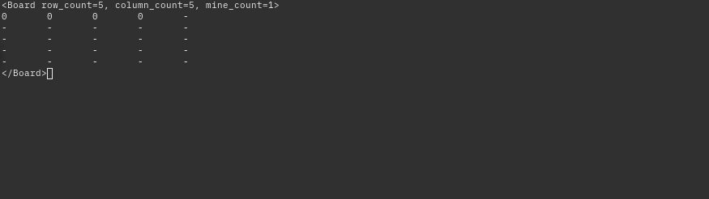

# 3.2. Utfordringer middels ([Detailed version](./DETAILED.md))

## [3.2.1_coordinate](./coordinate)

We are given the following image.


Using `zsteg` we find interesting data in the `green` and `blue` layer of the image, and assume that each of the sub-challenges are related to their own layer (`r`, `g`, `b`, `a` => `red`, `green`, `blue`, `alpha`)

```shell
$ zsteg -a
b8,g,lsb,xy         .. text: "[ X, Y, Z ] =\r\n[[ 4.46951449e+00, 2.56443868e+01, 4.82221609e+01, 2.75919604e+00,\r\n   6.39779539e+00, 5.82768924e+00, 4.59417363e+01, 1.02990843e+01,\r\n   9.02752721e+00, 2.95875663e+01, 5.21653404e+01, 7.40382644e+00,\r\n   1.87583859e+01, 4.15926138e+00, 2."
b8,b,lsb,xy         .. text: "[37.4040208986156, -122.11557126842482]\r\n[38.88824944889722, -77.02301190382201]\r\n[34.17304019448849, -117.88486574343878]\r\n[26.16538153242349, -80.31681550621417 ]\r\n[52.540198575411445, 13.626773749372456]\r\n[53.51014017498718, -2.395029415893364]\r\n[41.590"
```


### [3.2.1_coordinate_r](./coordinate/r)

The red layer has 8 red pixels.


We check the positioning of the pixels with a small script, and find the pixels at the following coordinates.

```
x	y
98	3
101	7
105	5
108	8
112	4
115	1
117	2
120	6
```

The x coordinates are within the decimal ASCII range and transform them as such.

##### [solve_r.py](./coordinate/r/solve_r.py)

```sh
$ python3 solve_r.py
Flag: subpixel
```

```sh
login@corax:~$ scoreboard subpixel
Gratulerer, korrekt svar!
```


### [3.2.1_coordinate_g](./coordinate/g)

From our initial checking, we know that the green layer contains embedded XYZ coordinates.

```sh
$ zsteg coordinate.png -e b8,g,lsb,xy > b8_g.txt
$ cat b8_g.txt | head -n 3
[ X, Y, Z ] =
[[ 4.46951449e+00, 2.56443868e+01, 4.82221609e+01, 2.75919604e+00,
   6.39779539e+00, 5.82768924e+00, 4.59417363e+01, 1.02990843e+01,
```

Plotting this with `matplotlib` and its `scatter(X, Y, Z)` function, we get the following image.

`$ python solve_g.py`


##### [`solve_g.py`](./coordinate/g/solve_g.py)

```sh
login@corax:~$ scoreboard focal point
Gratulerer, korrekt svar!
```


### [3.2.1_coordinate_b](./coordinate/b)

Instead of writing down the number manually, we extract the embedded data.
```shell
$ zsteg coordinate.png -e b8,b,lsb,xy > b8_b.txt
[37.4040208986156, -122.11557126842482]
[38.88824944889722, -77.02301190382201]
--- snip ---
```

The data looks like GPS coordinates, and when plotting them into Google Maps we see that they are coordinates to streets/rivers/buildings that are supposed to look like letters, giving us the following:

* `37.4040208986156, -122.11557126842482`


Adding them togheter gives us the flag: `FONTSIZE`.


```sh
login@corax:~$ scoreboard FONTSIZE
Gratulerer, korrekt svar!
```

### [3.2.1_coordinate_a](./coordinate/a)

This was solved easily with `stegosolve`, we find the following QR code in **Alpha plane 1**. 


Scanning the QR code gives us `w3w:///daytime.hacking.above` and finially coordinates to the lake named `Lutvannet`.

https://what3words.com/daytime.hacking.above

```shell
login@corax:~/3_utfordringer/2_middels/coordinate$ scoreboard Lutvannet
Gratulerer, korrekt svar!
```


## [3.2.2_minesweeper](./minesweeper)
We are supposed to create a [Minesweeper](https://en.wikipedia.org/wiki/Minesweeper_(video_game)) client that communicates with a server over [gRPC](https://grpc.io/).

The challenge is seperated into 3 levels, where we have to solve each level within x amount of seconds:
- **Easy**: 1 board, max 1 hour.
- **Medium**: 7 boards, max 10 seconds per board.
- **Hard**: 2 boards, max 5 seconds per board.

### Client

```shell
$ python -m grpc_tools.protoc \
-I./ \
--python_out=. \
--grpc_python_out=. \
./minesweeper.proto
```

I based my solver on [another solver](https://github.com/madewokherd/mines) and used it as a helper to my solver.
You can find my solver [here](./minesweeper/client.py).

### Flags

To somewhat mitigate the slow and unoptimized solver, I decided to setup a port forward with `socat` (another option is [`shuttle`](https://github.com/sshuttle/sshuttle)) and run the solver locally.



```shell
login@corax:~$ scoreboard 0b5408469e617df0e380b7364cdc1d27
Gratulerer, korrekt svar!
```
```shell
login@corax:~$ scoreboard 5315005b2ad1fbfc2ceaa9a20d646383
Gratulerer, korrekt svar!
```
```shell
login@corax:~$ scoreboard f94148481b7e295ebfb74490838f5c57
Gratulerer, korrekt svar!
```

## [3.2.3_transfer](./transfer)

We are provided with a README, some documentation, which has been heavily redacted, and a network traffic capture file (`capture.pcapng`).

### [3.2.3_transfer_easy](./transfer/easy)

The documentation provides information in regards to the transfer protocol. We finish skimming through it and continue by opening the `pcapng` in Wireshark and extract every "transfer" packet and start splitting up the data in the packets as noted in the documentation. 

---

#### Reversing
We know that the interesting data will be in the `CONTENT` header and attempt to decode the hex values of the first packets, and then notice that the unhexed content is in fact **base64** encoded strings. 

| # | HEX | BASE64 | DECODED |
| - | - | - | - | 
| 1 | 5a33566c633351365a33566c6333513d | Z3Vlc3Q6Z3Vlc3Q= | guest:guest |
| 2 | 556b4d30 | UkM0 | RC4 |
| 3 | 4f37564733624461513671654d6d537a453035357a72526a3951334d306e61523156436c7037704e73413d3d | O7VG3bDaQ6qeMmSzE055zrRj9Q3M0naR1VClp7pNsA== | **_RAW DATA_** |
| 4 | 5a4254577a7162314e727532796d714d5835516c72673d3d | ZBTWzqb1Nru2ymqMX5Qlrg== | **_RAW DATA_** |

---

#### Encryption
Packet #3 and #4 contain raw that after we decoded them, but the packet before (packet #2) hint us toward [RC4 (Rivest Cipher 4)](https://en.wikipedia.org/wiki/RC4), which is a stream cipher. Knowing this, we assume that packet #3 contains the decrypted data, and packet #4 contains the key provided to the user after it logged in with `guest:guest` as username and password.

Plotting this into [CyberChef](https://gchq.github.io/CyberChef/#recipe=From_Base64('A-Za-z0-9%2B/%3D',true)RC4(%7B'option':'Base64','string':'ZBTWzqb1Nru2ymqMX5Qlrg%3D%3D'%7D,'Latin1','Latin1')&input=TzdWRzNiRGFRNnFlTW1TekUwNTV6clJqOVEzTTBuYVIxVkNscDdwTnNBPT0) we successfully decrypted the packet contents:
```sh
ls /tmp/transfer
FLAG_1
FLAG_2
```

---

#### Flag

Now that we know that the communication between the client and the server is encrypted with RC4, we continue with appending the contents of each packet.

Plotting this into [CyberChef](https://gchq.github.io/CyberChef/#recipe=From_Hex('None')RC4(%7B'option':'Base64','string':'ZBTWzqb1Nru2ymqMX5Qlrg%3D%3D'%7D,'Latin1','Latin1')&input=M2JiNTQ2ZGRiMGRhNDNhYTllMzI2NGIzMTM0ZTc5Y2ViNDYzZjUwZGNjZDI3NjkxZDU1MGE1YTdiYTRkYjAzNDFlZjFiM2NhMDE1MzA2ZTM5NTA0OGRhZTY3YzkwNGJjNzYyOTNkMzM2ODg4OWUwNWE0YzE0YzNhZDVhNWU3NWJlMWRlZTM1YTlhM2U5YWUwN2ZiNjZiYmYxYzI3NGYwYzhiZjViYTljN2RlMzBlMGIxOTg0NjZiYzQ1MGUxNjBkYWU5NjliN2ExOGE1MTI5MDU1NjE4NDAyNDc4NmU2YmY5N2QzZDQ1YWI2NGVkMzQ2NDJmZjI3N2ZmZGM5NDM2OWQ2MmNjMTY2MjRlYmIyMWEwMWZkM2ZlNDAyZDUzOWZiNjViOTQ4OWM4YzU3Njg2ODRlMDdlYmE3NzliNzY1MmRmYmQxYzc3ODM3NzAyNmIwYzY2ZDkyMzI5MzkyNDViNjI3YjU1MDIyODAyYjQyNTJhNjZmZjllMGExYzMxOWQ3YzY1OTZmODMzNzk1YWRhNWM5NzkyNWJhYjNlMjI0ODU0OTc1NzkwNzE5ZDI2ZjNjNjcxNjlkZWE3NWQ3MTFmZjcxNjAzZDE0ZGNmODc4MTg4OTlkNjYxZWI4OGYxN2ZjMDYwYTNmNDVhMDhiZGJkM2MwZWM3YTExYjIwMDQ1NGM2NjBiYzlmMjg1NWVmMmZhODFiNGZhZTc3ZWJhMDBmMmI4YTAyMzI5M2Y2OTdlOGIxMzdjZDA2M2VmYTJhMGZjNzMwNzEwNjgwYmJmMTY5YTQ4ZTg5OWRiZmM1MTZlNDRlMWJkOTI2ZmVkODVhZDg1MjM0N2UzODdhYzc4MDZkNGNhZjkyNTdiMWRmYTVmMDIwMTA1NTVlNGY0OTA0Zjg3YTA5MDcyMzY4M2Y5ZTUyN2VkNzkyYzFmNDZhY2EzNGRkNjMzNmQ1NjgwNzU2ZDFhNjIxMjJjYWMzMjYxYmExMTg5MTA3MTAwYTI3MjUzYTA3ZmQ3MjkyYjJiYTczZTBkNjgyNTkxOWQzOGVhODRkY2Q2Y2E5NjQyMGI1NWM3ZTM1NzIzMzhiZWZjMThiNDcwY2RjYTcwYjI1NzljMjQyOTZmNzUzY2UxMmYyMzc5ZTI1ODEyMjc5ODUyNTMxZjlhMjZjODJjYmM4ZmQ2MTZmOTMwMDhiMmIwMTNmNDIzZmExNA) again we are provided with the first flag.

```sh
// --- snip ---
â.. 0a6c08918fc64daa57b4faa13f60db8b â..
// --- snip ---
```

```sh
login@corax:~$ scoreboard 0a6c08918fc64daa57b4faa13f60db8b
Gratulerer, korrekt svar!
```


### [3.2.3_transfer_medium](./transfer/medium)

We recall from **3.2.3_transfer_easy** that there is a `FLAG_2` in `/tmp/transfer`, and therefore need to implement the transport protocol so that we can fetch the flag.

---

#### Instructions
We start by going back to the documentation, coupled with the decrypted packets and start defining the instructions.

| VALUE | INSTRUCTION NAME |
| - | - |
| 0 | Connect |
| 1 | Login |
| 2 | Okay |
| 3 | List files |
| 4 | ? |
| 5 | Open file |
| 6 | Print file |
| 7 | Write to file |
| 8 | ? |
| 9 | Request credentials |
| 10 | Encryption key |
| 11 | Encryption algorithmn |
| 12 | Success |
| 13 | Failure |
| >13 | NoOp (Other) |

---

#### Transfer Client
I decided it would be easier to simply implement the entire transfer protcol in a transfer client CLI, you can find it [here](./medium/transfer_client.py). With this I found that instruction #4 was used to change directories, whilst instruction #8 was used to disconnect.

**Foreshadowing:** this CLI will be **_very_** helpful later on.

---

#### Flag

```bash
$ python transfer_client.py transfer 1334
root@transfer:/tmp/transfer$ ls
FLAG_1
FLAG_2
root@transfer:/tmp/transfer$ cat FLAG_2
╭──────╮
│ FLAG ╰───────────────────────────╮
│ cd29703ea8013a4b9c2df2ad0ade9594 │
╰──────────────────────────────────╯
```

```
login@corax:~$ scoreboard cd29703ea8013a4b9c2df2ad0ade9594
Gratulerer, korrekt svar!
```


## [3.2.4_rusty_reversing_medium](./rust_middels)

We are again provided with a binary with `debug_info` (debug symbols) set.

Attempting the same method as last time (searching for `flag` in the defined strings) we are presented with this part within the `main` function.


### gdb
Not seeing any obvious flags/passwords here we attempted to use [peda](https://github.com/longld/peda) version of [`gdb`](https://www.gnu.org/software/gdb/) and break at the `core::str::converts::from_utf8` function.
_Do note that I am very new to gdb, and there are most likely better ways to solving this_.

We set a breakpoint (`b from_utf8`) at the `from_utf8` function, run the binary, and input some random password.

```
$ gdb -q rust_medium
Reading symbols from rust_medium...
gdb-peda$ b from_utf8
Breakpoint 1 at 0x4754b: file library/core/src/str/converts.rs, line 86.
gdb-peda$ r
Starting program: 3_utfordringer/2_middels/rust_middels/rust_medium
Enter password: PASSWORD
// --- snip ---
[-------------------------------------code-------------------------------------]
// --- snip ---
=> 0x7f404b1df54b <_ZN4core3str8converts9from_utf817h68bd5c9d8606b0ebE+11>:	mov    rcx,rdx
// --- snip ---
Breakpoint 1, core::str::validations::run_utf8_validation () at library/core/src/str/validations.rs:121
121	library/core/src/str/validations.rs: No such file or directory.
```

### Password and flag
After typing a random password we continue the program (`c` = `continue`), and take a notice of the `RSI` register, containing the password `the_secret_password_is_secret_and_hidden`.
```
gdb-peda$ c
Continuing.
[----------------------------------registers-----------------------------------]
// --- snip ---
RSI: 0x555556056760 ("the_secret_password_is_secret_and_hidden")
// --- snip ---
R12: 0x555556056760 ("the_secret_password_is_secret_and_hidden")
// --- snip ---
[-------------------------------------code-------------------------------------]
// --- snip ---
=> 0x7f404b1df54b <_ZN4core3str8converts9from_utf817h68bd5c9d8606b0ebE+11>:	mov    rcx,rdx
[------------------------------------stack-------------------------------------]
// --- snip ---
0048| 0x7fff2eb21d58 --> 0x555556056760 ("the_secret_password_is_secret_and_hidden")
// --- snip ---
Breakpoint 1, core::str::validations::run_utf8_validation () at library/core/src/str/validations.rs:121
121	in library/core/src/str/validations.rs
```

```
$ ./rust_medium
Enter password: the_secret_password_is_secret_and_hidden
Flag: etj{rust_sure_creates_long_and_weird_function_names}
```

```
login@corax:~$ scoreboard etj{rust_sure_creates_long_and_weird_function_names}
Gratulerer, korrekt svar!
```
