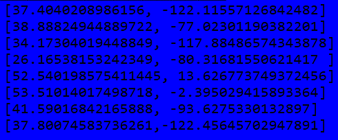

# 3.2.1_coordinate_b



Instead of writing down the number manually, we extract the embedded data.
```shell
$ zsteg coordinate.png -e b8,b,lsb,xy > b8_b.txt
[37.4040208986156, -122.11557126842482]
[38.88824944889722, -77.02301190382201]
[34.17304019448849, -117.88486574343878]
[26.16538153242349, -80.31681550621417 ]
[52.540198575411445, 13.626773749372456]
[53.51014017498718, -2.395029415893364]
[41.59016842165888, -93.6275330132897]
[37.80074583736261,-122.45645702947891]
```

The data look like GPS coordinates, and when plotting them into Google Maps we see that they are coordinates to streets/rivers/buildings that are supposed to look like letters, giving us the following:

* `37.4040208986156, -122.11557126842482`


**F**

**Flag:** `F`

* `38.88824944889722, -77.02301190382201`


**O**

**Flag:** `FO`

* `34.17304019448849, -117.88486574343878`
This one initially didn't make sense, but after checking the satellite map, we see that it's supposed to be the letter `N`.


**N**

**Flag:** `FON`

* `26.16538153242349, -80.31681550621417`


**T**

**Flag:** `FONT`

* `52.540198575411445, 13.626773749372456`


**S**

**Flag:** `FONTS`

* `53.51014017498718, -2.395029415893364`


**I**

**Flag:** `FONTSI`

* `41.59016842165888, -93.6275330132897`


**Z**

**Flag:** `FONTSIZ`


* `37.80074583736261,-122.45645702947891`


**E**

**Flag:** `FONTSIZE`

```shell
login@corax:~$ scoreboard FONTSIZE
Kategori: 3.2. Utfordringer middels
Oppgave:  3.2.1_coordinate_b
Svar:     FONTSIZE

Gratulerer, korrekt svar!
```
