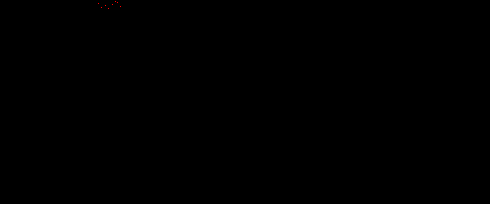

# 3.2.1_coordinate_r



The red layer has 8 red pixels.


We check the positioning of the pixels with a small script, and find the pixels at the following coordinates.

```
x	y
98	3
101	7
105	5
108	8
112	4
115	1
117	2
120	6
```

The x coordinates are within the decimal ASCII range and transform them as such.

##### [solve_r.py](./solve_r.py)

```python
from PIL import Image
image = Image.open("coordinates_red.png")
pixels = {}
for x in range(image.size[0]):
    for y in range(image.size[1]):
        p = image.getpixel((x, y))
        if p != 0:
            # print(x, y, sep="\t")
            pixels[y] = x
pixels = dict(sorted(pixels.items()))
print("Flag:", "".join([chr(x) for x in pixels.values()]))
```

```sh
$ python3 solve_r.py
Flag: subpixel
```

```sh
login@corax:~$ scoreboard subpixel
Kategori: 3.2. Utfordringer middels
Oppgave:  3.2.1_coordinate_r
Svar:     subpixel

Gratulerer, korrekt svar!
```
