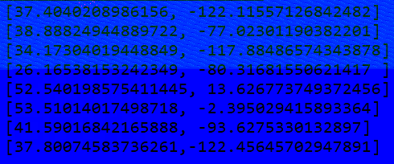
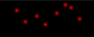
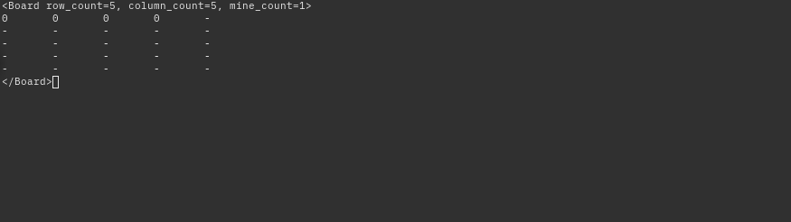
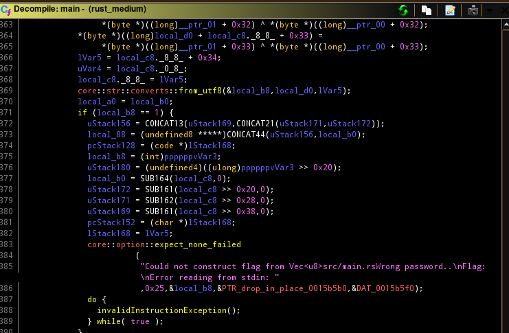

# 3. Utfordringer ([Simple version](./README.md))

## [3.1. Utfordringer lett](./1_lett)

### [3.1.1_clmystery](./1_lett/clmystery)
clmystery is a open-source "A command-line murder mystery". This was basically identical to last years challenge, we can therefore use the same technique. Copy the files from `corax` to our local machine, and clone the `clmystery` source. Finially compare the directories and find the differences. 

```sh
$ scp -r cybertalent:~/3_utfordringer/1_lett/clmystery/mystery mystery2
$ git clone https://github.com/veltman/clmystery myster2
$ diff --no-dereference mystery/vehicles mystery2/vehicles
31830c31830
< Owner: Jeremy Bowers
---
> Owner: Victor Sidney
```

```sh
login@corax:~$ scoreboard Victor Sidney
Kategori: 3.1. Utfordringer lett
Oppgave:  3.1.1_clmystery
Svar:     Victor Sidney

Gratulerer, korrekt svar!
```


### [3.1.2_fibonacci](./1_lett/fibonacci)
> # Fibonacci
>
>Klarer du å regne ut fibonacci raskt nok?
>
>
>Adresse: tcp://fibonacci:7600

Connecting to the server we are provided with randomly generated data (`fib(176)`), asking for the answer of `fib(176)`.

```sh
login@corax:~$ nc fibonacci 7600
fib(176)
pwn
Sorry, that was wrong
```

Calculating fib(x) can potentially be very slow, I therefore decided to download a static list ([`fib.txt`](./fib.txt)) of fibonacci numbers and use that to "calculate" the fibonacci numbers.
```sh
$ head -n 5 fib.txt
0 	0
1 	1
2 	1
3 	2
4 	3
```

##### [`solve.py`](./1_lett/fibonacci/solve.py)
```python
import re
from pwn import *

fib = {}
with open("fib.txt") as f:
    for line in f.read().splitlines():
        s = line.split("\t")
        fib[s[0].strip()] = s[1].strip()

io = remote("fibonacci", 7600)

print("Starting...")
while True:
    s = io.readlineS()
    r = re.search(r"fib\((.*?)\)", s)
    if not r:
        print(s)
        print(io.readlineS())
        print(io.readlineS())
        print(io.readlineS())
        io.close()
        exit(0)
    n = r.group(1).strip()
    f = fib[n]
    io.sendline(f)
```

```sh
$ python3 solve.py
Starting...
╭──────╮
│ FLAG ╰───────────────────────────╮
│ ce954ec88c3bef5ecf088239541c6b3f │
╰──────────────────────────────────╯
```

```sh
login@corax:~/scripts/fib$ scoreboard ce954ec88c3bef5ecf088239541c6b3f
Kategori: 3.1. Utfordringer lett
Oppgave:  3.1.2_fibonacci
Svar:     ce954ec88c3bef5ecf088239541c6b3f

Gratulerer, korrekt svar!
```


### [3.1.3_math](./1_lett/math)
#### 3.1.3_math_1
```
# Matematikk
 
Jeg har laget en matematikk-tjeneste.
Vil du prøve å logge inn på systemet?

Adresse: http://math:7070

PS: Det er 2(TO) flagg i denne oppgaven
```

Simple challenge, curl the provided URL, find a link to the flag.
`login@corax:~$ curl math:7070`
```html
<p><a href="/flag_1">Flag 1</a></p><p><a href="/flag_2">Flag 2</a></p>
```
`login@corax:~$ curl math:7070/flag_1`
```html
 ──────╮
│ FLAG ╰───────────────────────────╮
│ 1f3191fabf49137b4a1c8e41d2cb3730 │
╰──────────────────────────────────╯
```

```sh
login@corax:~$ scoreboard 1f3191fabf49137b4a1c8e41d2cb3730
Kategori: 3.1. Utfordringer lett
Oppgave:  3.1.3_math_1
Svar:     1f3191fabf49137b4a1c8e41d2cb3730

Gratulerer, korrekt svar!
```

#### 3.1.3_math_2

Continuing with flag #2 we find that it requires a specific user agent set.

`login@corax:~$ curl math:7070/flag_2`

> wrong user agent - must be Math Calculator (Python 3)

After setting the `User-Agent` header, we have a cookie set and are redirected to another location (`/challenge`).
```shell
login@corax:~$ curl math:7070/flag_2 -H "User-Agent: Math Calculator (Python 3)" -v

< Location: http://math:7070/challenge
--- snip ---
< Set-Cookie: user_id="!ACLXo5IfaJKH1CaFqyrYiw==?gASVIAAAAAAAAACMB3VzZXJfaWSUjBAyZDA3ZGQ5MTFiNDdhZDlmlIaULg=="
```

Executing the new request with a cookie set we are provided with a math equation, that we can easily solve with a dirty python script that `eval`s the equation (**_never do this_**). It is also important that we keep the same session as we have to solve multiple equations. After letting the script run for a few seconds, we are provided with the flag #2.
```shell
login@corax:~$ curl math:7070/challenge -H "User-Agent: Math Calculator (Python 3)" -H 'user_id="!ACLXo5IfaJKH1CaFqyrYiw==?gASVIAAAAAAAAACMB3VzZXJfaWSUjBAyZDA3ZGQ5MTFiNDdhZDlmlIaULg=='
33555-807979
```

##### [`solve.py`](./1_lett/math/solve.py)
```python
import requests

URL = "http://math:7070/challenge"
HEADERS = {"User-agent": "Math Calculator (Python 3)"}
s = requests.Session()

r = s.get(URL, headers=HEADERS)
next_equation = r.content.decode()
while True:
    print("eq =", next_equation)
    answer = str(eval(next_equation))
    print("answer =", answer)
    r = s.post(URL, answer, headers=HEADERS)
    next_equation = r.content.decode()
```

```sh
$ python solve.py
╭──────╮
│ FLAG ╰───────────────────────────╮
│ 12ea10a72a5c3828a1f3141bd9e5030b │
╰──────────────────────────────────╯
```

```sh
login@corax:~/scripts/1_3_math$ scoreboard 12ea10a72a5c3828a1f3141bd9e5030b
Kategori: 3.1. Utfordringer lett
Oppgave:  3.1.3_math_2
Svar:     12ea10a72a5c3828a1f3141bd9e5030b

Gratulerer, korrekt svar!
```


### [3.1.4_rusty_reversing_easy](./1_lett/rust_lett)
```
# Rust-tilbakevikling - lett

Jeg er litt Rust(en) når det kommer til mine evner innen tilbakevikling. Kan du hjelpe meg?

   Fil: rust_easy
```

We are provided with a binary, and notice that it has be compiled with `debug_info` (debug symbols).
```sh
$ file rust_easy
rust_easy: setuid ELF 64-bit LSB pie executable, x86-64, version 1 (SYSV), dynamically linked, BuildID[sha1]=802d5f1d534235f77ae80115570e6efc5260f107, with debug_info, not stripped
```
Opening the binary with [Ghidra](https://ghidra-sre.org/) and searching for the string after `flag` we find the following strings:


We decompile the function where the string is used (`main`) and take note of the `Storage` class.


```c
Storage::new
Storage::check_password
Storage::get_flag
```

Checking the `Storage::new` method we find the start of the password: `this_super_secret_password_`


Continuing in the same function we see the following variables and put them togheter into one hex string: `32292e342d251e2f2e351e23241e263424323220232d24`
```c
  *puVar1 = 0x32;
  puVar1[1] = 0x29;
  puVar1[2] = 0x2e;
  puVar1[3] = 0x34;
  puVar1[4] = 0x2d;
  puVar1[5] = 0x25;
  puVar1[6] = 0x1e;
  puVar1[7] = 0x2f;
  puVar1[8] = 0x2e;
  puVar1[9] = 0x35;
  puVar1[10] = 0x1e;
  puVar1[0xb] = 0x23;
  puVar1[0xc] = 0x24;
  puVar1[0xd] = 0x1e;
  puVar1[0xe] = 0x26;
  puVar1[0xf] = 0x34;
  puVar1[0x10] = 0x24;
  puVar1[0x11] = 0x32;
  puVar1[0x12] = 0x32;
  puVar1[0x13] = 0x20;
  puVar1[0x14] = 0x23;
  puVar1[0x15] = 0x2d;
  puVar1[0x16] = 0x24;
```

By [XORing](https://gchq.github.io/CyberChef/#recipe=From_Hex('Auto')XOR(%7B'option':'Hex','string':'41'%7D,'Standard',false)&input=MzIyOTJlMzQyZDI1MWUyZjJlMzUxZTIzMjQxZTI2MzQyNDMyMzIyMDIzMmQyNA) the data with `0x41` (`A`) we get the following string: `should_not_be_guessable`. Adding the two strings togheter we get our password and input it into the binary we finally get the flag.

```sh
login@corax:~/3_utfordringer/1_lett/rust_lett$ ./rust_easy
Enter password: this_super_secret_password_should_not_be_guessable
Flag: etj{rusty_binaries_are_not_thaaat_difficult_right}
```

```sh
login@corax:~/3_utfordringer/1_lett/rust_lett$ scoreboard etj{rusty_binaries_are_not_thaaat_difficult_right}
Kategori: 3.1. Utfordringer lett
Oppgave:  3.1.4_rusty_reversing_easy
Svar:     rusty_binaries_are_not_thaaat_difficult_right

Gratulerer, korrekt svar!
```


## 3.2. [Utfordringer middels](./2_middels)

### [3.2.1_coordinate](./2_middels/coordinate)

We are given the following image.



Using `zsteg` we find interesting data in the `green` and `blue` layer of the image, and assume that each of the sub-challenges are related to their own layer (`r`, `g`, `b`, `a` => `red`, `green`, `blue`, `alpha`)

```shell
$ zsteg -a
b8,g,lsb,xy         .. text: "[ X, Y, Z ] =\r\n[[ 4.46951449e+00, 2.56443868e+01, 4.82221609e+01, 2.75919604e+00,\r\n   6.39779539e+00, 5.82768924e+00, 4.59417363e+01, 1.02990843e+01,\r\n   9.02752721e+00, 2.95875663e+01, 5.21653404e+01, 7.40382644e+00,\r\n   1.87583859e+01, 4.15926138e+00, 2."
b8,b,lsb,xy         .. text: "[37.4040208986156, -122.11557126842482]\r\n[38.88824944889722, -77.02301190382201]\r\n[34.17304019448849, -117.88486574343878]\r\n[26.16538153242349, -80.31681550621417 ]\r\n[52.540198575411445, 13.626773749372456]\r\n[53.51014017498718, -2.395029415893364]\r\n[41.590"
```


#### [3.2.1_coordinate_r](./2_middels/coordinate/r)

The red layer has 8 red pixels.



We check the positioning of the pixels with a small script, and find the pixels at the following coordinates.

```
x	y
98	3
101	7
105	5
108	8
112	4
115	1
117	2
120	6
```

The x coordinates are within the decimal ASCII range and transform them as such.

###### [solve_r.py](./2_middels/coordinate/r/solve_r.py)

```python
from PIL import Image
image = Image.open("coordinates_red.png")
pixels = {}
for x in range(image.size[0]):
    for y in range(image.size[1]):
        p = image.getpixel((x, y))
        if p != 0:
            # print(x, y, sep="\t")
            pixels[y] = x
pixels = dict(sorted(pixels.items()))
print("Flag:", "".join([chr(x) for x in pixels.values()]))
```

```sh
$ python3 solve_r.py
Flag: subpixel
```

```sh
login@corax:~$ scoreboard subpixel
Kategori: 3.2. Utfordringer middels
Oppgave:  3.2.1_coordinate_r
Svar:     subpixel

Gratulerer, korrekt svar!
```


#### [3.2.1_coordinate_g](./2_middels/coordinate/g)

From our initial checking, we know that the green layer contains embedded XYZ coordinates.

```sh
$ zsteg coordinate.png -e b8,g,lsb,xy > b8_g.txt
$ cat b8_g.txt | head
[ X, Y, Z ] =
[[ 4.46951449e+00, 2.56443868e+01, 4.82221609e+01, 2.75919604e+00,
   6.39779539e+00, 5.82768924e+00, 4.59417363e+01, 1.02990843e+01,
   9.02752721e+00, 2.95875663e+01, 5.21653404e+01, 7.40382644e+00,
   1.87583859e+01, 4.15926138e+00, 2.18268791e+01, 1.19171121e+01,
   4.43151990e+01, 7.97109610e+00, 2.98474193e+01, 4.33063315e+01,
   4.83478327e+01, 1.10814799e+01, 4.48824687e+01, 2.39702859e+01,
   3.95335509e+01, 5.43953649e+01, 1.31411056e+01, 3.44025955e+01,
   3.10266857e+01, 3.60681869e+01, 1.70946907e+01, 1.44202318e+01,
   2.36704385e+01, 2.66075870e+01, 4.00664992e+01, 1.56470618e+01,
```

Plotting this with `matplotlib` and its `scatter(X, Y, Z)` function, we get the following image.

`$ python solve_g.py`


##### [`solve_g.py`](./2_middels/coordinate/g/solve_g.py)
```python
import re
import matplotlib.pyplot as plt
from mpl_toolkits.mplot3d import axes3d

# Quick messy data parsing
with open("b8_g.txt") as f:
    data = f.read().replace("[ X, Y, Z ] =", "").replace("\n", "").replace(" ", "").strip()
	XYZ = []
	for positions in data.split("]")[:-2]:
		positions = positions.replace("]", "").replace("[", "")
		XYZ.append([float(value) for value in positions.split(",") if value])

X, Y, Z = XYZ
fig = plt.figure()
ax = fig.add_subplot(111, projection='3d')
ax.scatter(X, Y, Z)
plt.show()
```

```sh
login@corax:~$ scoreboard focal point
Kategori: 3.2. Utfordringer middels
Oppgave:  3.2.1_coordinate_g
Svar:     focal point

Gratulerer, korrekt svar!
```


#### [3.2.1_coordinate_b](./2_middels/coordinate/b)

Instead of writing down the number manually, we extract the embedded data.
```shell
$ zsteg coordinate.png -e b8,b,lsb,xy > b8_b.txt
[37.4040208986156, -122.11557126842482]
[38.88824944889722, -77.02301190382201]
[34.17304019448849, -117.88486574343878]
[26.16538153242349, -80.31681550621417 ]
[52.540198575411445, 13.626773749372456]
[53.51014017498718, -2.395029415893364]
[41.59016842165888, -93.6275330132897]
[37.80074583736261,-122.45645702947891]
```

The data look like GPS coordinates, and when plotting them into Google Maps we see that they are coordinates to streets/rivers/buildings that are supposed to look like letters, giving us the following:

* `37.4040208986156, -122.11557126842482`


**F**

**Flag:** `F`

* `38.88824944889722, -77.02301190382201`


**O**

**Flag:** `FO`

* `34.17304019448849, -117.88486574343878`
This one initially didn't make sense, but after checking the satellite map, we see that it's supposed to be the letter `N`.


**N**

**Flag:** `FON`

* `26.16538153242349, -80.31681550621417`


**T**

**Flag:** `FONT`

* `52.540198575411445, 13.626773749372456`


**S**

**Flag:** `FONTS`

* `53.51014017498718, -2.395029415893364`


**I**

**Flag:** `FONTSI`

* `41.59016842165888, -93.6275330132897`


**Z**

**Flag:** `FONTSIZ`


* `37.80074583736261,-122.45645702947891`


**E**

**Flag:** `FONTSIZE`

```sh
login@corax:~$ scoreboard FONTSIZE
Kategori: 3.2. Utfordringer middels
Oppgave:  3.2.1_coordinate_b
Svar:     FONTSIZE

Gratulerer, korrekt svar!
```

#### [3.2.1_coordinate_a](./2_middels/coordinate/a)

This was solved easily with `stegosolve`, we find the following QR code in **Alpha plane 1**. 


Scanning the QR code gives us `w3w:///daytime.hacking.above` and finially coordinates to the lake named `Lutvannet`.

https://what3words.com/daytime.hacking.above


```shell
login@corax:~/3_utfordringer/2_middels/coordinate$ scoreboard Lutvannet
Kategori: 3.2. Utfordringer middels
Oppgave:  3.2.1_coordinate_a
Svar:     Lutvannet

Gratulerer, korrekt svar!
```


### [3.2.2_minesweeper](./minesweeper)
We are supposed to create a [Minesweeper](https://en.wikipedia.org/wiki/Minesweeper_(video_game)) client that communicates with a server over [gRPC](https://grpc.io/).

The challenge is seperated into 3 levels, where we have to solve each level within x amount of seconds:
- **Easy**: 1 board, max 1 hour.
- **Medium**: 7 boards, max 10 seconds per board.
- **Hard**: 2 boards, max 5 seconds per board.

The [README](./2_middels/minesweeper/LESMEG.md) also recommends writing the client in a compiled language, due to the time limitations and optimizations vs. a scripted language.

Having never touched neither **gRPC** nor a Minesweeper board solver, I had to spend some time searching for various sources, see **Reading material** below.

My thoughts were to write the client in [Golang](https://golang.org/), as I have never touched it and want to learn it one day. After spending some time with Golang I decided to go back to Python, which I am very familiar with. 


#### Client

```shell
$ python -m grpc_tools.protoc \
-I./ \
--python_out=. \
--grpc_python_out=. \
./minesweeper.proto
```

I started writing my own solver based on the research I did above, however halfway there I decided to go another route, and use [another solver](https://github.com/madewokherd/mines) as a helper to my solver.

You can find my solver [here](./2_middels/minesweeper/client.py).

#### Flags

To somewhat mitigate the slow and unoptimized solver, I decided to setup a port forward with `socat` (another option is [`shuttle`](https://github.com/sshuttle/sshuttle)) and run the solver locally.

```shell
$ python client.py localhost 1989
Starting client...
Fetching new game...
Starting level
<Game started=True, level_id=JXh1eG9KId73wn5F>
<Board row_count=5, column_count=5, mine_count=1>
0	-	-	-	-
-	-	-	-	-
-	-	-	-	-
-	-	-	-	-
-	-	-	-	-
</Board>
</Game>
Finding solution
Solved level ID JXh1eG9KId73wn5F
Got flag for level ID JXh1eG9KId73wn5F: 0b5408469e617df0e380b7364cdc1d27
--- snip ---
```


```shell
login@corax:~$ scoreboard 0b5408469e617df0e380b7364cdc1d27
Kategori: 3.2. Utfordringer middels
Oppgave:  3.2.2_minesweeper_easy
Svar:     0b5408469e617df0e380b7364cdc1d27

Gratulerer, korrekt svar!
```
```shell
login@corax:~$ scoreboard 5315005b2ad1fbfc2ceaa9a20d646383
Kategori: 3.2. Utfordringer middels
Oppgave:  3.2.2_minesweeper_medium
Svar:     5315005b2ad1fbfc2ceaa9a20d646383

Gratulerer, korrekt svar!
```
```shell
login@corax:~$ scoreboard f94148481b7e295ebfb74490838f5c57
Kategori: 3.2. Utfordringer middels
Oppgave:  3.2.2_minesweeper_hard
Svar:     f94148481b7e295ebfb74490838f5c57

Gratulerer, korrekt svar!
```

### Reading materials
- [Minesweeper strategy](http://www.minesweeper.info/wiki/Strategy)
- [Minesweeper and NP-completeness](http://web.mat.bham.ac.uk/R.W.Kaye/minesw/ordmsw.htm)
- [Write an AI to play Minesweeper](https://cs50.harvard.edu/ai/2020/projects/1/minesweeper/)
- [Solving minesweeper](https://danamlund.dk/minesweeper_solver/#org836c750)


### [3.2.3_transfer](./2_middels/transfer)

We are provided with a README (`LESMEG.md`, seen below), some documentation, which has been heavily redacted, and a network traffic capture file (`capture.pcapng`).

```
# Transfer
 
### Del 1
Vi har funnet denne nettverksdumpen som benytter en ukjent protokoll.
Kan du å tilbakevikle protokollen for å forstå hva slags data som overføres?
 
Fil: capture.pcapng
 
### Del 2
Vi kan nå serveren som var i nettverksdumpen. Kan du Koble til serveren og finne noe interessant på serveren?
 
Adresse: tcp://transfer:1334'
```

###### [documentation.pdf](./2_middels/transfer/documentation.pdf)


#### [3.2.3_transfer_easy](./2_middels/transfer/easy)

The documentation provides information in regards to the transfer protocol. We finish skimming through it and continue by opening the `pcapng` in Wireshark and extract every "transfer" packet and start splitting up the data in the packets as noted in the documentation. 

---

##### Transport packets
In the table below the `DIRECTION` column is referring to the directo of the packet (from or to the server).

| # | DIRECTION | MAGIC         | SEQ NUM       | I*    | LENGTH | CONTENT |
| - | - | ------------- | ------------- | ----- | -----  | -----   | 
| 1 | TO | 46494c45 | 0000000000000000 | 00 | 0000000000000000 | |
| 2 | FROM | 46494c45 | 380b16455cd30726 | 09 | 0000000000000000 | |
| 3 | TO | 46494c45 | 380b16455cd30726 | 01 | 0000000000000010 | 5a33566c633351365a33566c6333513d |
| 4 | FROM | 46494c45 | 380b16455cd30727 | 0a | 0000000000000018 | 5a4254577a7162314e727532796d714d5835516c72673d3d |
| 5 | TO | 46494c45 | 380b16455cd30727 | 02 | 0000000000000000 | |
| 6 | FROM | 46494c45 | 380b16455cd30728 | 0b | 0000000000000004 | 556b4d30 |
| 7 | TO | 46494c45 | 380b16455cd30728 | 03 | 0000000000000000 | |
| 8 | FROM | 46494c45 | 380b16455cd30729 | 0c | 000000000000002c | 4f37564733624461513671654d6d537a453035357a72526a3951334d306e61523156436c7037704e73413d3d |
| 9 | TO | 46494c45 | 380b16455cd30729 | 05 | 0000000000000008 | 4e42377873386f42 |
| 10 | FROM | 46494c45 | 380b16455cd3072a | 0c | 0000000000000000 | |
| 11 | TO | 46494c45 | 380b16455cd3072a | 06 | 0000000000000000 | |
| 12 | FROM | 46494c45 | 380b16455cd3072b | 0c | 000000000000016c | 5577626a6c51534e726d664a424c78324b54307a614969654261544254447256706564623464376a57706f2b6d75422f746d752f4843645044497631757078393477344c4759526d7645554f466732756c707436474b55536b46566868414a486875612f6c39505557725a4f30305a432f79642f2f636c44616459737757596b363749614166302f35414c564f66746c755569636a46646f6145344836366435743255742b394848654464774a724447625a49796b354a467469653155434b414b304a53706d2f35344b48444764664757572b444e35577470636c354a62717a346953465358563542786e53627a786e46703371646463522f334667505254632b486759695a316d48726950462f7747436a39466f49766230384473656847794145564d5a67764a386f5665387671427450726e66726f413872696749796b2f6158364c45337a51592b2b696f50787a4278426f433738576d6b6a6f6d6476385557354534623253622b303d |
| 13 | TO | 46494c45 | 380b16455cd3072b | 05 | 000000000000000c | 686132464930666a6836773d |
| 14 | FROM | 46494c45 | 380b16455cd3072c | 0c | 0000000000000000 | |
| 15 | TO | 46494c45 | 380b16455cd3072c | 07 | 0000000000000030 | 6541625579766b6c65783336587749424256586b394a425068364351636a61442b65556e37586b73483061736f773d3d |
| 16 | FROM | 46494c45 | 380b16455cd3072d | 0c | 0000000000000000 | |
| 17 | TO | 46494c45 | 380b16455cd3072d | 06 | 0000000000000000 | |
| 18 | FROM | 46494c45 | 380b16455cd3072e | 0c | 0000000000000030 | 5464597a62566141645730615968497372444a687568474a454845416f6e4a546f482f584b537372707a344e61413d3d |
| 19 | TO | 46494c45 | 380b16455cd3072e | 07 | 000000000000002c | 4a5a47644f4f7145334e624b6c6b494c5663666a56794d34767677597448444e796e43795635776b4b57383d |
| 20 | FROM | 46494c45 | 380b16455cd3072f | 0c | 0000000000000000 | |
| 21 | TO | 46494c45 | 380b16455cd3072f | 06 | 0000000000000000 | |
| 22 | FROM | 46494c45 | 380b16455cd30730 | 0c | 000000000000002c | 64547a684c794e35346c67534a35685355782b614a73677376492f5746766b77434c4b77452f516a2b68513d |

---

##### Reversing
We know that the interesting data will be in the `CONTENT` header and attempt to decode the hex values of the first packets, and then notice that the unhexed content is in fact **base64** encoded strings. 

| # | HEX | BASE64 | DECODED |
| - | - | - | - | 
| 1 | 5a33566c633351365a33566c6333513d | Z3Vlc3Q6Z3Vlc3Q= | guest:guest |
| 2 | 556b4d30 | UkM0 | RC4 |
| 3 | 4f37564733624461513671654d6d537a453035357a72526a3951334d306e61523156436c7037704e73413d3d | O7VG3bDaQ6qeMmSzE055zrRj9Q3M0naR1VClp7pNsA== | **_RAW DATA_** |
| 4 | 5a4254577a7162314e727532796d714d5835516c72673d3d | ZBTWzqb1Nru2ymqMX5Qlrg== | **_RAW DATA_** |

---

##### Encryption
Packet #3 and #4 contain raw that after we decoded them, but the packet before (packet #2) hint us toward [RC4 (Rivest Cipher 4)](https://en.wikipedia.org/wiki/RC4), which is a stream cipher. Knowing this, we assume that packet #3 contains the decrypted data, and packet #4 contains the key provided to the user after it logged in with `guest:guest` as username and password.

Plotting this into [CyberChef](https://gchq.github.io/CyberChef/#recipe=From_Base64('A-Za-z0-9%2B/%3D',true)RC4(%7B'option':'Base64','string':'ZBTWzqb1Nru2ymqMX5Qlrg%3D%3D'%7D,'Latin1','Latin1')&input=TzdWRzNiRGFRNnFlTW1TekUwNTV6clJqOVEzTTBuYVIxVkNscDdwTnNBPT0) we successfully decrypted the packet contents:
```sh
ls /tmp/transfer
FLAG_1
FLAG_2
```

---

##### Flag

Now that we know that the communication between the client and the server is encrypted with RC4, we continue with appending the contents of each packet:

```
3bb546ddb0da43aa9e3264b3134e79ceb463f50dccd27691d550a5a7ba4db0341ef1b3ca015306e395048dae67c904bc76293d3368889e05a4c14c3ad5a5e75be1dee35a9a3e9ae07fb66bbf1c274f0c8bf5ba9c7de30e0b198466bc450e160dae969b7a18a51290556184024786e6bf97d3d45ab64ed34642ff277ffdc94369d62cc16624ebb21a01fd3fe402d539fb65b9489c8c5768684e07eba779b7652dfbd1c778377026b0c66d9232939245b627b55022802b4252a66ff9e0a1c319d7c6596f833795ada5c97925bab3e224854975790719d26f3c67169dea75d711ff71603d14dcf87818899d661eb88f17fc060a3f45a08bdbd3c0ec7a11b200454c660bc9f2855ef2fa81b4fae77eba00f2b8a023293f697e8b137cd063efa2a0fc730710680bbf169a48e899dbfc516e44e1bd926fed85ad852347e387ac7806d4caf9257b1dfa5f02010555e4f4904f87a090723683f9e527ed792c1f46aca34dd6336d5680756d1a62122cac3261ba1189107100a27253a07fd7292b2ba73e0d6825919d38ea84dcd6ca96420b55c7e3572338befc18b470cdca70b2579c24296f753ce12f2379e25812279852531f9a26c82cbc8fd616f93008b2b013f423fa14
```

Plotting this into [CyberChef](https://gchq.github.io/CyberChef/#recipe=From_Hex('None')RC4(%7B'option':'Base64','string':'ZBTWzqb1Nru2ymqMX5Qlrg%3D%3D'%7D,'Latin1','Latin1')&input=M2JiNTQ2ZGRiMGRhNDNhYTllMzI2NGIzMTM0ZTc5Y2ViNDYzZjUwZGNjZDI3NjkxZDU1MGE1YTdiYTRkYjAzNDFlZjFiM2NhMDE1MzA2ZTM5NTA0OGRhZTY3YzkwNGJjNzYyOTNkMzM2ODg4OWUwNWE0YzE0YzNhZDVhNWU3NWJlMWRlZTM1YTlhM2U5YWUwN2ZiNjZiYmYxYzI3NGYwYzhiZjViYTljN2RlMzBlMGIxOTg0NjZiYzQ1MGUxNjBkYWU5NjliN2ExOGE1MTI5MDU1NjE4NDAyNDc4NmU2YmY5N2QzZDQ1YWI2NGVkMzQ2NDJmZjI3N2ZmZGM5NDM2OWQ2MmNjMTY2MjRlYmIyMWEwMWZkM2ZlNDAyZDUzOWZiNjViOTQ4OWM4YzU3Njg2ODRlMDdlYmE3NzliNzY1MmRmYmQxYzc3ODM3NzAyNmIwYzY2ZDkyMzI5MzkyNDViNjI3YjU1MDIyODAyYjQyNTJhNjZmZjllMGExYzMxOWQ3YzY1OTZmODMzNzk1YWRhNWM5NzkyNWJhYjNlMjI0ODU0OTc1NzkwNzE5ZDI2ZjNjNjcxNjlkZWE3NWQ3MTFmZjcxNjAzZDE0ZGNmODc4MTg4OTlkNjYxZWI4OGYxN2ZjMDYwYTNmNDVhMDhiZGJkM2MwZWM3YTExYjIwMDQ1NGM2NjBiYzlmMjg1NWVmMmZhODFiNGZhZTc3ZWJhMDBmMmI4YTAyMzI5M2Y2OTdlOGIxMzdjZDA2M2VmYTJhMGZjNzMwNzEwNjgwYmJmMTY5YTQ4ZTg5OWRiZmM1MTZlNDRlMWJkOTI2ZmVkODVhZDg1MjM0N2UzODdhYzc4MDZkNGNhZjkyNTdiMWRmYTVmMDIwMTA1NTVlNGY0OTA0Zjg3YTA5MDcyMzY4M2Y5ZTUyN2VkNzkyYzFmNDZhY2EzNGRkNjMzNmQ1NjgwNzU2ZDFhNjIxMjJjYWMzMjYxYmExMTg5MTA3MTAwYTI3MjUzYTA3ZmQ3MjkyYjJiYTczZTBkNjgyNTkxOWQzOGVhODRkY2Q2Y2E5NjQyMGI1NWM3ZTM1NzIzMzhiZWZjMThiNDcwY2RjYTcwYjI1NzljMjQyOTZmNzUzY2UxMmYyMzc5ZTI1ODEyMjc5ODUyNTMxZjlhMjZjODJjYmM4ZmQ2MTZmOTMwMDhiMmIwMTNmNDIzZmExNA) again we are provided with the first flag.

```sh
ls /tmp/transfer
FLAG_1
FLAG_2
FLAG_1â..â..â..â..â..â..â..â.®
â.. FLAG â.°â..â..â..â..â..â..â..â..â..â..â..â..â..â..â..â..â..â..â..â..â..â..â..â..â..â..â..â.®
â.. 0a6c08918fc64daa57b4faa13f60db8b â..
â.°â..â..â..â..â..â..â..â..â..â..â..â..â..â..â..â..â..â..â..â..â..â..â..â..â..â..â..â..â..â..â..â..â..â..â.¯
kake.txtTorsk er en hest som skyter festenTorsk er en hest som skyter festenKake er en hest som smaker torskKake er en hest som smaker torsk
```

```sh
login@corax:~$ scoreboard 0a6c08918fc64daa57b4faa13f60db8b
Kategori: 3.2. Utfordringer middels
Oppgave:  3.2.3_transfer_easy
Svar:     0a6c08918fc64daa57b4faa13f60db8b

Gratulerer, korrekt svar!
```


#### [3.2.3_transfer_medium](./2_middels/transfer/medium)

We recall from **3.2.3_transfer_easy** that there is a `FLAG_2` in `/tmp/transfer`, and therefore need to implement the transport protocol so that we can fetch the flag.

---

##### Instructions
We start by going back to the documentation, coupled with the decrypted packets and start defining the instructions.

| VALUE | INSTRUCTION NAME |
| - | - |
| 0 | Connect |
| 1 | Login |
| 2 | Okay |
| 3 | List files |
| 4 | ? |
| 5 | Open file |
| 6 | Print file |
| 7 | Write to file |
| 8 | ? |
| 9 | Request credentials |
| 10 | Encryption key |
| 11 | Encryption algorithmn |
| 12 | Success |
| 13 | Failure |
| >13 | NoOp (Other) |

---

##### Transfer Client
I decided it would be easier to simply implement the entire transfer protcol in a transfer client CLI, you can find it [here](./2_middels/transfer/medium/transfer_client.py). With this I found that instruction #4 was used to change directories, whilst instruction #8 was used to disconnect.

**Foreshadowing:** this CLI will be **_very_** helpful later on.

---

##### Flag

```bash
$ python transfer_client.py transfer 1334
root@transfer:/tmp/transfer$ ls
FLAG_1
FLAG_2
root@transfer:/tmp/transfer$ cat FLAG_1
╭──────╮
│ FLAG ╰───────────────────────────╮
│ 0a6c08918fc64daa57b4faa13f60db8b │
╰──────────────────────────────────╯
root@transfer:/tmp/transfer$ cat FLAG_2
╭──────╮
│ FLAG ╰───────────────────────────╮
│ cd29703ea8013a4b9c2df2ad0ade9594 │
╰──────────────────────────────────╯
root@transfer:/tmp/transfer$ cd ..
root@transfer:/tmp$ cd /
root@transfer:/$ ls
bin
boot
dev
etc
home
lib
lib64
media
mnt
opt
proc
root
run
sbin
srv
sys
tmp
usr
var
.dockerenv
```

```
login@corax:~$ scoreboard cd29703ea8013a4b9c2df2ad0ade9594
Kategori: 3.2. Utfordringer middels
Oppgave:  3.2.3_transfer_medium
Svar:     cd29703ea8013a4b9c2df2ad0ade9594

Gratulerer, korrekt svar!
```


### [3.2.4_rusty_reversing_medium](./2_middels/rust_middels)

We are again provided with a binary with `debug_info` (debug symbols) set.

```
$ file rust_medium
rust_medium: setuid ELF 64-bit LSB pie executable, x86-64, version 1 (SYSV), dynamically linked, BuildID[sha1]=64d74b20dd52b19944357f7c1d43dc5dbd3d21a3, with debug_info, not stripped
```

Attempting the same method as last time (searching for `flag` in the defined strings) I was presented with this part within the `main` function.



#### gdb
Not seeing any obvious flags/passwords here I attempted to use [peda](https://github.com/longld/peda) version of [`gdb`](https://www.gnu.org/software/gdb/) and break at the `core::str::converts::from_utf8` function.
_Do not that I am very new to gdb, and there are most likely better ways to solving this_.

We set a breakpoint (`b from_utf8`) at the `from_utf8` function, run the binary, and input some random password.

```
$ gdb -q rust_medium
Reading symbols from rust_medium...
gdb-peda$ b from_utf8
Breakpoint 1 at 0x4754b: file library/core/src/str/converts.rs, line 86.
gdb-peda$ r
Starting program: 3_utfordringer/2_middels/rust_middels/rust_medium
Enter password: PASSWORD
[----------------------------------registers-----------------------------------]
RAX: 0x7fff2eb21cc0 --> 0x3
RBX: 0x7fff2eb21db0 --> 0x555556056740 ("PASSWORD\np\037K@\177")
RCX: 0x7fff2eb21ca8 --> 0x0
RDX: 0x9 ('\t')
RSI: 0x555556056740 ("PASSWORD\np\037K@\177")
RDI: 0x0
RBP: 0x0
RSP: 0x7fff2eb21c68 --> 0x7fff2eb21db0 --> 0x555556056740 ("PASSWORD\np\037K@\177")
RIP: 0x7f404b1df54b (<_ZN4core3str8converts9from_utf817h68bd5c9d8606b0ebE+11>:	mov    rcx,rdx)
R8 : 0x555556056730 --> 0x41 ('A')
R9 : 0x18a0
R10: 0x2a ('*')
R11: 0x246
R12: 0x7f404b1f62e0 --> 0x0
R13: 0x1
R14: 0x7fff2eb21de0 --> 0x5
R15: 0x0
EFLAGS: 0x246 (carry PARITY adjust ZERO sign trap INTERRUPT direction overflow)
[-------------------------------------code-------------------------------------]
   0x7f404b1df545 <_ZN4core3str8converts9from_utf817h68bd5c9d8606b0ebE+5>:	push   rbx
   0x7f404b1df546 <_ZN4core3str8converts9from_utf817h68bd5c9d8606b0ebE+6>:	mov    rax,rdi
   0x7f404b1df549 <_ZN4core3str8converts9from_utf817h68bd5c9d8606b0ebE+9>:	xor    edi,edi
=> 0x7f404b1df54b <_ZN4core3str8converts9from_utf817h68bd5c9d8606b0ebE+11>:	mov    rcx,rdx
   0x7f404b1df54e <_ZN4core3str8converts9from_utf817h68bd5c9d8606b0ebE+14>:	sub    rcx,0xf
   0x7f404b1df552 <_ZN4core3str8converts9from_utf817h68bd5c9d8606b0ebE+18>:	cmovae rdi,rcx
   0x7f404b1df556 <_ZN4core3str8converts9from_utf817h68bd5c9d8606b0ebE+22>:	test   rdx,rdx
   0x7f404b1df559 <_ZN4core3str8converts9from_utf817h68bd5c9d8606b0ebE+25>:	
    je     0x7f404b1df759 <_ZN4core3str8converts9from_utf817h68bd5c9d8606b0ebE+537>
[------------------------------------stack-------------------------------------]
0000| 0x7fff2eb21c68 --> 0x7fff2eb21db0 --> 0x555556056740 ("PASSWORD\np\037K@\177")
0008| 0x7fff2eb21c70 --> 0x7fff2eb21de0 --> 0x5
0016| 0x7fff2eb21c78 --> 0x0
0024| 0x7fff2eb21c80 --> 0x0
0032| 0x7fff2eb21c88 --> 0x7f404b1ad86b (<_ZN62_$LT$std..io..stdio..StdinLock$u20$as$u20$std..io..BufRead$GT$9read_line17h83b5cac8a98f85baE+91>:	mp    QWORD PTR [rsp+0x30],0x0)
0040| 0x7fff2eb21c90 --> 0x0
0048| 0x7fff2eb21c98 --> 0x7fff2eb21db0 --> 0x555556056740 ("PASSWORD\np\037K@\177")
0056| 0x7fff2eb21ca0 --> 0x0
[------------------------------------------------------------------------------]
Legend: code, data, rodata, value

Breakpoint 1, core::str::validations::run_utf8_validation () at library/core/src/str/validations.rs:121
121	library/core/src/str/validations.rs: No such file or directory.
```


#### Password and flag
After typing a random password we continue the program (`c` = `continue`), and take a notice of the `RSI` register, containing the password `the_secret_password_is_secret_and_hidden`.
```
gdb-peda$ c
Continuing.
[----------------------------------registers-----------------------------------]
RAX: 0x7fff2eb21d70 --> 0x7f404b1f3608 --> 0x7f404b1e2090 ("Enter password: called `Result::unwrap()` on an `Err` value")
RBX: 0x555556054160 --> 0x575462630f002254
RCX: 0x6e ('n')
RDX: 0x28 ('(')
RSI: 0x555556056760 ("the_secret_password_is_secret_and_hidden")
RDI: 0x0
RBP: 0x28 ('(')
RSP: 0x7fff2eb21d28 --> 0x555556054160 --> 0x575462630f002254
RIP: 0x7f404b1df54b (<_ZN4core3str8converts9from_utf817h68bd5c9d8606b0ebE+11>:	mov    rcx,rdx)
R8 : 0x555556056750 --> 0x21 ('!')
R9 : 0x1860
R10: 0x2a ('*')
R11: 0x246
R12: 0x555556056760 ("the_secret_password_is_secret_and_hidden")
R13: 0x28 ('(')
R14: 0x555556054120 --> 0x2537071050654a20
R15: 0x5555560541c0 --> 0x23271711746a5631
EFLAGS: 0x246 (carry PARITY adjust ZERO sign trap INTERRUPT direction overflow)
[-------------------------------------code-------------------------------------]
   0x7f404b1df545 <_ZN4core3str8converts9from_utf817h68bd5c9d8606b0ebE+5>:	push   rbx
   0x7f404b1df546 <_ZN4core3str8converts9from_utf817h68bd5c9d8606b0ebE+6>:	mov    rax,rdi
   0x7f404b1df549 <_ZN4core3str8converts9from_utf817h68bd5c9d8606b0ebE+9>:	xor    edi,edi
=> 0x7f404b1df54b <_ZN4core3str8converts9from_utf817h68bd5c9d8606b0ebE+11>:	mov    rcx,rdx
   0x7f404b1df54e <_ZN4core3str8converts9from_utf817h68bd5c9d8606b0ebE+14>:	sub    rcx,0xf
   0x7f404b1df552 <_ZN4core3str8converts9from_utf817h68bd5c9d8606b0ebE+18>:	cmovae rdi,rcx
   0x7f404b1df556 <_ZN4core3str8converts9from_utf817h68bd5c9d8606b0ebE+22>:	test   rdx,rdx
   0x7f404b1df559 <_ZN4core3str8converts9from_utf817h68bd5c9d8606b0ebE+25>:	je     0x7f404b1df759 <_ZN4core3str8converts9from_utf817h68bd5c9d8606b0ebE+537>
[------------------------------------stack-------------------------------------]
0000| 0x7fff2eb21d28 --> 0x555556054160 --> 0x575462630f002254
0008| 0x7fff2eb21d30 --> 0x555556054120 --> 0x2537071050654a20
0016| 0x7fff2eb21d38 --> 0x5555560541c0 --> 0x23271711746a5631
0024| 0x7fff2eb21d40 --> 0x28 ('(')
0032| 0x7fff2eb21d48 --> 0x7f404b19d741 (<_ZN6medium4main17h529ab5f9f5af22f3E+1089>:	cmp    DWORD PTR [rsp+0x20],0x1)
0040| 0x7fff2eb21d50 --> 0x7f404b1f2040 --> 0x1
0048| 0x7fff2eb21d58 --> 0x555556056760 ("the_secret_password_is_secret_and_hidden")
0056| 0x7fff2eb21d60 --> 0x28 ('(')
[------------------------------------------------------------------------------]
Legend: code, data, rodata, value

Breakpoint 1, core::str::validations::run_utf8_validation () at library/core/src/str/validations.rs:121
121	in library/core/src/str/validations.rs
```

```
$ ./rust_medium
Enter password: the_secret_password_is_secret_and_hidden
Flag: etj{rust_sure_creates_long_and_weird_function_names}
```

```
login@corax:~$ scoreboard etj{rust_sure_creates_long_and_weird_function_names}
Kategori: 3.2. Utfordringer middels
Oppgave:  3.2.4_rusty_reversing_medium
Svar:     rust_sure_creates_long_and_weird_function_names

Gratulerer, korrekt svar!
```


## 3.3. [Utfordringer vanskelig](./3_vanskelig)

### [3.3.1_euler](./3_vanskelig/euler)

#### [3.3.1_euler_1](./3_vanskelig/euler/1)


Simple challenge where we are supposed to calculate each equation separately and use the results (ASCII charactercodes) to concat them into a string. I used Python, [SageMath](https://www.sagemath.org/), [SymPy](https://www.sympy.org/en/index.html) (for Eulers Polynomial), and some mathematical principles.

##### [`solve_1.py`](./3_vanskelig/euler/1/solve_1.py)
```python
from sage.all import *
from sympy import * # for eulers polynomial/number

A = []

# binomial coefficient
A.append(binomial(8, 4) + binomial(5, 1))
# complex numbers
# |a + bi| = sqrt((a + bi)(a - bi)) = sqrt(a^2 + b^2)
A.append(sqrt(45**2 + 108**2))
# trigometric + binomial coeff
A.append(cos(pi/3) * binomial(12, 3))
# complex + euler polynomial/number
A.append(sqrt(105**2 + 36**2) + (4 * euler(0, 75)))
# logarithmic
A.append(2 * ln(e**58))
# phi
# e^{i\pi}: eulers identity/equation => e^{i\pi} + 1 = 0 => e^{i\pi} = -1
A.append(euler_phi(189) + -1)
# euler polynomial/number + trig
A.append(euler(2, 10) - 7 * cos(pi))
# trig
# e^{i\pi}: eulers identity/equation => e^{i\pi} + 1 = 0 => e^{i\pi} = -1
A.append((sin(pi / 6) * euler_phi(484)) + -1)
# euler polynomial/number + trig
# i * sin(pi) = 0, because sin(pi) = 0
A.append(euler(2, 11) + cos(pi) + 0)
# trig + phi + trig
A.append((sin(pi / 6) * euler_phi(303)) + sin(pi / 2))
# trig + phi
A.append(cos(pi / 3) * euler_phi(458))

print("Flag:", "".join([chr(int(a)) for a in A]))
```

```sh
$ python solve_1.py
Flag: Kunstkammer
```

```sh
login@corax:~$ scoreboard kunstkammer
Kategori: 3.3. Utfordringer vanskelig
Oppgave:  3.3.1_euler_1
Svar:     kunstkammer

Gratulerer, korrekt svar!
```

#### [3.3.1_euler_2](./3_vanskelig/euler/2)


We are given hints regarding [William Rowan](https://en.wikipedia.org/wiki/William_Rowan_Hamilton) and _Cycles_ (Sykler).

---

##### Theory
After doing some quick research (see **Reading materials** below), we find [Hamiltonian paths](https://en.wikipedia.org/wiki/Hamiltonian_path).
> In the mathematical field of graph theory, a Hamiltonian path (or traceable path) is a path in an undirected or directed graph that visits each vertex exactly once. A Hamiltonian cycle (or Hamiltonian circuit) is a Hamiltonian path that is a cycle. Determining whether such paths and cycles exist in graphs is the Hamiltonian path problem, which is **NP-complete.** 

And in addition:
> A Hamiltonian cycle, Hamiltonian circuit, vertex tour or graph cycle is a cycle that **visits each vertex exactly once**. A graph that contains a Hamiltonian cycle is called a Hamiltonian graph. 
---

##### Mapping
Mapping each node to their own ID makes it easier to process later on (I almost missed one node, this it has the ID of `99`).


With the nodes and their edges mapped, we can now generate our own graphs:


---

##### Solution
Knowing that the problem is NP-Complete we can attempt to brute force the solution, and after some searching we find [this method](
https://gist.github.com/mikkelam/ab7966e7ab1c441f947b) and add it to the final code.

###### [solve_2.py](./3_vanskelig/euler/2/solve_2.py)

```python
import networkx as nx
import matplotlib.pyplot as plt

DEBUG = True

NODES = {
    1: { "label": "n", "edges": [2, 4] },
    2: { "label": " ", "edges": [1, 3, 8] },
    3: { "label": " ", "edges": [2, 40] },
    4: { "label": "r", "edges": [1, 5, 36, 40] },
    5: { "label": "e", "edges": [4, 6, 38] },
    6: { "label": "v", "edges": [5, 7] },
    7: { "label": " ", "edges": [6, 8, 40] },
    8: { "label": " ", "edges": [2, 7, 9, 38] },
    9: { "label": "r", "edges": [8, 10, 35] },
    10: { "label": "o", "edges": [9, 28, 30, 35] },
    11: { "label": " ", "edges": [12, 30] },
    12: { "label": "m", "edges": [11, 13] },
    13: { "label": "o", "edges": [12, 14, 17] },
    14: { "label": " ", "edges": [13, 15, 16, 17, 99] },
    15: { "label": "r", "edges": [14, 16, 19] },
    16: { "label": "g", "edges": [14, 15, 17, 18, 19, 24] },
    17: { "label": "v", "edges": [13, 14, 16, 20, 25] },
    18: { "label": "n", "edges": [16, 22, 99] },
    99: { "label": " ", "edges": [14, 18, 21] },
    19: { "label": "o", "edges": [15, 16, 36] },
    20: { "label": " ", "edges": [17, 21, 23] },
    21: { "label": " ", "edges": [20, 24, 25, 99] },
    22: { "label": "e", "edges": [18, 23] },
    23: { "label": "t", "edges": [20, 22, 24, 25] },
    24: { "label": "e", "edges": [16, 21, 23] },
    25: { "label": "i", "edges": [17, 21, 23] },
    26: { "label": "e", "edges": [27, 32, 35] },
    27: { "label": "e", "edges": [26, 28, 33, 34] },
    28: { "label": "f", "edges": [10, 27, 29] },
    29: { "label": " ", "edges": [28, 30, 31] },
    30: { "label": " ", "edges": [10, 11, 29, 31, 33, 35] },
    31: { "label": " ", "edges": [29, 30, 32] },
    32: { "label": "n", "edges": [26, 31, 33, 34] },
    33: { "label": "v", "edges": [27, 30, 32] },
    34: { "label": "r", "edges": [27, 32, 35] },
    35: { "label": "d", "edges": [9, 10, 26, 30, 34] },
    36: { "label": "n", "edges": [4, 19, 37] },
    37: { "label": " ", "edges": [36, 38] },
    38: { "label": " ", "edges": [5, 8, 37, 39] },
    39: { "label": "v", "edges": [38, 40] },
    40: { "label": "a", "edges": [3, 4, 7, 39] },
}

EDGES = set()

LABELS = {}

# From https://gist.github.com/mikkelam/ab7966e7ab1c441f947b
def hamilton(G):
    F = [(G,[list(G.nodes())[0]])]
    n = G.number_of_nodes()
    while F:
        graph,path = F.pop()
        confs = []
        neighbors = (node for node in graph.neighbors(path[-1]) 
                     if node != path[-1]) #exclude self loops
        for neighbor in neighbors:
            conf_p = path[:]
            conf_p.append(neighbor)
            conf_g = nx.Graph(graph)
            conf_g.remove_node(path[-1])
            confs.append((conf_g,conf_p))
        for g,p in confs:
            if len(p)==n:
                return p
            else:
                F.append((g,p))
    return None

# Loop through nodes and make sure they have valid edges
for node_id, node in NODES.items():
    edges = ""
    LABELS[node_id] = node["label"]
    for edge_node_id in node["edges"]:
        edge_node = NODES[edge_node_id]

        if node_id not in edge_node["edges"]:
            print(f"Node #{node_id} has Node #{edge_node_id} as an edge node, but Node #{edge_node_id} does not have Node #{node_id}")
            print(f"Node #{node_id}:")
            print(node)
            print(f"Node #{edge_node_id}:")
            print(edge_node)
            exit(1)

        edges += f"\t-> {edge_node_id}\n"

        # Let's add the edge to our global set, if it doesn't exist there yet
        # Very inefficient method to check if the edge exists or not
        for global_edge in EDGES:
            if (global_edge[0] == node_id and global_edge[1] == edge_node_id) \
            or (global_edge[1] == node_id and global_edge[0] == edge_node_id):
                break
        else:
            EDGES.add((node_id, edge_node_id))


    print(f"Node #{node_id} [label='{node['label']}'] has {len(node['edges'])} edges")
    if DEBUG:
        print(edges)

print(f"Found a total of {len(EDGES)} edges")

# Let's re-create the graph
G = nx.DiGraph()

for node in NODES:
    G.add_node(node)

for edge in EDGES:
    G.add_edge(edge[0], edge[1])


print("This might take a while....") # 706893343 iterations...
# path = hamilton(G)
path = [1, 4, 5, 6, 7, 8, 9, 10, 28, 29, 31, 32, 34, 35, 26, 27, 33, 30, 11, 12, 13, 14, 99, 18, 22, 23, 25, 17, 20, 21, 24, 16, 15, 19, 36, 37, 38, 39, 40, 3, 2]

# Reverse the path or we get:
# nrev  rof  nrdeev  mo  netiv  egron  va
path = path[::-1]


# Generate the flag
answer = ""
for node_id in path:
    answer += NODES[node_id]["label"]

print("Answer:", answer)

nx.draw(G, labels=LABELS, with_labels=True)
plt.show()
```

---

##### Flag
```sh
$ python solve_2.py
Answer:   av  norge  viten  om  veedrn  for  vern
```
The sentence does not seem correct, but after a quick Google search we find the Norwegian Armed Force's [yearly focus report **FOKUS 2020**](https://www.forsvaret.no/aktuelt-og-presse/publikasjoner/fokus/Fokus%202020.pdf/_/attachment/inline/639faaf2-7009-4056-9e0d-6dc5a6c5519b:1b228e374a207c8f79b1d8a166d902d7c0edd5e1/Fokus%202020.pdf) with the text `VITEN OM VERDEN FOR VERN AV NORGE` on the frontpage.


```sh
login@corax:~$ scoreboard viten om verden for vern av norge
Kategori: 3.3. Utfordringer vanskelig
Oppgave:  3.3.1_euler_2
Svar:     viten om verden for vern av norge

Gratulerer, korrekt svar!
```

---

##### Reading materials
- [Icosian game](https://en.wikipedia.org/wiki/Icosian_game)
- [Hamiltonian path](https://en.wikipedia.org/wiki/Hamiltonian_path)
- [Hamiltonian Paths and Cycles](https://medium.com/stamatics-iit-kanpur/hamiltonian-paths-and-cycles-4f233bfbc53a)
- [Icosian calculus](https://en.wikipedia.org/wiki/Icosian_calculus)
- [Hamiltonian cycle for a large graph](https://en.wikipedia.org/wiki/Zero-knowledge_proof#Hamiltonian_cycle_for_a_large_graph)


#### [3.3.1_euler_3](./3_vanskelig/euler/3)


##### `h`

We are provided with a binary (`h`), we see that it generates 2 numbers based on the input number.
```shell
$ ./h 1
0, 1
$ ./h 2
1, 2
$ ./h 3
2, 2
```

After attempting to enter invalid characters, we are presented with this output (this can also be found if we open the binary in Ghidra).

```shell
$ ./h -

usage: ./h [options] [one_number]

numbers starting with '0' are treated as octal,
numbers starting with '0x' are treated as hexadecimal
```

Trying the verbose flag (`-v`) we see that the binary uses [Miseve](https://github.com/radii/msieve), "A Library for Factoring Large Integers".
```shell
$ ./h -v 1


Msieve v. 1.54 (SVN unknown)
Sun Dec 20 19:54:17 2020
random seeds: 0031b72a 8498c607
factoring 1 (1 digits)
p1 factor: 1
0,

Msieve v. 1.54 (SVN unknown)
Sun Dec 20 19:54:17 2020
random seeds: 0031b72a 8498c607
factoring 2 (1 digits)
p1 factor: 2
elapsed time 00:00:00
1
```

> What Msieve Does
> ----
> There are plenty of algorithms for performing **integer factorization**.  The Msieve library implements most of them from scratch, and relies on optional external libraries for the rest of them. Trial division and Pollard Rho is used on all inputs; if the result is less than 25 digits in size, tiny custom routines do the factoring. For larger numbers, the code switches to the GMP-ECM library and runs the P-1, P+1 and ECM algorithms, expending a user-configurable amount of effort to do so. If these do not completely factor the input number, the library switches to the heavy artillery. Unless told otherwise, Msieve runs the self initializing quadratic sieve algorithm, and if this doesn't factor the input number then you've found a library problem. If you know what you're doing, Msieve also contains a complete implementation of the number field sieve, that has helped complete some of the largest public factorization efforts known.

Shortly put, it is a library that performs integer factorization with various algorithmns.

#### Pattern
Knowing that there is some form of factorization in play, we continue by looking at the pattern between the numbers. Notice when the input is **5**, how the last number (**2**) of the output (**4, 2**), corresponds with the first number (**2**) of the output (**2, 6**) when the input is **6** (5 + 1).

```shell
$ ./h 5
4, 2
$ ./h 6
2, 6
$ ./h 7
6, 4
$ ./h 8
4, 6
```

In other words, the binary `h` does the following: `h(n) = f(n), f(n + 1)`, where `n` is the input number and `f` is function that calculates the value.

##### Numbers
Now that we have a pattern, what do [the numbers](https://www.youtube.com/watch/vVPT0JT1dOw) themselves mean, what function is being used? We know that the general theme of these challenges is "Euler", and that we have some form of integer factorization. After some quick "Googling" we find [Euler's totient function](https://en.wikipedia.org/wiki/Euler%27s_totient_function) (also called  Euler's phi function).

> In number theory, Euler's totient function **counts the positive integers up to a given integer n that are relatively prime to n**. It is written using the Greek letter phi as φ(n) or ϕ(n), and may also be called Euler's phi function. **In other words, it is the number of integers k in the range 1 ≤ k ≤ n for which the greatest common divisor gcd(n, k) is equal to 1**. The integers k of this form are sometimes referred to as totatives of n.

Using this, we can test the same numbers that we passed into the `h` binary above, and see that they matches.
```shell
# $ ./h 5 
φ(5) = 4
φ(6) = 2
φ(7) = 6
φ(8) = 4
```
---

##### 3.3.1_euler_3a
> h(n) = 8, 8

This is easily solveable by pure bruteforcing, `n = 15` because:

```
φ(15) = 8
φ(15 + 1) = φ(16) = 8
h(15) = 8, 8
```

```
login@corax:~$ scoreboard 15
Kategori: 3.3. Utfordringer vanskelig
Oppgave:  3.3.1_euler_3a
Svar:     15

Gratulerer, korrekt svar!
```
---

##### 3.3.1_euler_3b
> h(n) = 217772874500023635365563422386019273512381236824318290514357322123165713825792, 636647330747919895136525940302294632068470331232708261863503953920000000000000

Here we use [factordb](http://factordb.com/index.php?query=217772874500023635365563422386019273512381236824318290514357322123165713825792) to provide us with the facotrization of `217772874500023635365563422386019273512381236824318290514357322123165713825792`: `2^100 * 3^99`.

Here we can consider primes and primes to a power, `P = 2^a * 3^b * 5^c...`, in this case we assume `n = 2^a * 3^b`, as every number has to be prime factored this way. 

> If the prime factorisation of n is given by n = p_1^e_1*...*p_n^e_n, then φ(n) = n *(1 - 1/p_1)* ... (1 - 1/p_n).
[Source](https://www.doc.ic.ac.uk/~mrh/330tutor/ch05s02.html)

Writing a quick bruteforce to find `a` and `b` we get the following:

##### [`brute.py`](./3_vanskelig/euler/3/brute.py)

```python
from sage.all import *;

number = 217772874500023635365563422386019273512381236824318290514357322123165713825792
for a in range(200):
	for b in range(200):
		n = ZZ(pow(2, a)) * ZZ(pow(3, b))
		result = euler_phi(n)
		if result == number:
			print("Found n: 2^{} * 3^{} = {}".format(a, b, n))
			exit(0)
```
```shell
$ python brute.py
Found n: 2^100 * 3^100 = 653318623500070906096690267158057820537143710472954871543071966369497141477376
```
Which is the same as `(2 * 3)^100`.

```
login@corax:~$ scoreboard 653318623500070906096690267158057820537143710472954871543071966369497141477376
Kategori: 3.3. Utfordringer vanskelig
Oppgave:  3.3.1_euler_3b
Svar:     653318623500070906096690267158057820537143710472954871543071966369497141477376

Gratulerer, korrekt svar!
```
---

##### 3.3.1_euler_3c
> h(n) = 9000000000000000000000000000000000000000000000000000000000, 3756326117848493706034345777213934145547380150921415411200

> **Example 3.8.3** If p is a prime, then ϕ(p) = p − 1, because 1, 2, …, p − 1 are all relatively prime to p, and 0 is not.
>
> **Theorem 3.8.4** If p is a prime and a is a positive integer, then
ϕ(p^a) = p^a − p^a−1
[Source](https://www.whitman.edu/mathematics/higher_math_online/section03.08.html)

Using **Example 3.8.3** we test for `p = (a + 1)`, where `a` is our first number (`900000000...`):
```
is_prime(9000000000000000000000000000000000000000000000000000000000 + 1) = true
ϕ(9000000000000000000000000000000000000000000000000000000000 + 1) = 9000000000000000000000000000000000000000000000000000000000
```

```
login@corax:~$ scoreboard 9000000000000000000000000000000000000000000000000000000001
Kategori: 3.3. Utfordringer vanskelig
Oppgave:  3.3.1_euler_3c
Svar:     9000000000000000000000000000000000000000000000000000000001

Gratulerer, korrekt svar!
```
---

##### 3.3.1_euler_3d
> d) h(n) = 200000000000001220000000000000120, 99999922911895859181617256996352
> (hint: n = p · q)

Here we are given an additional hint, that `n = p * q`, referring to [RSA](https://en.wikipedia.org/wiki/RSA_(cryptosystem)).

Having a smaller number in this challenge, we can attempt to find [the number of solutions of φ(x) = m](https://faculty.math.illinois.edu/~ford/wwwpapers/sierp.pdf) (or [here](http://www.numbertheory.org/php/carmichael.html).)

Instead making something ourselves, we use [Wolfram Alpha](https://www.wolframalpha.com/input/?i=phi%28n%29%3D200000000000001220000000000000120) to find possible `n`s in `ϕ(n) = 200000000000001220000000000000120`:


###### [`find_3d.py`](./3_vanskelig/euler/3/find_3d.py)

```python
ns = [
	200000000000001250000000000000183,
	200057307038170774697836995216983,
	201886792452832730975686574640791,
	400000000000002500000000000000366,
	400114614076341549395673990433966,
	403773584905665461951373149281582
]
# And finish by checking each `n`:
for n in ns:
    a = euler_phi(n)
    b = euler_phi(n + 1)
    if a == 200000000000001220000000000000120 and b == 99999922911895859181617256996352:
        print("Found n:", n)
```

`Found n: 200000000000001250000000000000183`

```
login@corax:~$ scoreboard 200000000000001250000000000000183
Kategori: 3.3. Utfordringer vanskelig
Oppgave:  3.3.1_euler_3d
Svar:     200000000000001250000000000000183

Gratulerer, korrekt svar!
```
---

### Reading materials
- [Euler's Totient Function and Euler's Theorem](https://www.doc.ic.ac.uk/~mrh/330tutor/ch05s02.html)
- [What is a good way to introduce Euler's totient function?](https://math.stackexchange.com/questions/3470094/what-is-a-good-way-to-introduce-eulers-totient-function) 
- [Solving φ(x)=n, where φ(x) is Euler's totient function - testing Carmichael's conjecture](http://www.numbertheory.org/php/carmichael.html)
- [Estimating the φ(n) of Upper/Lower Bound in its RSA Cryptosystem](https://eprint.iacr.org/2012/666.pdf)
- [The Euler Phi Function](https://www.whitman.edu/mathematics/higher_math_online/section03.08.html)
- [Complexity of Inverting the Euler Function](https://arxiv.org/pdf/math/0404116v3.pdf)
- [The number of solutions of φ(x) = m](https://faculty.math.illinois.edu/~ford/wwwpapers/sierp.pdf)
- [Finding the Inverse of Euler Totient Function](https://library.wolfram.com/infocenter/MathSource/696/)


### [3.3.2_rusty_reversing_hard](./3_vanskelig/rust_vanskelig)
We are yet again provided with a binary, but this time without `debug_info`.
```sh
$ file rust_hard
rust_hard: setuid ELF 64-bit LSB pie executable, x86-64, version 1 (SYSV), dynamically linked, BuildID[sha1]=54fec6fc3b4190b65ea4c4cb6ae7f91bf7c48cb2, stripped
```

Opening the binary in Ghidra also doesn't help, we continue with `gdb` and use `CTRL + C` when prompted for a password, and the continue with stepping until we find something interesting.

```sh
$ gdb -q rust_hard
gdb-peda$ r
Starting program: ./rust_hard
Enter password: ^C
```

By watching the registers and stack whilst stepping over functions, we see the the `RBX` register changing with various characters, and the we start seeing something appear in the stack: `sometimes_a_password_is_not_very_long_but_this_one_actually_is_supe`. 

```
[----------------------------------registers-----------------------------------]
RAX: 0x555556f7d823 --> 0x0
RBX: 0x72 ('r')
RCX: 0xc ('\x0c')
RDX: 0x555556f7b166 --> 0x7ad74c1d39e314bc
RSI: 0x555556f7b1c6 --> 0x14b820424b8664c9
RDI: 0x0
RBP: 0x555556f7b180 --> 0xe706955ab9544192
RSP: 0x7fffb4a551b0 --> 0x9 ('\t')
RIP: 0x7f97796745f9 (mov    BYTE PTR [rax+rdi*1],bl)
R8 : 0x2
R9 : 0x1701
R10: 0x29 (')')
R11: 0x346
R12: 0x7fffb4a552b8 --> 0x0
R13: 0x0
R14: 0x4f ('O')
R15: 0x555556f7b120 --> 0x826bfc2edc392ee1
EFLAGS: 0x206 (carry PARITY adjust zero sign trap INTERRUPT direction overflow)
[-------------------------------------code-------------------------------------]
   0x7f97796745ec:	nop    DWORD PTR [rax+0x0]
   0x7f97796745f0:	movzx  ebx,BYTE PTR [rdx+rdi*1-0x3]
   0x7f97796745f5:	xor    bl,BYTE PTR [rsi+rdi*1-0x3]
=> 0x7f97796745f9:	mov    BYTE PTR [rax+rdi*1],bl
   0x7f97796745fc:	movzx  ebx,BYTE PTR [rdx+rdi*1-0x2]
   0x7f9779674601:	xor    bl,BYTE PTR [rsi+rdi*1-0x2]
   0x7f9779674605:	mov    BYTE PTR [rax+rdi*1+0x1],bl
   0x7f9779674609:	movzx  ebx,BYTE PTR [rdx+rdi*1-0x1]
[------------------------------------stack-------------------------------------]
0000| 0x7fffb4a551b0 --> 0x9 ('\t')
0008| 0x7fffb4a551b8 --> 0x555556f7d7c0 ("PASSWORD\n\360ly\227\177")
0016| 0x7fffb4a551c0 --> 0x555556f7d7e0 ("sometimes_a_password_is_not_very_long_but_this_one_actually_is_supe")
0024| 0x7fffb4a551c8 --> 0x4f ('O')
0032| 0x7fffb4a551d0 --> 0x0
0040| 0x7fffb4a551d8 --> 0x8
0048| 0x7fffb4a551e0 --> 0x7fffb4a55280 --> 0x555556f7d7c0 ("PASSWORD\n\360ly\227\177")
0056| 0x7fffb4a551e8 --> 0x1
[------------------------------------------------------------------------------]
Legend: code, data, rodata, value
0x00007f97796745f9 in ?? ()
```

```sh
[----------------------------------registers-----------------------------------]
RAX: 0x555556f7d823 --> 0x72 ('r')
RBX: 0x72 ('r')
--- snip ---
[------------------------------------stack-------------------------------------]
0008| 0x7fffb4a551b8 --> 0x555556f7d7c0 ("PASSWORD\n\360ly\227\177")
0016| 0x7fffb4a551c0 --> 0x555556f7d7e0 ("sometimes_a_password_is_not_very_long_but_this_one_actually_is_super")
--- snip ---
```

And finially giving us:

```sh
0016| 0x7fffb4a551c0 --> 0x555556f7d7e0 ("sometimes_a_password_is_not_very_long_but_this_one_actually_is_super_duper_long")

```

```sh
login@corax:~/3_utfordringer/3_vanskelig/rust_vanskelig$ ./rust_hard
Enter password: sometimes_a_password_is_not_very_long_but_this_one_actually_is_super_duper_long
Flag: etj{i_did_not_know_rust_did_dynamic_dispatch_with_such_weird_vftable_placement}
```

```sh
login@corax:~/3_utfordringer/3_vanskelig/rust_vanskelig$ scoreboard etj{i_did_not_know_rust_did_dynamic_dispatch_with_such_weird_vftable_placement}
Kategori: 3.3. Utfordringer vanskelig
Oppgave:  3.3.2_rusty_reversing_hard
Svar:     i_did_not_know_rust_did_dynamic_dispatch_with_such_weird_vftable_placement

Gratulerer, korrekt svar!
```


