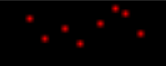

# 3. Utfordringer ([Detailed version](./DETAILED.md))


## [3.1. Utfordringer lett](./1_lett)

### [3.1.1_clmystery](./1_lett/clmystery)
clmystery is a open-source "A command-line murder mystery". This was basically identical to last years challenge, we can therefore use the same technique. Copy the files from `corax` to our local machine, and clone the `clmystery` source. Finially compare the directories and find the differences. 

```sh
$ scp -r cybertalent:~/3_utfordringer/1_lett/clmystery/mystery mystery2
$ git clone https://github.com/veltman/clmystery myster2
$ diff --no-dereference mystery/vehicles mystery2/vehicles
31830c31830
< Owner: Jeremy Bowers
---
> Owner: Victor Sidney
```

```sh
login@corax:~$ scoreboard Victor Sidney
Gratulerer, korrekt svar!
```

### [3.1.2_fibonacci](./1_lett/fibonacci)
Connecting to the server we are provided with randomly generated data (`fib(176)`), asking for the answer of `fib(176)`.

```sh
login@corax:~$ nc fibonacci 7600
fib(176)
pwn
Sorry, that was wrong
```

Calculating fib(x) can potentially be very slow, I therefore decided to download a static list ([`fib.txt`](./fib.txt)) of fibonacci numbers and use that to "calculate" the fibonacci numbers.
```sh
$ head -n 5 fib.txt
0 	0
1 	1
2 	1
3 	2
4 	3
```

##### [`solve.py`](./1_lett/fibonacci/solve.py)

```sh
$ python3 solve.py
Starting...
╭──────╮
│ FLAG ╰───────────────────────────╮
│ ce954ec88c3bef5ecf088239541c6b3f │
╰──────────────────────────────────╯
```

```sh
login@corax:~/scripts/fib$ scoreboard ce954ec88c3bef5ecf088239541c6b3f
Gratulerer, korrekt svar!
```

### [3.1.3_math](./1_lett/math)
#### 3.1.3_math_1
Simple challenge, curl the provided URL, find a link to the flag.
`login@corax:~$ curl math:7070`
```html
<p><a href="/flag_1">Flag 1</a></p><p><a href="/flag_2">Flag 2</a></p>
```
`login@corax:~$ curl math:7070/flag_1`
```html
 ──────╮
│ FLAG ╰───────────────────────────╮
│ 1f3191fabf49137b4a1c8e41d2cb3730 │
╰──────────────────────────────────╯
```

```sh
login@corax:~$ scoreboard 1f3191fabf49137b4a1c8e41d2cb3730
Gratulerer, korrekt svar!
```

#### 3.1.3_math_2

Continuing with flag #2 we find that it requires a specific user agent set.

`login@corax:~$ curl math:7070/flag_2`

> wrong user agent - must be Math Calculator (Python 3)

After setting the `User-Agent` header, we have a cookie set and are redirected to another location (`/challenge`).
```shell
login@corax:~$ curl math:7070/flag_2 -H "User-Agent: Math Calculator (Python 3)" -v

< Location: http://math:7070/challenge
--- snip ---
< Set-Cookie: user_id="!ACLXo5IfaJKH1CaFqyrYiw==?gASVIAAAAAAAAACMB3VzZXJfaWSUjBAyZDA3ZGQ5MTFiNDdhZDlmlIaULg=="
```

Executing the new request with a cookie set we are provided with a math equation, that we can easily solve with a dirty python script that `eval`s the equation (**_never do this_**). It is also important that we keep the same session as we have to solve multiple equations. After letting the script run for a few seconds, we are provided with the flag #2.
```shell
login@corax:~$ curl math:7070/challenge -H "User-Agent: Math Calculator (Python 3)" -H 'user_id="!ACLXo5IfaJKH1CaFqyrYiw==?gASVIAAAAAAAAACMB3VzZXJfaWSUjBAyZDA3ZGQ5MTFiNDdhZDlmlIaULg=='
33555-807979
```

##### [`solve.py`](./1_lett/math/solve.py)

```sh
$ python solve.py
╭──────╮
│ FLAG ╰───────────────────────────╮
│ 12ea10a72a5c3828a1f3141bd9e5030b │
╰──────────────────────────────────╯
```

```sh
login@corax:~/scripts/1_3_math$ scoreboard 12ea10a72a5c3828a1f3141bd9e5030b
Gratulerer, korrekt svar!
```


### [3.1.4_rusty_reversing_easy](./1_lett/rust_lett)
We are provided with a binary, and notice that it has be compiled with `debug_info` (debug symbols).
```sh
$ file rust_easy
rust_easy: setuid ELF 64-bit LSB pie executable, x86-64, version 1 (SYSV), dynamically linked, BuildID[sha1]=802d5f1d534235f77ae80115570e6efc5260f107, with debug_info, not stripped
```
Opening the binary with [Ghidra](https://ghidra-sre.org/) and searching for the string after `flag` we find the following strings:


We decompile the function where the string is used (`main`) and take note of the `Storage` class.


```c
Storage::new
Storage::check_password
Storage::get_flag
```
Checking the `Storage::new` method we find the start of the password: `this_super_secret_password_`


Continuing in the same function we see the following variables and put them togheter into one hex string: `32292e342d251e2f2e351e23241e263424323220232d24`
```c
  *puVar1 = 0x32;
  puVar1[1] = 0x29;
// --- snip ---
```

By [XORing](https://gchq.github.io/CyberChef/#recipe=From_Hex('Auto')XOR(%7B'option':'Hex','string':'41'%7D,'Standard',false)&input=MzIyOTJlMzQyZDI1MWUyZjJlMzUxZTIzMjQxZTI2MzQyNDMyMzIyMDIzMmQyNA) the data with `0x41` (`A`) we get the following string: `should_not_be_guessable`. Adding the two strings togheter we get our password and input it into the binary we finally get the flag.

```sh
login@corax:~/3_utfordringer/1_lett/rust_lett$ ./rust_easy
Enter password: this_super_secret_password_should_not_be_guessable
Flag: etj{rusty_binaries_are_not_thaaat_difficult_right}
```

```sh
login@corax:~/3_utfordringer/1_lett/rust_lett$ scoreboard etj{rusty_binaries_are_not_thaaat_difficult_right}
Gratulerer, korrekt svar!
```


### [3.1.8_punchcard](./1_lett/punchcard)

**Note:** I solved this challenge after the CTF.

From the Norwegian Armed Force's page about the [Cybertalent Program](https://www.forsvaret.no/jobb/talentprogram-cyberoperasjoner) we find the following image, and notice the dots on the horse, which look like old [punch cards](https://en.wikipedia.org/wiki/Punched_card).


---

#### Highlighting
After performing some image manipulation as an attempt to highlight the boxes even more, we notice very similar boxes to the left of the horse.


---

#### Pattern
There seemed to be a repeating pattern, and when drawing columns and rows we see that there are 12 rows, and repeating pattern every 11 column.


---

#### Big
Attempting to do the same to the boxes on the horse, we see that the same pattern exists there, albeit the last rows are offset a bit.


---

#### Grid
Further processing gives us the following grid.


|   	    | 1 | 2 | 3 | 4 | 5 | 6 | 7 | 8 | 9 | 10 | 11	|
|--------|---|---|---|---|---|---|---|---|---|----|----|
| **12** | X |   | X | X | X | X |   |   | X | X  | X 	|
| **11** |   | X	|   |   | X |   | X | X | X |    | X 	|
| **0**  |   | X	| X | X |   |   |   | X |   | X  |   	|
| **1**  |   |  	|   |   |   |   |   |   |   |    |   	|
| **2**  |   |  	|   |   |   |   |   |   |   |    |   	|
| **3**  |   |  	|   |   |   |   |   |   |   |    |   	|
| **4**  |   | X	|   |   |   |   | X | X |   |    |   	|
| **5**  |   |  	|   |   | X |   |   |   | X |    | X  |
| **6**  |   |  	|   |   |   |   |   |   |   |    |   	|
| **7**  |   |  	| X |   |   |   |   |   |   |    |   	|
| **8** 	| X |  	|   |   |   |   |   |   |   |    |   	|
| **9** 	|   |  	|   | X |   |   |   |   |   | X  |   	|

#### IBM-EBCDIC

We find that this pattern matches the IBM-EBCDIC punch cards.

> Before ASCII became the standard, many of the internal codes used to represent characters within computers were strongly influenced by the punched card code for characters. One of the most famous of such codes, and one that has persisted in use the longest, is, of course, EBCDIC (Extended Binary-Coded Decimal Interchange Code). The diagram below illustrates the relationship between EBCDIC and punched card code:
>
> 
> 
> [Source](http://quadibloc.com/comp/cardint.htm)

Now map the columns and rows to 0s and 1s, depending on where it's punched (X).

|   	    | 1 | 2 | 3 | 4 | 5 | 6 | 7 | 8 | 9 | 10 | 11	|
|--------|---|---|---|---|---|---|---|---|---|----|----|
| **12** | 1 | 0 | 1 | 1 | 1 | 1 | 0 | 0 | 1 | 1  | 1 	|
| **11** | 0 | 1	| 0 | 0 | 1 | 0 | 1 | 1 | 1 | 0  | 1 	|
| **0**  | 0 | 1	| 1 | 1 | 0 | 0 | 0 | 1 | 0 | 1  | 0 	|
| **1**  | 0 | 0 | 0 | 0 | 0 | 0 | 0 | 0 | 0 | 0  | 0 	|
| **2**  | 0 | 0 | 0 | 0 | 0 | 0 | 0 | 0 | 0 | 0  | 0 	|
| **3**  | 0 | 0 | 0 | 0 | 0 | 0 | 0 | 0 | 0 | 0  | 0 	|
| **4**  | 0 | 0	| 0 | 0 | 0 | 0 | 1 | 1 | 0 | 0  | 0 	|
| **5**  | 0 | 0 | 0 | 0 | 1 | 0 | 0 | 0 | 1 | 0  | 1  |
| **6**  | 0 | 0 | 0 | 0 | 0 | 0 | 0 | 0 | 0 | 0  | 0 	|
| **7**  | 0 | 0 | 1 | 0 | 0 | 0 | 0 | 0 | 0 | 0  | 0 	|
| **8** 	| 1 | 0	| 0 | 0 | 0 | 0 | 0 | 0 | 0 | 0  | 0 	|
| **9** 	| 0 | 0 | 0 | 1 | 0 | 0 | 0 | 0 | 0 | 1  | 0 	|

Extracting each column into a list gives us the following:
```
1.  100000000010
2.  011000100000
3.  101000000100
4.  101000000001
5.  110000010000
6.  100000000000
7.  010000100000
8.  011000100000
9.  110000010000
10. 101000000001
11. 110000010000
```

Adding them togheter gives us this string: `100000000010011000100000101000000100101000000001110000010000100000000000010000100000011000100000110000010000101000000001110000010000`

It should now be easy to map the column and rows to their characters, we therefore write a parser that does this for us and with that solve the challenge. We also see that the generated card matches the grid we found in the horse.

```sh
$ python parse_ibm-ebcdic.py code --generate-card 100000000010011000100000101000000100101000000001110000010000100000000000010000100000011000100000110000010000101000000001110000010000
Output: Hugin&Munin
```


[Huginn and Muninn](https://en.wikipedia.org/wiki/Huginn_and_Muninn) are two ravens that brought information to the most powerful Norse god, Odin. They can see every little movement on the earth, they hear every sound, and then they report back to Odin. That's the reason we can find the ravens in the Coat of Arms for the Norwegian Intelligence Service (Etteretningstjenesten).


You can also find them on the [frontpage of the CTF](https://ctf.cybertalent.no/).


```
login@corax:~$ scoreboard 'Hugin&Munin'
Kategori: 3.1. Utfordringer lett
Oppgave:  3.1.8_punchcard
Svar:     Hugin&Munin

Gratulerer, korrekt svar!
```

##### More fun
The script also allows us the create our own cards.

```sh
$ python parse_ibm-ebcdic.py --generate-card text 'Hello, thi$ is IBM-EBCDIC punch c@rd from [2021]'

100000000010101000010000110001000000110001000000110000001000001001000010000000000000011001000000101000000010101000000001010001000010000000000000101000000001011010000000000000000000100000000001100010000000010000100000010000000000100000010000100010000000100001000000100000100000100000000001100001000000000000000000110000000100011000100000110000010000101001000000101000000010000000000000101001000000000000100010110000000001101000100000000000000000101000001000110000000001110000001000110000100000000000000000100010000010000010000000001000000000000010000000000100000000001010000010
```


```
$ python parse_ibm-ebcdic.py --generate-card text klarz
Output: 110010000000110001000000101100000000110000000001011000000001


$ python parse_ibm-ebcdic.py code 110010000000110001000000101100000000110000000001011000000001
Output: klarz
```


###### [`parse_ibm-ebcdic.py`](./1_lett/punchcard/parse_ibm-ebcdic.py)


### [3.1.9_secret](./1_lett/secret)

**Note:** I solved this "challenge" after the CTF.

From the Norwegian Armed Force's page about the [Cybertalent Program](https://www.forsvaret.no/jobb/talentprogram-cyberoperasjoner) we find the following image, that contains some shell commands. We see that a file was moved to /dev/shm, and find the secret there.


```
login@corax:~$ ls -altr /dev/shm/
total 4
drwxr-xr-x 5 root root 340 Jan 21 15:45 ..
-rw-r--r-- 1 root root  33 Jan 21 15:45 .secret
drwxrwxrwt 2 root root  60 Jan 21 15:45 .
login@corax:~$ cat /dev/shm/.secret
7238876002abdfd7f091fa8978cbadee
```

```
login@corax:~$ scoreboard 7238876002abdfd7f091fa8978cbadee
Kategori: 3.1. Utfordringer lett
Oppgave:  3.1.9_secret
Svar:     7238876002abdfd7f091fa8978cbadee

Gratulerer, korrekt svar!
```


## [3.2. Utfordringer middels)(./2_middels)

### [3.2.1_coordinate](./2_middels/coordinate)

We are given the following image.


Using `zsteg` we find interesting data in the `green` and `blue` layer of the image, and assume that each of the sub-challenges are related to their own layer (`r`, `g`, `b`, `a` => `red`, `green`, `blue`, `alpha`)

```shell
$ zsteg -a
b8,g,lsb,xy         .. text: "[ X, Y, Z ] =\r\n[[ 4.46951449e+00, 2.56443868e+01, 4.82221609e+01, 2.75919604e+00,\r\n   6.39779539e+00, 5.82768924e+00, 4.59417363e+01, 1.02990843e+01,\r\n   9.02752721e+00, 2.95875663e+01, 5.21653404e+01, 7.40382644e+00,\r\n   1.87583859e+01, 4.15926138e+00, 2."
b8,b,lsb,xy         .. text: "[37.4040208986156, -122.11557126842482]\r\n[38.88824944889722, -77.02301190382201]\r\n[34.17304019448849, -117.88486574343878]\r\n[26.16538153242349, -80.31681550621417 ]\r\n[52.540198575411445, 13.626773749372456]\r\n[53.51014017498718, -2.395029415893364]\r\n[41.590"
```


#### [3.2.1_coordinate_r](./2_middels/coordinate/r)

The red layer has 8 red pixels.



We check the positioning of the pixels with a small script, and find the pixels at the following coordinates.

```
x	y
98	3
101	7
105	5
108	8
112	4
115	1
117	2
120	6
```

The x coordinates are within the decimal ASCII range and transform them as such.

###### [solve_r.py](./2_middels/coordinate/r/solve_r.py)

```sh
$ python3 solve_r.py
Flag: subpixel
```

```sh
login@corax:~$ scoreboard subpixel
Gratulerer, korrekt svar!
```


#### [3.2.1_coordinate_g](./2_middels/coordinate/g)

From our initial checking, we know that the green layer contains embedded XYZ coordinates.

```sh
$ zsteg coordinate.png -e b8,g,lsb,xy > b8_g.txt
$ cat b8_g.txt | head -n 3
[ X, Y, Z ] =
[[ 4.46951449e+00, 2.56443868e+01, 4.82221609e+01, 2.75919604e+00,
   6.39779539e+00, 5.82768924e+00, 4.59417363e+01, 1.02990843e+01,
```

Plotting this with `matplotlib` and its `scatter(X, Y, Z)` function, we get the following image.

`$ python solve_g.py`


##### [`solve_g.py`](./2_middels/coordinate/g/solve_g.py)

```sh
login@corax:~$ scoreboard focal point
Gratulerer, korrekt svar!
```


#### [3.2.1_coordinate_b](./2_middels/coordinate/b)

Instead of writing down the number manually, we extract the embedded data.
```shell
$ zsteg coordinate.png -e b8,b,lsb,xy > b8_b.txt
[37.4040208986156, -122.11557126842482]
[38.88824944889722, -77.02301190382201]
--- snip ---
```

The data looks like GPS coordinates, and when plotting them into Google Maps we see that they are coordinates to streets/rivers/buildings that are supposed to look like letters, giving us the following:

* `37.4040208986156, -122.11557126842482`


Adding them togheter gives us the flag: `FONTSIZE`.


```sh
login@corax:~$ scoreboard FONTSIZE
Gratulerer, korrekt svar!
```

#### [3.2.1_coordinate_a](./2_middels/coordinate/a)

This was solved easily with `stegosolve`, we find the following QR code in **Alpha plane 1**. 


Scanning the QR code gives us `w3w:///daytime.hacking.above` and finially coordinates to the lake named `Lutvannet`.

https://what3words.com/daytime.hacking.above

```shell
login@corax:~/3_utfordringer/2_middels/coordinate$ scoreboard Lutvannet
Gratulerer, korrekt svar!
```


### [3.2.2_minesweeper](./2_middels/minesweeper)
We are supposed to create a [Minesweeper](https://en.wikipedia.org/wiki/Minesweeper_(video_game)) client that communicates with a server over [gRPC](https://grpc.io/).

The challenge is seperated into 3 levels, where we have to solve each level within x amount of seconds:
- **Easy**: 1 board, max 1 hour.
- **Medium**: 7 boards, max 10 seconds per board.
- **Hard**: 2 boards, max 5 seconds per board.

#### Client

```shell
$ python -m grpc_tools.protoc \
-I./ \
--python_out=. \
--grpc_python_out=. \
./minesweeper.proto
```

I based my solver on [another solver](https://github.com/madewokherd/mines) and used it as a helper to my solver.
You can find my solver [here](./2_middels/minesweeper/client.py).

#### Flags

To somewhat mitigate the slow and unoptimized solver, I decided to setup a port forward with `socat` (another option is [`shuttle`](https://github.com/sshuttle/sshuttle)) and run the solver locally.


```shell
login@corax:~$ scoreboard 0b5408469e617df0e380b7364cdc1d27
Gratulerer, korrekt svar!
```
```shell
login@corax:~$ scoreboard 5315005b2ad1fbfc2ceaa9a20d646383
Gratulerer, korrekt svar!
```
```shell
login@corax:~$ scoreboard f94148481b7e295ebfb74490838f5c57
Gratulerer, korrekt svar!
```

### [3.2.3_transfer](./2_middels/transfer)

We are provided with a README, some documentation, which has been heavily redacted, and a network traffic capture file (`capture.pcapng`).

#### [3.2.3_transfer_easy](./2_middels/transfer/easy)

The documentation provides information in regards to the transfer protocol. We finish skimming through it and continue by opening the `pcapng` in Wireshark and extract every "transfer" packet and start splitting up the data in the packets as noted in the documentation. 

---

##### Reversing
We know that the interesting data will be in the `CONTENT` header and attempt to decode the hex values of the first packets, and then notice that the unhexed content is in fact **base64** encoded strings. 

| # | HEX | BASE64 | DECODED |
| - | - | - | - | 
| 1 | 5a33566c633351365a33566c6333513d | Z3Vlc3Q6Z3Vlc3Q= | guest:guest |
| 2 | 556b4d30 | UkM0 | RC4 |
| 3 | 4f37564733624461513671654d6d537a453035357a72526a3951334d306e61523156436c7037704e73413d3d | O7VG3bDaQ6qeMmSzE055zrRj9Q3M0naR1VClp7pNsA== | **_RAW DATA_** |
| 4 | 5a4254577a7162314e727532796d714d5835516c72673d3d | ZBTWzqb1Nru2ymqMX5Qlrg== | **_RAW DATA_** |

---

##### Encryption
Packet #3 and #4 contain raw that after we decoded them, but the packet before (packet #2) hint us toward [RC4 (Rivest Cipher 4)](https://en.wikipedia.org/wiki/RC4), which is a stream cipher. Knowing this, we assume that packet #3 contains the decrypted data, and packet #4 contains the key provided to the user after it logged in with `guest:guest` as username and password.

Plotting this into [CyberChef](https://gchq.github.io/CyberChef/#recipe=From_Base64('A-Za-z0-9%2B/%3D',true)RC4(%7B'option':'Base64','string':'ZBTWzqb1Nru2ymqMX5Qlrg%3D%3D'%7D,'Latin1','Latin1')&input=TzdWRzNiRGFRNnFlTW1TekUwNTV6clJqOVEzTTBuYVIxVkNscDdwTnNBPT0) we successfully decrypted the packet contents:
```sh
ls /tmp/transfer
FLAG_1
FLAG_2
```

---

##### Flag

Now that we know that the communication between the client and the server is encrypted with RC4, we continue with appending the contents of each packet.

Plotting this into [CyberChef](https://gchq.github.io/CyberChef/#recipe=From_Hex('None')RC4(%7B'option':'Base64','string':'ZBTWzqb1Nru2ymqMX5Qlrg%3D%3D'%7D,'Latin1','Latin1')&input=M2JiNTQ2ZGRiMGRhNDNhYTllMzI2NGIzMTM0ZTc5Y2ViNDYzZjUwZGNjZDI3NjkxZDU1MGE1YTdiYTRkYjAzNDFlZjFiM2NhMDE1MzA2ZTM5NTA0OGRhZTY3YzkwNGJjNzYyOTNkMzM2ODg4OWUwNWE0YzE0YzNhZDVhNWU3NWJlMWRlZTM1YTlhM2U5YWUwN2ZiNjZiYmYxYzI3NGYwYzhiZjViYTljN2RlMzBlMGIxOTg0NjZiYzQ1MGUxNjBkYWU5NjliN2ExOGE1MTI5MDU1NjE4NDAyNDc4NmU2YmY5N2QzZDQ1YWI2NGVkMzQ2NDJmZjI3N2ZmZGM5NDM2OWQ2MmNjMTY2MjRlYmIyMWEwMWZkM2ZlNDAyZDUzOWZiNjViOTQ4OWM4YzU3Njg2ODRlMDdlYmE3NzliNzY1MmRmYmQxYzc3ODM3NzAyNmIwYzY2ZDkyMzI5MzkyNDViNjI3YjU1MDIyODAyYjQyNTJhNjZmZjllMGExYzMxOWQ3YzY1OTZmODMzNzk1YWRhNWM5NzkyNWJhYjNlMjI0ODU0OTc1NzkwNzE5ZDI2ZjNjNjcxNjlkZWE3NWQ3MTFmZjcxNjAzZDE0ZGNmODc4MTg4OTlkNjYxZWI4OGYxN2ZjMDYwYTNmNDVhMDhiZGJkM2MwZWM3YTExYjIwMDQ1NGM2NjBiYzlmMjg1NWVmMmZhODFiNGZhZTc3ZWJhMDBmMmI4YTAyMzI5M2Y2OTdlOGIxMzdjZDA2M2VmYTJhMGZjNzMwNzEwNjgwYmJmMTY5YTQ4ZTg5OWRiZmM1MTZlNDRlMWJkOTI2ZmVkODVhZDg1MjM0N2UzODdhYzc4MDZkNGNhZjkyNTdiMWRmYTVmMDIwMTA1NTVlNGY0OTA0Zjg3YTA5MDcyMzY4M2Y5ZTUyN2VkNzkyYzFmNDZhY2EzNGRkNjMzNmQ1NjgwNzU2ZDFhNjIxMjJjYWMzMjYxYmExMTg5MTA3MTAwYTI3MjUzYTA3ZmQ3MjkyYjJiYTczZTBkNjgyNTkxOWQzOGVhODRkY2Q2Y2E5NjQyMGI1NWM3ZTM1NzIzMzhiZWZjMThiNDcwY2RjYTcwYjI1NzljMjQyOTZmNzUzY2UxMmYyMzc5ZTI1ODEyMjc5ODUyNTMxZjlhMjZjODJjYmM4ZmQ2MTZmOTMwMDhiMmIwMTNmNDIzZmExNA) again we are provided with the first flag.

```sh
// --- snip ---
â.. 0a6c08918fc64daa57b4faa13f60db8b â..
// --- snip ---
```

```sh
login@corax:~$ scoreboard 0a6c08918fc64daa57b4faa13f60db8b
Gratulerer, korrekt svar!
```


#### [3.2.3_transfer_medium](./2_middels/transfer/medium)

We recall from **3.2.3_transfer_easy** that there is a `FLAG_2` in `/tmp/transfer`, and therefore need to implement the transport protocol so that we can fetch the flag.

---

##### Instructions
We start by going back to the documentation, coupled with the decrypted packets and start defining the instructions.

| VALUE | INSTRUCTION NAME |
| - | - |
| 0 | Connect |
| 1 | Login |
| 2 | Okay |
| 3 | List files |
| 4 | ? |
| 5 | Open file |
| 6 | Print file |
| 7 | Write to file |
| 8 | ? |
| 9 | Request credentials |
| 10 | Encryption key |
| 11 | Encryption algorithmn |
| 12 | Success |
| 13 | Failure |
| >13 | NoOp (Other) |

---

##### Transfer Client
I decided it would be easier to simply implement the entire transfer protcol in a transfer client CLI, you can find it [here](./2_middels/transfer/medium/transfer_client.py). With this I found that instruction #4 was used to change directories, whilst instruction #8 was used to disconnect.

**Foreshadowing:** this CLI will be **_very_** helpful later on.

---

##### Flag

```bash
$ python transfer_client.py transfer 1334
root@transfer:/tmp/transfer$ ls
FLAG_1
FLAG_2
root@transfer:/tmp/transfer$ cat FLAG_2
╭──────╮
│ FLAG ╰───────────────────────────╮
│ cd29703ea8013a4b9c2df2ad0ade9594 │
╰──────────────────────────────────╯
```

```
login@corax:~$ scoreboard cd29703ea8013a4b9c2df2ad0ade9594
Gratulerer, korrekt svar!
```


## [3.2.4_rusty_reversing_medium](./2_middels/rust_middels)

We are again provided with a binary with `debug_info` (debug symbols) set.

Attempting the same method as last time (searching for `flag` in the defined strings) we are presented with this part within the `main` function.


#### gdb
Not seeing any obvious flags/passwords here we attempted to use [peda](https://github.com/longld/peda) version of [`gdb`](https://www.gnu.org/software/gdb/) and break at the `core::str::converts::from_utf8` function.
_Do note that I am very new to gdb, and there are most likely better ways to solving this_.

We set a breakpoint (`b from_utf8`) at the `from_utf8` function, run the binary, and input some random password.

```
$ gdb -q rust_medium
Reading symbols from rust_medium...
gdb-peda$ b from_utf8
Breakpoint 1 at 0x4754b: file library/core/src/str/converts.rs, line 86.
gdb-peda$ r
Starting program: 3_utfordringer/2_middels/rust_middels/rust_medium
Enter password: PASSWORD
// --- snip ---
[-------------------------------------code-------------------------------------]
// --- snip ---
=> 0x7f404b1df54b <_ZN4core3str8converts9from_utf817h68bd5c9d8606b0ebE+11>:	mov    rcx,rdx
// --- snip ---
Breakpoint 1, core::str::validations::run_utf8_validation () at library/core/src/str/validations.rs:121
121	library/core/src/str/validations.rs: No such file or directory.
```

#### Password and flag
After typing a random password we continue the program (`c` = `continue`), and take a notice of the `RSI` register, containing the password `the_secret_password_is_secret_and_hidden`.
```
gdb-peda$ c
Continuing.
[----------------------------------registers-----------------------------------]
// --- snip ---
RSI: 0x555556056760 ("the_secret_password_is_secret_and_hidden")
// --- snip ---
R12: 0x555556056760 ("the_secret_password_is_secret_and_hidden")
// --- snip ---
[-------------------------------------code-------------------------------------]
// --- snip ---
=> 0x7f404b1df54b <_ZN4core3str8converts9from_utf817h68bd5c9d8606b0ebE+11>:	mov    rcx,rdx
[------------------------------------stack-------------------------------------]
// --- snip ---
0048| 0x7fff2eb21d58 --> 0x555556056760 ("the_secret_password_is_secret_and_hidden")
// --- snip ---
Breakpoint 1, core::str::validations::run_utf8_validation () at library/core/src/str/validations.rs:121
121	in library/core/src/str/validations.rs
```

```
$ ./rust_medium
Enter password: the_secret_password_is_secret_and_hidden
Flag: etj{rust_sure_creates_long_and_weird_function_names}
```

```
login@corax:~$ scoreboard etj{rust_sure_creates_long_and_weird_function_names}
Gratulerer, korrekt svar!
```


## [3.3. Utfordringer vanskelig](./3_vanskelig)

### [3.3.1_euler](./3_vanskelig/euler)

#### [3.3.1_euler_1](./3_vanskelig/euler/1)

Simple challenge where we are supposed to calculate each equation separately and use the results (ASCII charactercodes) to concat them into a string. I used Python, [SageMath](https://www.sagemath.org/), [SymPy](https://www.sympy.org/en/index.html) (for Eulers Polynomial), and some mathematical principles.

###### [`solve_1.py`](./3_vanskelig/euler/1/solve_1.py)
```sh
$ python solve_1.py
Flag: Kunstkammer
```

```sh
login@corax:~$ scoreboard kunstkammer
Gratulerer, korrekt svar!
```

#### [3.3.1_euler_2](./3_vanskelig/euler/2)

We are given hints regarding [William Rowan](https://en.wikipedia.org/wiki/William_Rowan_Hamilton) and _Cycles_ (Sykler).

---

##### Mapping
Mapping each node to their own ID makes it easier to process later on (I almost missed one node, this it has the ID of `99`).


With the nodes and their edges mapped, we can now generate our own graphs:


---

##### Solution
Knowing that the problem is NP-Complete we can attempt to brute force the solution, and after some searching we find [this method](
https://gist.github.com/mikkelam/ab7966e7ab1c441f947b) and add it to the final code.

####### [solve_2.py](./3_vanskelig/euler/2/solve_2.py)

---

##### Flag
```sh
$ python solve_2.py
Answer:   av  norge  viten  om  veedrn  for  vern
```
The sentence does not seem correct, but after a quick Google search we find the Norwegian Armed Force's [yearly focus report **FOKUS 2020**](https://www.forsvaret.no/aktuelt-og-presse/publikasjoner/fokus/Fokus%202020.pdf/_/attachment/inline/639faaf2-7009-4056-9e0d-6dc5a6c5519b:1b228e374a207c8f79b1d8a166d902d7c0edd5e1/Fokus%202020.pdf) with the text `VITEN OM VERDEN FOR VERN AV NORGE` on the frontpage.

```sh
login@corax:~$ scoreboard viten om verden for vern av norge
Gratulerer, korrekt svar!
```

---

#### [3.3.1_euler_3](./3_vanskelig/euler/3)

##### `h`

We are provided with a binary (`h`), we see that it generates 2 numbers based on the input number.
```shell
$ ./h 1
0, 1
$ ./h 2
1, 2
$ ./h 3
2, 2
```

After attempting to enter invalid characters, we are presented with this output (this can also be found if we open the binary in Ghidra).

```shell
$ ./h -

usage: ./h [options] [one_number]

numbers starting with '0' are treated as octal,
numbers starting with '0x' are treated as hexadecimal
```

Trying the verbose flag (`-v`) we see that the binary uses [Miseve](https://github.com/radii/msieve), "A Library for Factoring Large Integers".
```shell
$ ./h -v 1
Msieve v. 1.54 (SVN unknown)
--- snip ---
```
Msieve is a library that performs integer factorization with various algorithmns.

##### Pattern
Knowing that there is some form of factorization in play, we continue by looking at the pattern between the numbers. Notice when the input is **5**, how the last number (**2**) of the output (**4, 2**), corresponds with the first number (**2**) of the output (**2, 6**) when the input is **6** (5 + 1).

```shell
$ ./h 5
4, 2
$ ./h 6
2, 6
$ ./h 7
6, 4
```

In other words, the binary `h` does the following: `h(n) = f(n), f(n + 1)`, where `n` is the input number and `f` is function that calculates the value.

##### Numbers
We find [Euler's totient function](https://en.wikipedia.org/wiki/Euler%27s_totient_function) (also called Euler's phi function).

Using this, we can test the same numbers that we passed into the `h` binary above, and see that they matches.
```shell
# $ ./h 5 
φ(5) = 4
φ(6) = 2
φ(7) = 6
φ(8) = 4
```
---

##### 3.3.1_euler_3a
> h(n) = 8, 8

This is easily solveable by pure bruteforcing, `n = 15` because:

```
φ(15) = 8
φ(15 + 1) = φ(16) = 8
h(15) = 8, 8
```

```
login@corax:~$ scoreboard 15
Gratulerer, korrekt svar!
```
---

##### 3.3.1_euler_3b
> h(n) = 217772874500023635365563422386019273512381236824318290514357322123165713825792, 636647330747919895136525940302294632068470331232708261863503953920000000000000

Here we use [factordb](http://factordb.com/index.php?query=217772874500023635365563422386019273512381236824318290514357322123165713825792) to provide us with the facotrization of `217772874500023635365563422386019273512381236824318290514357322123165713825792`: `2^100 * 3^99`.

Here we can consider primes and primes to a power, `P = 2^a * 3^b * 5^c...`, in this case we assume `n = 2^a * 3^b`, as every number has to be prime factored this way. 

> If the prime factorisation of n is given by n = p_1^e_1*...*p_n^e_n, then φ(n) = n *(1 - 1/p_1)* ... (1 - 1/p_n).
[Source](https://www.doc.ic.ac.uk/~mrh/330tutor/ch05s02.html)

Writing a quick bruteforce to find `a` and `b` we get the following:

###### [`brute.py`](./3_vanskelig/euler/3/brute.py)

```shell
$ python brute.py
Found n: 2^100 * 3^100 = 653318623500070906096690267158057820537143710472954871543071966369497141477376
```

```
login@corax:~$ scoreboard 653318623500070906096690267158057820537143710472954871543071966369497141477376
Gratulerer, korrekt svar!
```
---

##### 3.3.1_euler_3c
> h(n) = 9000000000000000000000000000000000000000000000000000000000, 3756326117848493706034345777213934145547380150921415411200

> **Example 3.8.3** If p is a prime, then ϕ(p) = p − 1, because 1, 2, …, p − 1 are all relatively prime to p, and 0 is not.
>
> **Theorem 3.8.4** If p is a prime and a is a positive integer, then
ϕ(p^a) = p^a − p^a−1
[Source](https://www.whitman.edu/mathematics/higher_math_online/section03.08.html)

Using **Example 3.8.3** we test for `p = (a + 1)`, where `a` is our first number (`900000000...`):
```
is_prime(9000000000000000000000000000000000000000000000000000000000 + 1) = true
ϕ(9000000000000000000000000000000000000000000000000000000000 + 1) = 9000000000000000000000000000000000000000000000000000000000
```

```
login@corax:~$ scoreboard 9000000000000000000000000000000000000000000000000000000001
Gratulerer, korrekt svar!
```
---

##### 3.3.1_euler_3d
> d) h(n) = 200000000000001220000000000000120, 99999922911895859181617256996352
> (hint: n = p · q)

Here we are given an additional hint, that `n = p * q`, referring to [RSA](https://en.wikipedia.org/wiki/RSA_(cryptosystem)).

Having a smaller number in this challenge, we can attempt to find [the number of solutions of φ(x) = m](https://faculty.math.illinois.edu/~ford/wwwpapers/sierp.pdf) (or [here](http://www.numbertheory.org/php/carmichael.html).)

Instead making something ourselves, we use [Wolfram Alpha](https://www.wolframalpha.com/input/?i=phi%28n%29%3D200000000000001220000000000000120) to find possible `n`s in `ϕ(n) = 200000000000001220000000000000120`:

###### [`find_3d.py`](./3_vanskelig/euler/3/find_3d.py)

`Found n: 200000000000001250000000000000183`

```
login@corax:~$ scoreboard 200000000000001250000000000000183
Gratulerer, korrekt svar!
```


### [3.3.2_rusty_reversing_hard](./3_vanskelig/rust_vanskelig)
We are yet again provided with a binary, but this time without `debug_info`.

Opening the binary in Ghidra also doesn't help, we continue with `gdb` and use `CTRL + C` when prompted for a password, and the continue with stepping until we find something interesting.

By watching the registers and stack whilst stepping over functions, we see the the `RBX` register changing with various characters, and the we start seeing something appear in the stack: `sometimes_a_password_is_not_very_long_but_this_one_actually_is_supe`. 

```
[----------------------------------registers-----------------------------------]
RAX: 0x555556f7d823 --> 0x0
RBX: 0x72 ('r')
// --- snip ---
[------------------------------------stack-------------------------------------]
// --- snip ---
0016| 0x7fffb4a551c0 --> 0x555556f7d7e0 ("sometimes_a_password_is_not_very_long_but_this_one_actually_is_supe")
// --- snip ---
```

```sh
[----------------------------------registers-----------------------------------]
RAX: 0x555556f7d823 --> 0x72 ('r')
RBX: 0x72 ('r')
--- snip ---
[------------------------------------stack-------------------------------------]
0008| 0x7fffb4a551b8 --> 0x555556f7d7c0 ("PASSWORD\n\360ly\227\177")
0016| 0x7fffb4a551c0 --> 0x555556f7d7e0 ("sometimes_a_password_is_not_very_long_but_this_one_actually_is_super")
--- snip ---
```

And finially giving us:

```sh
0016| 0x7fffb4a551c0 --> 0x555556f7d7e0 ("sometimes_a_password_is_not_very_long_but_this_one_actually_is_super_duper_long")

```

```sh
login@corax:~/3_utfordringer/3_vanskelig/rust_vanskelig$ ./rust_hard
Enter password: sometimes_a_password_is_not_very_long_but_this_one_actually_is_super_duper_long
Flag: etj{i_did_not_know_rust_did_dynamic_dispatch_with_such_weird_vftable_placement}
```

```sh
login@corax:~/3_utfordringer/3_vanskelig/rust_vanskelig$ scoreboard etj{i_did_not_know_rust_did_dynamic_dispatch_with_such_weird_vftable_placement}
Gratulerer, korrekt svar!
```


## [3.4. Utfordringer umulig](./4_umulig)
### [3.4.8_transfer_root](./4_umulig/README.md#348_transfer_root)
Having created a complete CLI for the [transfer client](./2_middels/transfer/medium/transfer_client.py) earlier, we can connect to the transfer server and navigate around the file system and find a flag in `/root/FLAG`.

```shell
$ python transfer_client.py transfer 1334
root@transfer:/tmp/transfer$ cd /root
root@transfer:/root$ ls
.bashrc
.profile
FLAG
transfer
root@transfer:/root$ cat FLAG
╭──────╮
│ FLAG ╰───────────────────────────╮
│ 2692ac1fb3e881ab73240db60dd03ae7 │
╰──────────────────────────────────╯
root@transfer:/root$
```

```shell
login@corax:~$ scoreboard 2692ac1fb3e881ab73240db60dd03ae7
Gratulerer, korrekt svar!
```


