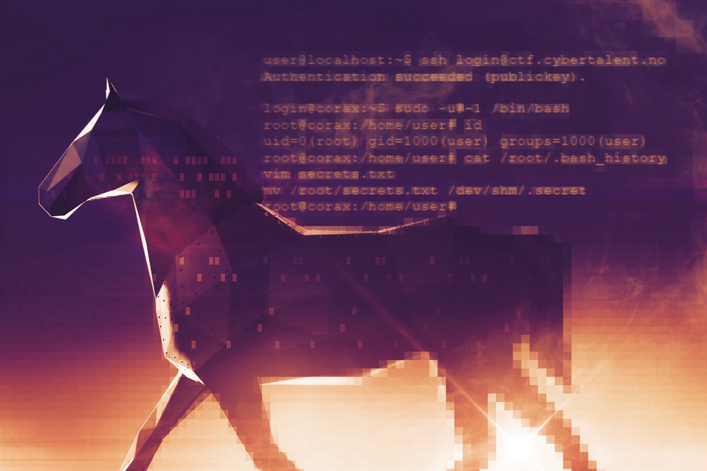
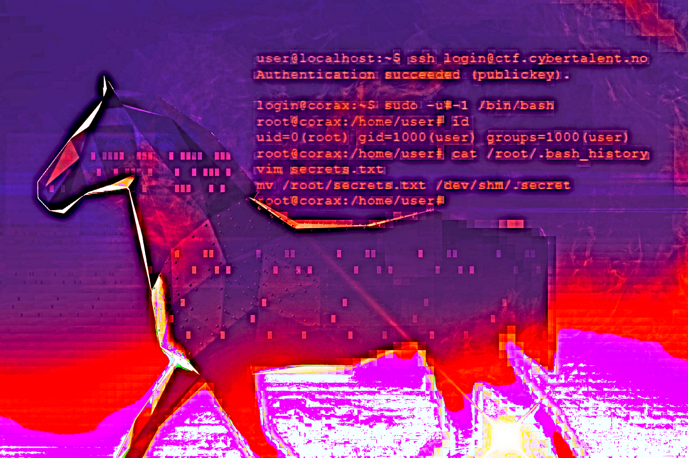
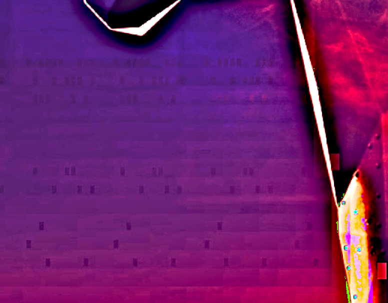
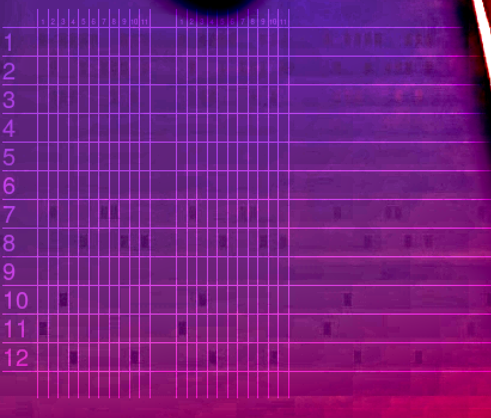
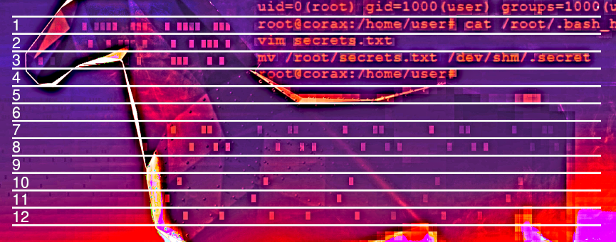
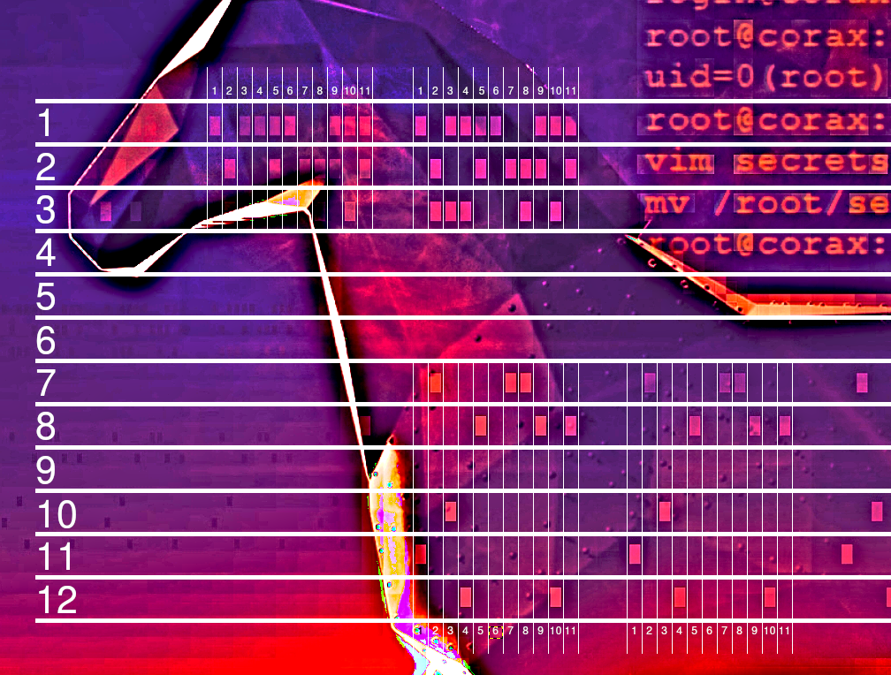
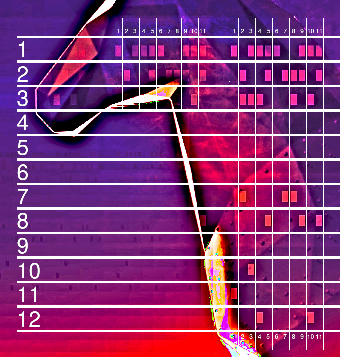
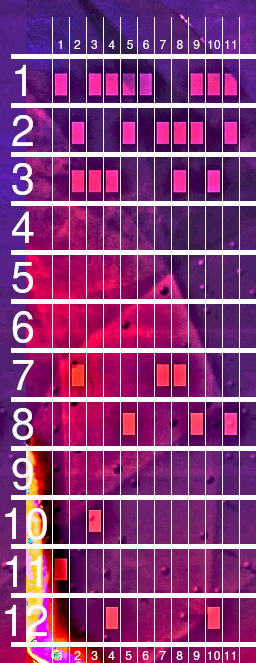
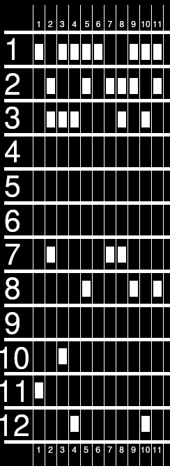
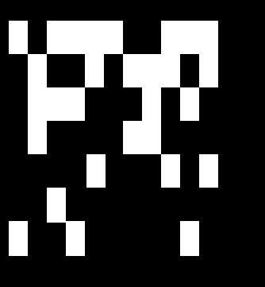

# 0. Horse

This resulted in no flag and is therefore here only to document the attempts.

From the Norwegian Armed Force's page about the [Cybertalent Program](https://www.forsvaret.no/jobb/talentprogram-cyberoperasjoner) we find the following image, and notice the dots on the horse, which look like old [punch cards](https://en.wikipedia.org/wiki/Punched_card).



---

## Highlighting
After performing some image manipulation as an attempt to highlight the boxes even more, we notice very similar boxes to the left of the horse.




---

## Pattern
There seemed to be a repeating pattern, and when drawing columns and rows we see that there are 12 rows, and repeating pattern every 11 column.



---

## Big
Attempting to do the same to the boxes on the horse, we see that the same pattern exists there, albeit the last rows are offset a bit.








---

## Grid
Further processing gives us the following grid.

 

|   	    | 1 | 2 | 3 | 4 | 5 | 6 | 7 | 8 | 9 | 10 | 11	|
|--------|---|---|---|---|---|---|---|---|---|----|----|
| **12** | X |   | X | X | X | X |   |   | X | X  | X 	|
| **11** |   | X	|   |   | X |   | X | X | X |    | X 	|
| **0**  |   | X	| X | X |   |   |   | X |   | X  |   	|
| **1**  |   |  	|   |   |   |   |   |   |   |    |   	|
| **2**  |   |  	|   |   |   |   |   |   |   |    |   	|
| **3**  |   |  	|   |   |   |   |   |   |   |    |   	|
| **4**  |   | X	|   |   |   |   | X | X |   |    |   	|
| **5**  |   |  	|   |   | X |   |   |   | X |    | X  |
| **6**  |   |  	|   |   |   |   |   |   |   |    |   	|
| **7**  |   |  	| X |   |   |   |   |   |   |    |   	|
| **8** 	| X |  	|   |   |   |   |   |   |   |    |   	|
| **9** 	|   |  	|   | X |   |   |   |   |   | X  |   	|

### Reversed (Upside down)

|   	    | 1 | 2 | 3 | 4 | 5 | 6 | 7 | 8 | 9 | 10 | 11	|
|--------|---|---|---|---|---|---|---|---|---|----|----|
| **12** |   |   |   | X |   |   |   |   |   | X  |   	|
| **11** | X |  	|   |   |   |   |   |   |   |    |   	|
| **0**  |   |  	| X |   |   |   |   |   |   |    |   	|
| **1**  |   |  	|   |   |   |   |   |   |   |    |   	|
| **2**	 |   |  	|   |   | X |   |   |   | X |    | X 	|
| **3**	 |   | X	|   |   |   |   | X | X |   |    |   	|
| **4**	 |   |  	|   |   |   |   |   |   |   |    |   	|
| **5**	 |   |  	|   |   |   |   |   |   |   |    |    |
| **6**	 |   |  	|   |   |   |   |   |   |   |    |   	|
| **7** 	|   | X	| X | X |   |   |   | X |   | X  |   	|
| **8** 	|   | X	|   |   | X |   | X | X | X |    | X 	|
| **9**  | X |  	| X | X | X | X |   |   | X | X  | X 	|

---

---

## Decoding

We notice that column `8`, `9`, `10`, and `11` are identical to column `2`, `5`, `4`, `5` respectively. We use this information and map each unique column to their own character (`1=A, 2=B, 3=C, etc.`), resulting in the following string: `ABCDEFGBEDE`.

| 1 | 2 | 3	| 4	| 5 | 6	| 7	| 8	| 9	| 10	| 11	|
|---|---|---|---|---|---|---|---|---|----|----|
| 1 | 2	| 3	| 4 | 5	| 6	| 7 | 2 | 5	| 4  | 5  |
| A | B	| C	| D | E	| F	| G | B | E	| D  | E  |
 
 ---
 
## Bruteforcing
We write the following Python script to attempt to find a word that match these characteristics.

#### find_word.py
```python
import sys

# 0 1 2 3 4 5 6 7 8 9 10
# A B C D E F G B E D E

ignored_indexes = (1, 3, 4, 7, 8, 9, 10)

with open(sys.argv[1], "rb") as f:
    wordlist = f.read().splitlines()

for word in wordlist:
    if len(word) != 11:
        continue

    B = word[1]
    D = word[3]
    E = word[4]
    chars = (B, D, E)

    if (word[7] != B) \
    or (word[9] != D) \
    or (word[8] != E or word[10] != E) \
    or (word[7] == E or word[7] == D) \
    or (word[8] == B or word[8] == D) \
    or (word[10] == B or word[7] == D) \
    or (word[9] == E or word[9] == B): \
        continue

    used_chars = set()
    for i, c in enumerate(word):
        if i in ignored_indexes:
            continue
        if c in chars or c in used_chars:
            break
        used_chars.add(c)
    else:
        print(word.decode(errors="ignore"))

```

Using the Norwegian Scrabble Association's  [2020 wordlist](https://www2.scrabbleforbundet.no/?p=4527) results with the following words:
```sh
$ python find_word.py nsf2020.txt
bakerivarer
brunevarene
magnesiaene
moderatorer
```

Doing the same with `rockyou` results with the following words:
```sh
$ python find_word.py rockyou.txt
roylichoili
primextreme
carlospaolo
```

**Note:** `CYBERTALENT` has a length of `11` characters, but does not fit the characteristics that we have found above.

---

## Desperation

In a last-ditch effort, we color each cell, based on if they have a box or not, and finially remove the rows with no boxes.

