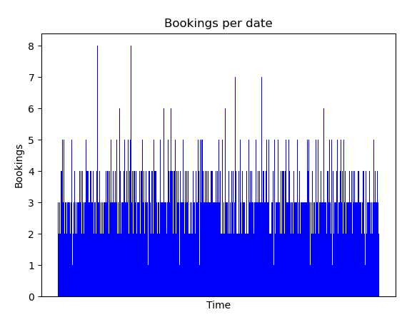
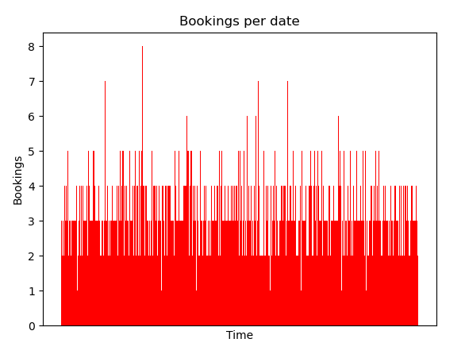
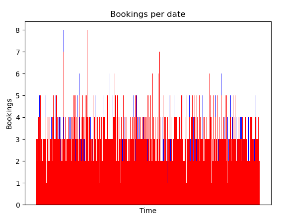
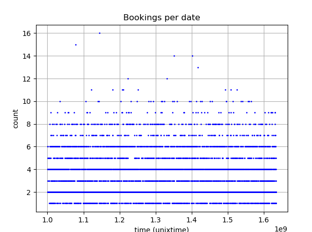
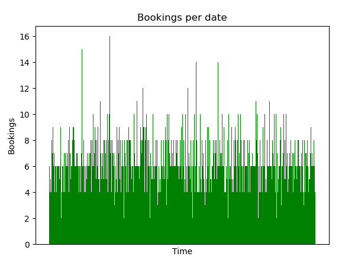

# 2_seatheworld_bookings_parser

With the bookings data list downloaded via. the [data set downloader](../2_seatheworld_data_set_downloader), we can now take a closer look at the bookings themselves.

`$ python parse_bookings.py`

```sh
$ cat bookings.json | jq | head -n 13
[
  {
    "reference": "LMEVO",
    "departure_airport": "CWA",
    "departure_date": "2010-09-15",
    "departure_time": "09:25",
    "arrival_airport": "EWR",
    "arrival_date": "2010-09-15",
    "arrival_time": "13:30",
    "first_name": "EUNICE",
    "last_name": "HOUGHTON",
    "name": "EUNICE HOUGHTON"
  },
```

---

In another desperate attempt, we try to map the amount of bookings per date over time to see if there is any pattern that we can use, without luck here as well.

#### Departures


---

#### Arrivals


---

#### Both




---

#### Combined



---

#### `parse_bookings.py`
```python
import json
import datetime
import collections

import matplotlib
import matplotlib.pyplot as plt
import numpy as np

with open("./IBMUSER.SEATW.BOOKINGS") as f:
    raw_bookings = f.read().split("\x00")

bookings = []
dates = collections.defaultdict(int)
dates = {
    "departure": collections.defaultdict(int),
    "arrival": collections.defaultdict(int),
    "all": collections.defaultdict(int),
}
for raw_booking in raw_bookings:
    raw_booking = raw_booking.strip()
    if raw_booking == "":
        continue
    s = raw_booking.split()

    # Departure date in unixtime
    d = int(datetime.datetime.strptime(s[2], "%Y-%m-%d").timestamp())
    dates["departure"][d] += 1
    dates["all"][d] += 1
    # Arrival date in unixtime
    a = int(datetime.datetime.strptime(s[5], "%Y-%m-%d").timestamp())
    dates["arrival"][a] += 1
    dates["all"][a] += 1

    booking = {
        "reference": s[0],
        "departure_airport": s[1],
        #"departure_datetime": dateparser.parse("{} {}".format(s[2], s[3])),
        "departure_date": s[2],
        "departure_time": s[3],
        "arrival_airport": s[4],
        "arrival_date": s[5],
        "arrival_time": s[6],
        #"arrival_datetime": dateparser.parse("{} {}".format(s[5], s[6])),
        "first_name": s[7],
        "last_name": s[8],
        "name": "{} {}".format(s[7], s[8]),
    }
    bookings.append(booking)

with open("bookings.json", "w") as f:
    json.dump(bookings, f)

# Sort the dates
for name, data in dates.items():
    dates[name] = {key:data[key] for key in sorted(data.keys())}

data = dates["all"]
x = data.keys()
y = data.values()
x_pos = [i / 1000000 for i in x]
plt.bar(x_pos, y, color="green")
plt.xlabel("Time")
plt.ylabel("Bookings")
plt.title("Bookings per date")

#plt.xticks(x_pos, x)
plt.xticks([])
plt.show()
```
