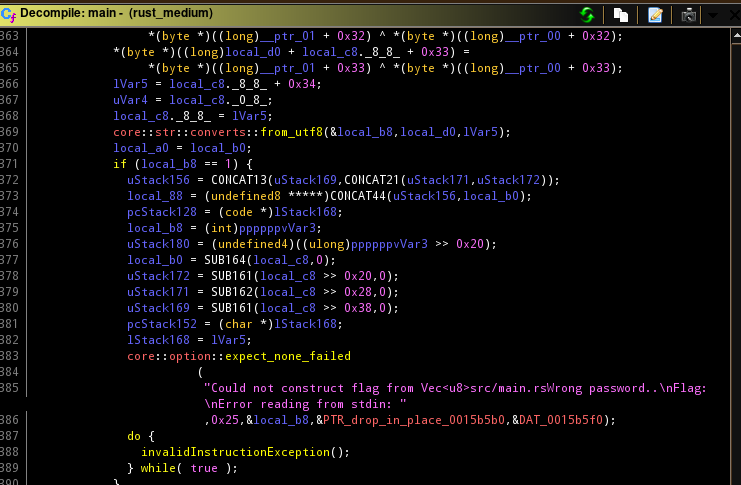

# Etteretningstjenesten - Cybertalent - Winter 2020 [Detailed version](./DETAILED.md)

# 0. Preface
Each challenge category have their own more detailed write-up (`DETAILED.md`) containing more theory, information, code and resources than the simplified write-up (`README.md`). You can find the detailed version in the title of every category. Below is a list of all the challenges and the links to them for easy access. The entire write-up can be found below this list.

## Challenges
- [**1. Grunnleggende**](./1_grunnleggende/README.md)
    - [1.5_nettverk](./1_grunnleggende#/README.md15_nettverk)
- [**2. Oppdrag**](./2_oppdrag/README.md) - [[_Detailed version_]](./2_oppdrag/DETAILED.md)
    - [2.1_beslag](./2_oppdrag/1_beslag/README.md)
        - [2.1_beslag_1](./2_oppdrag/1_beslag/1/README.md)
        - [2.1_beslag_2](./2_oppdrag/1_beslag/2/README.md)
        - [2.1_beslag_3](./2_oppdrag/1_beslag/3/README.md)
    - [2.2_seatheworld](./2_oppdrag/2_seatheworld/README.md)
        - [2.2_seatheworld](./2_oppdrag/2_seatheworld/1/README.md)
        - [2.2_seatheworld_aksess](./2_oppdrag/2_seatheworld/aksess/README.md)
        - [2.2_seatheworld_booking](./2_oppdrag/2_seatheworld/booking/README.md)
        - [2.2_seatheworld_ekstra](./2_oppdrag/2_seatheworld/ekstra/README.md)
    - [2.3_scada](./2_oppdrag/3_scada/README.md)
        - [2.3_onion](./2_oppdrag/3_scada/onion/README.md)
        - [2.3_scada_aksess](./2_oppdrag/3_scada/aksess/README.md)
        - [2.3_scada_gissel](./2_oppdrag/3_scada/gissel/README.md)
- [**3. Utfordringer**](./3_utfordringer/README.md) - [[_Detailed version_]](./3_utfordringer/DETAILED.md)

    - [3.1. Utfordringer lett](./3_utfordringer/1_lett/README.md) - [[_Detailed version_]](./3_utfordringer/1_lett/DETAILED.md)
        - [3.1.1_clmystery](./3_utfordringer/1_lett/clmystery/README.md)
        - [3.1.2_fibonacci](./3_utfordringer/1_lett/fibonacci/README.md)
        - [3.1.3_math](./3_utfordringer/1_lett/math/README.md)
            - [3.1.3_math_1](./3_utfordringer/1_lett/math/README.md#313_math_1)
            - [3.1.3_math_2](./3_utfordringer/1_lett/math/README.md#313_math_2)
        - [3.1.4_rusty_reversing_easy](./3_utfordringer/1_lett/rust_lett/README.md)
        - [3.1.8_punchcard](./3_utfordringer/1_lett/punchcard/README.md)
        - [3.1.9_secret](./3_utfordringer/1_lett/secret/README.md)

    - [3.2. Utfordringer middels](./3_utfordringer/2_middels/README.md) - [[_Detailed version_]](./3_utfordringer/2_middels/DETAILED.md)
        - [3.2.1_coordinate](./3_utfordringer/2_middels/coordinate/README.md)
            - [3.2.1_coordinate_r](./3_utfordringer/2_middels/coordinate/r/README.md)
            - [3.2.1_coordinate_g](./3_utfordringer/2_middels/coordinate/g/README.md)
            - [3.2.1_coordinate_b](./3_utfordringer/2_middels/coordinate/b/README.md)
            - [3.2.1_coordinate_a](./3_utfordringer/2_middels/coordinate/a/README.md)
        - [3.2.2_minesweeper](./3_utfordringer/2_middels/minesweeper/README.md)
            - [3.2.2_minesweeper_easy](./3_utfordringer/2_middels/minesweeper/README.md)
            - [3.2.2_minesweeper_medium](./3_utfordringer/2_middels/minesweeper/README.md)
            - [3.2.2_minesweeper_hard](./3_utfordringer/2_middels/minesweeper/README.md)
        - [3.2.3_transfer](./3_utfordringer/2_middels/transfer/README.md)
            - [3.2.3_transfer_easy](./3_utfordringer/2_middels/transfer/easy/README.md)
            - [3.2.3_transfer_medium](./3_utfordringer/2_middels/transfer/medium/README.md)
        - [3.2.4_rusty_reversing_medium](./3_utfordringer/2_middels/rust_middels/README.md)

    - [3.3. Utfordringer vanskelig](./3_utfordringer/3_vanskelig/README.md) - [[_Detailed version_]](./3_utfordringer/3_vanskelig/DETAILED.md)
        - [3.3.1_euler](./3_utfordringer/3_vanskelig/euler/README.md)
            - [3.3.1_euler_1](./3_utfordringer/3_vanskelig/euler/1/README.md)
            - [3.3.1_euler_2](./3_utfordringer/3_vanskelig/euler/2/README.md)
            - [3.3.1_euler_3](./3_utfordringer/3_vanskelig/euler/3/README.md)
                - [3.3.1_euler_3a](./3_utfordringer/3_vanskelig/euler/3/README.md#331_euler_3a)
                - [3.3.1_euler_3b](./3_utfordringer/3_vanskelig/euler/3/README.md#331_euler_3b)
                - [3.3.1_euler_3c](./3_utfordringer/3_vanskelig/euler/3/README.md#331_euler_3c)
                - [3.3.1_euler_3d](./3_utfordringer/3_vanskelig/euler/3/README.md#331_euler_3d)
        - [3.3.2_rusty_reversing_hard](./3_utfordringer/3_vanskelig/rust_vanskelig/README.md)
    - [3.4. Utfordringer umulig](./3_utfordringer/4_umulig/README.md)
        - [3.4.8_transfer.root](./3_utfordringer/4_umulig/README.md#348_transfer_root)
- [**9. Gammelt**](./9_gammelt/README.md)
- [**9000. Madness**](./9000_madness)
    - [2_seatheworld_bookings_bruteforcer](./9000_madness/2_seatheworld_bookings_bruteforcer/README.md)
    - [2_seatheworld_bookings_parser](./9000_madness/2_seatheworld_bookings_parser/README.md)
    - [2_seatheworld_data_set_downloader](./9000_madness/2_seatheworld_data_set_downloader/README.md)


# 1. Grunnleggende
Having completed last years CTF, these challenges (except **1.5_nettverk**) were copy paste from my notes. You can find more information regarding the challenges in these write-ups [Sithis](https://github.com/williamsolem/Etjenesten-Cybertalent-CTF-Writeup), [Agent Random](https://blog.agentrandom.com/cybertalent-ctf/), [zig](https://www.indregard.no/2020/03/e-tjenestens-ctf/), [UnblvR](https://github.com/myrdyr/ctf-writeups/tree/master/etjenesten20), or [SgtSIGSEGV](https://blog.mrfjo.org/2020/03/02/NIS-Cybertalent).

### 1.5_nettverk
Simple Python networking challenge. More information on Python socket programming can be found in the official Python documentation [here](https://docs.python.org/3/howto/sockets.html) and [here](https://docs.python.org/3/library/socket.html).

```
$ python3 solve.py
Husk at utf-8 kan ha multi-byte tegn 😊

╭────────────────────────────────────────╮
│ Gratulerer!                            │
│                                        │
│ Her er flagget:                        │
│                                        │
├────────────────────────────────────────┤
│    059d93ffd79c5cbd77268f17141c22e7    │
╰────────────────────────────────────────╯
```

```
login@corax:~$ scoreboard 059d93ffd79c5cbd77268f17141c22e7
Gratulerer, korrekt svar!
```


# [2. Oppdrag](./2_oppdrag)
We are informed that a group of terrorists have kidnapped an unknown amount of people from a Norwegian research vessel "MS KOLDBJORN". The entire rep can be found in Norwegian [here](./2_oppdrag/INTREP.txt).

Our priorities are to:
1. Release the hostage(s)
2. Identifiy the kidnappers
3. Hold onto the Norwegian sovereignty of the Queen and Motherland (Note: the translation here might be incorrect, search for "Dronning Maud Land" [here](https://www.stortinget.no/globalassets/pdf/stortingsarkivet/duuk/1946-1965/590622u.pdf))

We are provided with 2 files, a pcap file ([`traffic_log_suspect_3577374.pcap`](./2_oppdrag/traffic_log_suspect_3577374.pcap)), which contains network traffic from one of the confiscated phones, and an archive ([`phone_dump.tgz`](./2_oppdrag/phone_dump.tgz)) containing the contents of an Android mobile phone that was confiscated from one of the suspects.

We start with extracting the archive, and find the following files:
```
├── data
│   └── data
│       └── no.cybertalent.liberatortoolkit
│           ├── databases
│           │   └── users.db
│           ├── files
│           │   └── data.bin
│           └── shared_prefs
│               ├── ChatActivity.xml
│               └── VaultActivity.xml
└── sdcard
    ├── Android
    │   └── data
    │       └── no.cybertalent.liberatortoolkit
    │           └── files
    │               ├── !aW1wb3J0YW50X2xpbmtz
    │               ├── !c2hvcHBpbmdfbGlzdA==
    │               ├── !dG9kbw==
    │               └── !ZmxhZw==
    └── Download
        └── lt3000.apk

12 directories, 9 files
```

In the dump we have an APK, and the application data for it. Having never done a proper Android/APK reversing I spent some extra time setting up a proper environment. I decided to learn how to use the following tools:

- [Android Studio](https://developer.android.com/studio) with a Android Virtual Device (AVD) image without the Play API
- [JADX](https://github.com/skylot/jadx) to decompile the APK
- [Frida](https://frida.re/) for hijacking and dynamic reverse engineering of the Android application
- [objection](https://github.com/sensepost/objection) for some extra Android explotation fun

With the environment now setup, we can continue our investigation below. 


## [2.1_beslag](./2_oppdrag/1_beslag)

We start by decompiling the APK with JADX, and find a package named `no.cybertalent.liberatortoolkit`, with the following classes:

```sh
├── ChatActivity.java
├── EditActivity.java
├── helpers
│   ├── ChatHelper.java
│   └── CheckHelper.java
├── MainActivity.java
├── R.java
├── TunerActivity.java
└── VaultActivity.java
```

**Note:** Enabling the `Show Inconsistent code` option in the JADX preference is very helpful.


Looking through the classes we find a found 3 interesting Activity classes: `TunerActivity`, `ChatActivity`, and `VaultActivity`. We also find some helper classes (`ChatHelper` and `CheckHelper`) that check if the application is running in an emulator (`ChatHelper.emu`), and if the Android is rooted (`CheckHelper.is(Context context`).

In addition we find a native library named `libnative-lib.so` with the following functions:
```
ChatHelper.getResponse
VaulActivity.finalize
VaulActivity.undo
```

---

### Installation
Continuing with setting up Android Studio and start an AVD (Android Virtual Device) to install and run the APK. It's important to use an Android image without the Play Store API, as it does not allow us to root. We start the emulator, install the APK, and transfer over the data.


```sh
$ emulator -writable-system -avd cybertalent21_oppdrag -no-snapshot-load -qemu
$ adb devices
List of devices attached
emulator-5554	device
$ adb root
restarting adbd as root
$ adb install lt3000.apk
$ adb push data/* /data/user/0
$ adb push sdcard/* /sdcard
```

When we launch the application we are presented with the following screen.


Each button map to each activity we found earlier in the decompiled APK, we therefore assume that each button corresponds to each challenge (`2.1_beslag_x`).

### [2.1_beslag_1](./2_oppdrag/1_beslag/1)


We are presented with some form of authentication, and a channel switcher with 9 channels. The channels play various audio, mostly static, but also some music and a radio show.

---

### Reversing
Checking `TunerActivity` there is a function `onValueChange` that is called everytime the channel is changed. There is some form authentication that checks the username and password through a SQLite database.
```java
SQLiteDatabase readableDatabase = new c.a.a.d.b(tunerActivity2).getReadableDatabase();
Cursor query = readableDatabase.query("users", new String[]{"password_hash"}, "username = ?", new String[]{charSequence}, null, null, null);
```

In addition, there is some interesting code that does something different on Channel 7 when the user is authenticated, it calls `c.a.a.d.a.b` with two files, `data.bin`, and `data.mp3`. 
```java
if (this.f1160a.getValue() == 7) {
// --- snip ---
    File file = new File(TunerActivity.this.getFilesDir().getAbsolutePath() + "/data.bin");
    File file2 = new File(TunerActivity.this.getFilesDir().getAbsolutePath() + "/data.mp3");
    c.a.a.d.a.b(file, file2, charSequence2.getBytes());
// --- snip ---
```

---

### `data.bin`
Looking back to the files provided with the challenge, we find `data.bin`. It is however containing some form of raw or encrypted data.
There is however no `data.mp3`, looking closer at the decompiled code we find the following function call.
```java
c.a.a.d.a.b(file, file2, charSequence2.getBytes());
```

The `c.a.a.d.a` class contains various functions, shortly put; it uses the provided password and a static salt to generate a `SecretKey` that is used to AES decrypt `data.bin`.
```java
public static final byte[] f1089a = "saltpaamaten".getBytes();
```

And within the `c.a.a.d.a.b(File, File, byte[])` function
```java
Cipher instance = Cipher.getInstance("AES/CBC/PKCS5Padding");
SecretKey c2 = c(bArr);
```

We now know that we need to find the user credentials to decrypt the file.

---

### `users.db`
Knowing that the credentials are stored in a SQLite database, we recall that there is a `users.db` file in the phone dump that we can look closer at.

```sh
$ sqlite3 data/data/no.cybertalent.liberatortoolkit/databases/users.db
sqlite> SELECT * FROM users;
_id|username|firstname|lastname|password_hash
1|hungry_hippo_123|Frank|Shorius|2034F6E32958647FDFF75D265B455EBF
```

We now have have a username, name and a hashed password. After a quick Google search, we find out that the password is `secretpassword`, giving us: `hungry_hippo_123:2034F6E32958647FDFF75D265B455EBF:secretpassword`.

Plotting the credentials into the app and scrolling through the channels we get some different audio for Channel 7, a robotic woman repeating the phrase:
> Your flag is london underscore calling.

The `data.mp3` file can be found [here](./2_oppdrag/1_bedrag/1/data.mp3).

---

```sh
login@corax:~$ scoreboard london_calling
Bra jobbet!
Det hadde vært praktisk om vi visste hvordan de har kommunisert.
```

---

### [2.1_beslag_2](./2_oppdrag/1_beslag/2)


Opening the **Chat** we are presented with a view with `Access Denied` and tells us to log in to https://mobile.cybertalent.no/challenge.

* * *

#### mobile.cybertalent.no


We re-use the credentials from **2.1\_beslag\_1** (`hungry_hippo_123:secretpassword`) to successfully login, and are now presented with some challenge words. The words are refreshed every 10 seconds. Submitting something random calls a `POST /challenge` and returns `Bad response code`.


Sending the challenge into the application with `/response TroveShrineMarbleBehavior` gives us the following response, which also returns `Bad response code` when submitting.

* * *

#### Reversing

##### `ChatActivity.onCreate(Bundle)`

When `ChatActivity` is created the `onCreate` method is called, which again sets up new [`View.OnKeyListener`](https://developer.android.com/reference/android/view/View.OnKeyListener) (via. `new a()`). The public method [`onKey`](https://developer.android.com/reference/android/view/View.OnKeyListener#onKey%28android.view.View,%20int,%20android.view.KeyEvent%29 "https://developer.android.com/reference/android/view/View.OnKeyListener#onKey(android.view.View,%20int,%20android.view.KeyEvent)") in this class listens to the input. Then it loads in the `SharedPreferences` for `ChatActivity`, and finally starts the activity thread with the `new b()` (`Runnable`) class.

```java
public void onCreate(Bundle bundle) {
    // snip...
    this.p.setOnKeyListener(new a());
    SharedPreferences preferences = getPreferences(0);
    // snip...
    Thread thread = new Thread(new b());
    thread.start()
}
```

* * *

##### `ChatActivity.q` (`SharedPreferences`)

The `SharedPreferences` can be found in `data/data/no.cybertalent.liberatortoolkit/shared_prefs/ChatActivity.xml` of the phone dump.

```xml
<?xml version='1.0' encoding='utf-8' standalone='yes' ?>
<map>
    <string name="nick">hungry_hippo_123</string>
    <string name="token">0000</string>
</map>
```

* * *

##### `ChatActivity.b.run()`

As mentioned, `ChatActivity.onCreate` starts the activity thread with a new instance of the `ChatActivity.b` (`Runnable`) class, which contains the following code for the `ChatActivity.b.run()` function.
`ChatHelper.a(String, String)` is a function that handles the communication between the application and the remote chat API. When this is first run it calls `https://mobile.cybertalent.no/chat?token=0000`, which responds with the text seen in the initial chat screenshot above.

```java
ChatActivity.this.o.post(new a(ChatHelper.a("chat", ChatActivity.q.getString("token", "0000"))));
Thread.sleep(1000);
```

* * *

##### `ChatActivity.a.onKey(View, int, KeyEvent)`

The `onKey` only function calls the `ChatActivity.t()` if the input key is `Enter`.

```java
public boolean onKey(View view, int i, KeyEvent keyEvent) {
    // --- snip ---
    chatActivity.t();
}
```

* * *

##### `ChatActivity.t()`

`t()` is a function that handles all the input (general chat) and commands (`/nick`, `/token` and `/response`) from the input field, as shown below.

* * *

###### `/response <challenge>`

The following code is executed when the input matches `/response <challenge>`. `ChatHelper.getResponse(String)` is called with the provided challenge, in addition `a1` is prefixed to the final string if the static boolean `ChatHelper.emu` is `true`.

```java
String response = ChatHelper.getResponse(split[1]);
StringBuilder sb = new StringBuilder();
if (ChatHelper.emu) {
  sb.append("a1");
}
sb.append(response.toLowerCase());
// --- snip ---
```

* * *

###### say

A new thread is started if the input is not a command (begins with a `/`), `ChatActivity.c` is a `Runnable` class.

```java
new Thread(new c(charSequence)).start();
```

* * *

###### `ChatActivity.c.run()`

This function fetches `token` and `nick` from `SharedPreferences`, and then does a `POST https://mobile.cybertalent.no/say` with a simple JSON object:

```json
{
    "content": "<input>",
    "token": "<SharedPreferences.token>",
    "nick": "<SharedPreferences.nick>"
}
```

* * *

##### `ChatHelper.getResponse(String)`

`getResponse` is a native function, that uses functions provided in a provided native library.

```java
public static native String getResponse(String str);
```

Let's take a closer look at the `getResponse` function in the native library that was extracted from the APK.

* * *

###### `libnative-lib.so`

We find that that the native `getResponse` function (`Java_no_cybertalent_liberatortoolkit_helpers_ChatHelper_getResponse`) calls `ChatHelper` and prefixes the return string with `deadbeef` if `CheckHelper.emu` is `true`.

```c
lVar3 = (**(code **)(*param_1 + 0x480))(param_1,param_2,&DAT_00100a8e,&DAT_00100a19); // DAT_00100a8e = emu
if (lVar3 != 0) {
	cVar1 = (**(code **)(*param_1 + 0x490))(param_1,param_2,lVar3);
	local_59 = cVar1 == '\0';
}
// --- snip ---
bVar9 = (local_59 & 1) == 0;
if (bVar9) {
	*(undefined8 *)((long)pvVar5 + 1) = 7378415037781730660; // feebdaed => deadbeef
}
```

* * *

##### `ChatHelper.emu`

`emu` is a static boolean variable, that checks if the application is running within an emulator, we therefore need to find a way to override the results of this variable.

```java
public static final boolean emu;

static {
  // --- snip ---
  if (!str4.contains("sdk_google") && !str4.contains("google_sdk") && !str4.contains("sdk") && !str4.contains("sdk_x86") && !str4.contains("vbox86p") && !str4.contains("emulator") && !str4.contains("simulator")) {
    emu = false;
  }
  emu = true;
}
```

* * *

#### Solution flow

We now have everything we need to generate a correct response code and get a token, and we know that every response code is only valid for 10 seconds, our flow will be the following:

1.  Override the `ChatHelper.emu` static variable to return `false`.
2.  Login to the `mobile.cybertalent.no` portal via. `/login` with the credentials `hungry_hippo_123:secretpassword`.
3.  Get a challenge code from `/getchall`.
4.  Pass the challenge code into the `ChatHelper.getResponse()` method.
5.  Submit the generated response code to `/challenge` and get our token.
6.  Fetch the chat from `/chat?token=x` with our token.

* * *

##### Automation

To interact with the Android application we can use [Frida](https://frida.re/), which is a dynamic instrumentation toolkit for developers, reverse-engineers, and security researchers. We need to override the value of `ChatHelper.emu` and then call the `ChatHelper.getResponse` function. The Frida [JavaScript API](https://frida.re/docs/javascript-api/) is well documented and we finish our script.

###### [`frida-chat.js`](./2_oppdrag/1_beslag/2/frida-chat.js)

```js
// --- snip ---
var ChatHelper = Java.use("no.cybertalent.liberatortoolkit.helpers.ChatHelper")
ChatHelper.emu.value = false;
send(ChatHelper.getResponse(challenge));
// --- snip ---
```

* * *

Combining this with some python code automates this entire solution flow for us, in addition the code also launches / spawns the application. Running the script takes about a second and successfully generates a valid token and extracts the chat.

###### [`extract_chat.py`](./2_oppdrag/1_beslag/2/extract_chat.py)

* * *

```sh
$ python extract_chat.py > chat.txt
Loaded frida-chat.js
Challenge: GorillaPoloOperatingBreeze
Response: 5fa780b9babab1a6a7baa74786bd80b182b9a4bf5080bdbd88bd
Token: 7c6ccda74458e01ec197
```

Entering the token into the app with `/token 7c6ccda74458e01ec197` gives us the following view:


The entire chat log can be found [here](./2_oppdrag/1_beslag/2/chat.txt).

* * *

```shell
login@corax:~$ scoreboard 04907eee5386072670b5107b744b2f8481294377
Flott! Nå vet vi litt mer om gisseltakerne.
Ligger det noen interessante filer eller tekniske spor her også?
```

---


### [2.1_beslag_3](./2_oppdrag/1_beslag/3)


The **Vault** view has a 4 number input (a PIN), and a list of 4 different items, we recall the items being files found from the initial phone dump.

```sh
└── sdcard
    └── Android
        └── data
            └── no.cybertalent.liberatortoolkit
                └── files
                    ├── !aW1wb3J0YW50X2xpbmtz
                    ├── !c2hvcHBpbmdfbGlzdA==
                    ├── !dG9kbw==
                    └── !ZmxhZw==
```

The names are encoded in base 64, decoding them gives us the following names
```
important_links
shopping_list
todo
flag                           
```

* * *

#### Reversing

##### `VaultActivity.onCreate(Bundle)`

When `VaultActivity` is created the `onCreate` method is called, which initializes the 4 NumberPickers and loads in the `SharedPreferences` and checks for the locked state and the hash of the pin. It then ends by creating a new instance of the `c.a.a.d.c` class. The `VaultActivity` has a `onLockerClick` listener that triggers whenever the **UNLOCK**/**LOCK** button is clicked.

```java
// --- snip ---
if (!preferences.contains("locked")) {
    w(false);
}
if (!s.contains("pin_hash")) {
    edit.putString("pin_hash", "null");
}
// --- snip ---
new c(this).execute(new Void[0]);
```

* * *

##### `SharedPreferences`

The `SharedPreferences` can be found in `data/data/no.cybertalent.liberatortoolkit/shared_prefs/VaultActivity.xml` of the phone dump.

```xml
<?xml version='1.0' encoding='utf-8' standalone='yes' ?>
<map>
    <boolean name="locked" value="true" />
    <string name="pin_hash">BSzN6uy2dDcolImpMKxffg==</string>
</map>
```

* * *

##### `VaultActivity.onLockerClick(View)`

The function starts by checking `VaultActivity.u()`, which returns `true` if the Vault is in a locked state. It then grabs the value of each number picker (the pin numbers) and first calls `t(pin)`, and then calls the `finalize` function with the result from `t(pin)`.

It then base 64 encodes the first 16 bytes from the `finalize` function, and compares this to the `pin_hash` in our `SharedPreferences`. If it matches, it continues looping through the files above, and passes them to `c.a.a.d.a.b(File, File, byte[])`, with the encoded filename, decoded filename, and the remaining 32 bytes from the `finalize` function, as arguments.

```java
byte[] finalize = finalize(t(r.toString()));
// --- snip ---
if (Base64.encodeToString(Arrays.copyOfRange(finalize, 0, 16), 0).trim().equals(s.getString("pin_hash", null).trim())) {
    while (i5 < length) {
        File file = fileArr[i5];
        if (file.getName().startsWith("!") && u()) {
            c.a.a.d.a.b(file, new File((file.getParent() + "/" + new String(Base64.decode(file.getName().substring(i4), 0))).replace(str4, str3)), Arrays.copyOfRange(finalize, 16, 48));
            // --- snip ---
        }
// --- snip ---
```

#### `c.a.a.d.c`

This is a `AsyncTask` class is called at the end of `VaultActivity.onCreate`. It downloads a file from `https://mobile.cybertalent.no/xtra` (a copy can be found [here](./2_oppdrag/1_beslag/3/xtra)), and once downloaded executes `VaultActivity.undo` with the data, and then sets the `VaulActivity.t` **variable** (not the function) to the result of the `undo` function.

```java
// --- snip ---
InputStream openStream = new URL("https://mobile.cybertalent.no/xtra").openStream();
// --- snip ---
VaultActivity.t = ByteBuffer.wrap(vaultActivity.undo(bArr2));
```

##### `VaultActivity.undo(byte[])`

`undo` is a native function, that uses functions provided in a provided native library.

```java
public native byte[] undo(byte[] bArr);
```

We could take a close look at the `undo` function in the native library that was extracted from the APK earlier, and we could use Frida to read the return data, but we decide to test out [objection](https://github.com/sensepost/objection).

> `objection` is a runtime mobile exploration toolkit, powered by Frida, built to help you assess the security posture of your mobile applications, without needing a jailbreak.

We start objection and start listening to function calls to `undo`.

```sh
$ objection -g no.cybertalent.liberatortoolkit explore
Using USB device `Android Emulator 5556`
Agent injected and responds ok!

     _   _         _   _
 ___| |_|_|___ ___| |_|_|___ ___
| . | . | | -_|  _|  _| | . |   |
|___|___| |___|___|_| |_|___|_|_|
      |___|(object)inject(ion) v1.9.6

     Runtime Mobile Exploration
        by: @leonjza from @sensepost

[tab] for command suggestions
...o.cybertalent.liberatortoolkit on (pwn: 8.0.0) [usb] #
```

```
# android hooking watch class_method no.cybertalent.liberatortoolkit.VaultActivity.undo --dump-args --dump-backtrace --dump-return

(agent) Attempting to watch class no.cybertalent.liberatortoolkit.VaultActivity and method undo.
(agent) Hooking no.cybertalent.liberatortoolkit.VaultActivity.undo([B)
(agent) Registering job 8769892465034. Type: watch-method for: no.cybertalent.liberatortoolkit.VaultActivity.undo
```
And after launching Vault we see that `undo` function has been called:

```
(agent) [8769892465034] Arguments no.cybertalent.liberatortoolkit.VaultActivity.undo([100,120,48,53,79,103,27,-9,92,-72,-93,-75,14,111,54,80,100,0,112,0,120,52,0,0,0,0,-72,0,29,0,112,0,10,0,-28,...)
(agent) [8769892465034] Return Value: [100,101,120,10,48,51,53,0,79,-51,103,-12,27,...]

```
Saving the return bytestream to a file, we get a `Dalvik dex file`, and can now decompile it with JADX. We see that this `extra` class has a `getData` function that accepts a String `str`, it appends the salt `y_so_salty` to the string and then generates a MD5, and a SHA256 hash out of the string. It then returns them both in the same output, in that order. The class and java source files can be found [here](.).

```java
public class extra {
    private static final String SALT = "y_so_salty";
    public static byte[] getData(String str) {
        sb.append(str);
        sb.append(SALT);
        // --- snip ---
        MessageDigest instance = MessageDigest.getInstance("md5");
        MessageDigest instance2 = MessageDigest.getInstance("sha256");
        // --- snip ---
        return byteArrayOutputStream.toByteArray();
```

* * *

##### `VaultActivity.t(String)`

The argument passed into the function is the PIN (i.e. `"0000"`, `"1337"`). The function attempts to load the `VaultActivity.t` **variable** (not the function) into memory as a class and call the `extra.getData(String)` method.
We now know that the `getData` function returns a MD5 digest, followed by a SHA256 digest, which is exactly what this function (`t(String)`) does as well, it is only a wrapper around the `getData` function call.

```java
public final byte[] t(String str) {
    // --- snip ---
    cls = new InMemoryDexClassLoader(t, getClassLoader()).loadClass("com.example.extra.extra");
    // --- snip ---
    method = cls.getMethod("getData", String.class);
}
```

* * *

##### `VaulActivity.finalize(byte[])`

`finalize` is a another native function, this time we use Ghidra to take a closer look at the function from the library that was extracted from the APK.

```java
public native byte[] finalize(byte[] bArr);
```

* * *

###### `libnative-lib.so`

We find that that the native method of `finalize` (`Java_no_cybertalent_liberatortoolkit_VaultActivity_finalize`) calls the static boolean method `CheckHelper.is(Context)`, and then checks if the `/proc/self/status` file contains `TracerPid: 0`, to finially return some result back to the caller. `TracerPid` returns the [PID of process tracing this process (0 if not being traced)](https://man7.org/linux/man-pages/man5/proc.5.html).

In other words this function seems to be doing additional checks that we need to bypass.

```c
// --- snip ---
uVar5 = _JNIEnv::CallObjectMethod((_jobject *)param_1,p_Var6,uVar5);
p_Var4 = (_jmethodID *)
       (**(code **)(*param_1 + 0x30))
                 (param_1,"no/cybertalent/liberatortoolkit/helpers/CheckHelper");
uVar7 = (**(code **)(*param_1 + 0x388))
                (param_1,p_Var4,&DAT_00100a92,"(Landroid/content/Context;)Z"); // DAT_00100a92 = "is"
cVar1 = _JNIEnv::CallStaticBooleanMethod((_jclass *)param_1,p_Var4,uVar7,uVar5);
// --- snip ---
__fd = __open_2("/proc/self/status",0);
// --- snip ---
```

* * *

##### `CheckHelper.is(Context)`

The `is` function simply returns `true` if it believes we have a rooted Android device by checking various known directories that a rooted Android device has access to.

```java
public class CheckHelper {
    public static boolean is(Context context) {
    	// --- snip ---
        String[] strArr = {"/sbin/", "/system/bin/", "/system/xbin/", "/data/local/xbin/", "/data/local/bin/", "/system/sd/xbin/", "/system/bin/failsafe/", "/data/local/"};
        for (int i = 0; i < 8; i++) {
            if (new File(a.b(strArr[i], string)).exists()) {
                return true;
            }
        }
        return false;
    }
}
```

* * *

##### `c.a.a.d.a.b(File, File, byte[])`

When the correct PIN has been entered in `onLockerClick` it starts looping through all the encrypted files and calls this (`c.a.a.d.a.b`) function. We recall seeing this exact same function being used from the `TunerActivity` challenge, and therefore know that it is used to decrypt files, where the third argument (`byte[]`) is the key. In our case this key would be the SHA256 part of the TODO.

* * *

#### Solution flow

We now have everything we need to find the PIN and decrypt the files in the Vault. We can solve this challenge without running the application, but that is no fun. Our flow will be the following:

1.  Override the `CheckHelper.is(Context)` function to return `false`.
2.  Get an instance of `VaultActivity`.
3.  Loop through the numbers 0000 - 9999.
4.  Use the number as PIN and pass it into `VaulActivity.t(String)`
5.  Pass the result to `VaultActivity.finalize()`.
6.  Base 64 encode the first 16 bytes of the resultt and compare it to the `pin_hash` variable from the `SharedPreferences`.
7.  If it matches, stop the bruteforcing and print out the PIN.
8.  Input the PIN and unlock the Vault.

* * *

##### Automation

We now use [Frida](https://frida.re/) again to automate our solution flow. We could go even further with this script by launching the Vault view automatically, and executing the unlock, instead of just outputting the PIN.

###### [`frida-vault.js`](./2_oppdrag/1_beslag/3/frida-vault.py)

```js
// --- snip ---
// Override the `CheckHelper.is` function.
var CheckHelper = Java.use("no.cybertalent.liberatortoolkit.helpers.CheckHelper");
CheckHelper.is.implementation = function() {
	return false;
}
// --- snip ---
for (var i = 0; i <= 9999; i++) {
    var finalize_result = instance.finalize(instance.t(pin));
    // --- snip ---
    if (b64 === "BSzN6uy2dDcolImpMKxffg==") {
    	console.log("Found PIN:", pin);
    	return;
    }
}
```

###### [`unlock_vault.py`](./2_oppdrag/1_beslag/3/unlock_vault.py)

* * *

Executing the script and letting it run for a few seconds results with the PIN `5693`, and we can now open the various files.

```sh
$ python unlock_vault.py
Loaded frida-vault.js
Found VaultActivity object instance: no.cybertalent.liberatortoolkit.VaultActivity@d097244
Starting bruteforce...
Found PIN: 5693
```

* * *

###### Todo

```
Buy xmas presents
Find an xmas tree
Order airline tickets
```

###### Flag

```
d025828e7d38c133d3224154ae7785b344536761
```

###### Shopping list
```
1 Milk
1 Bread
6 Eggs
1000 rounds 7.76mm
10 HE grenades
4 Yoghurt
1 Butter
```

###### Important links

```
Hidden service URL:
http://fileserver/files/onion_name.txt
 
Scada client binary:
http://fileserver/files/082391170510954df0c28af1ebb9380a
Rembember this only works on the internal network, not from the outside.
```

* * *

```sh
login@corax:~$ scoreboard d025828e7d38c133d3224154ae7785b344536761
Kanskje det ligger noen interessante filer her?
```


## [2.2_seatheworld](./2_oppdrag/2_seatheworld)
### [2.2_seatheworld](./2_oppdrag/2_seatheworld/1)

Continuing our investigation we start taking a look at the provided network traffic dump file `traffic_log_suspect_3577374.pcap`, and find DNS query requests done to a `ns1.seatheworld.tld` server.

After looking at the list of [DNS records](https://en.wikipedia.org/wiki/List_of_DNS_record_types) we attempt to perform a [DNS zone transfer (AXFR)](https://en.wikipedia.org/wiki/DNS_zone_transfer), resulting in the record `_flagg.nusse.seatheworld.tld`, we also take mental a note of the DNS record for `nusse.seatheworld.tld`.

```
login@corax:~$ dig @ns1.seatheworld.tld seatheworld.tld AXFR
_flagg.nusse.seatheworld.tld. 600 IN	TXT	"03e5e4ecc1c8d69eff7f2de0a4367724"
nusse.seatheworld.tld.	600	IN	A	203.0.113.23
```

---

```sh
login@corax:~$ scoreboard 03e5e4ecc1c8d69eff7f2de0a4367724
Bra jobbet!
Hva kan det være denne maskinen brukes til?
```


### [2.2_seatheworld_aksess](./2_oppdrag/2_seatheworld/aksess)


We start by doing a nmap scan on the `nusse.seatheworld.tld` server and find references to `IBM OS/390 ftpd V1R10`, `IBM Telnet TN3270`, and `IBM httpd V5R3M0`.

---

#### 80/tcp - IBM httpd V5R3M0

We start by using `socat` to tunnel the traffic through SSH `socat TCP-LISTEN:1080,reuseaddr,fork "EXEC:ssh cybertalent nc nusse.seatheworld.tld 80"`. Another and a better solution to this is to use [sshuttle](https://github.com/sshuttle/sshuttle).

The **CONFIGURATION AND ADMINISTRATION FORMS** page used HTTP Basic authentication, we look for default IBM credentials and find the following [documentation](https://www.ibm.com/support/knowledgecenter/SSTQBD_12.0.1/com.ibm.zsys.rdt.guide.adcd.doc/topics/userids.html).

| User ID | Password |
| ------- | -------- |
| ADCDMST (RACF® special authority) | SYS1 or ADCDMST |
| IBMUSER (RACF special authority) | SYS1 or IBMUSER |
| SYSADM (DB2® and RACF special authority) | SYS1 or SYSADM |
| SYSOPR (DB2 and RACF special authority) | SYS1 or SYSOPR |
| ADCDA - ADCDZ | TEST |
| WEBADM | WEBADM |
| OPEN1 through OPEN3 | SYS1 |
| ZOSMFAD |	ZOSMFAD |

Testing the `WEBADM:WEBADM` credentials we successfully log in to the admin web interface, but are prompted to change password, and do so.

---

#### 23/tcp - IBM Telnet TN3270 (TN3270E)

> The [IBM 3270](https://en.wikipedia.org/wiki/IBM_3270) is a family of block oriented display and printer computer terminals introduced by IBM in 1971 and normally used to communicate with IBM mainframes.

And after reading up on the official [introduction](https://www.ibm.com/support/knowledgecenter/zosbasics/com.ibm.zos.znetwork/znetwork_261.htm) and some [documentation](
https://www.ibm.com/ru/software/info/students/zm9/zcontest1.pdf) we find [x3270](http://x3270.bgp.nu/):

> x3270 is an IBM 3270 terminal emulator for the X Window System and Windows. It runs on most Unix-like operating systems -- e.g., Linux, Mac OS X, Solaris and Cygwin. It also runs natively on Windows. 

We also find 3270 related commands installed on the `corax` host.
```sh
login@corax:~$ x3270if
usage:
 x3270if [options] "action[(param[,...])]"
// --- snip ---
```

After installing x3270 locally, we connect to the telnet port that we have proxied through `socat`.


`localhost` does not work, so `127.0.0.1` had to be used instead. After connecting we are presented with a developer image of the IBM mainframe operating system [z/OS](https://www.ibm.com/support/knowledgecenter/zosbasics/com.ibm.zos.zmainframe/zconc_opsyszosintro.htm). We take a note of the `LOGON` command example (`LOGON IBMUSER`).

---


Entering `LOGON` we are presented with the `TSO/E LOGON` view.


With the hint from the initial page (`LOGON IBMUSER`), we recall the [documentation](https://www.ibm.com/support/knowledgecenter/SSTQBD_12.0.1/com.ibm.zsys.rdt.guide.adcd.doc/topics/userids.html) containing default credentials and enter `IBMUSER:SYS1` and get the first flag.


---

```sh
login@corax:~$ scoreboard RETRO_IS_THE_NEW_MODERN
Navn på gisseltakerne burde være tilgjengelig et sted på denne stormaskinen.
```


### [2.2_seatheworld_booking](./2_oppdrag/2_seatheworld/booking)

From the first view we get information on how to load the application.

```
START BOOKING APPLICATION (IBMUSER ONLY):
LOAD IBMUSER.SEATW.LOAD(BOOKING)
```


We recall seeing a booking reference code from seized chat log from `07 DES 2020`: `WJWQX`.

```
--- Day changed 07 DES 2020 ---

[08:27] hungry_hippo_123: btw can't find my booking reference
// --- snip ---
[11:26] B4tCracK: and duh, yeah, you need the reference. i got it here two secs
[12:08] B4tCracK: WJWQX
```

Entering the booking reference code we are given information regarding `Frank Shorius`'s booking.


The system does not allow searching through older bookings, so I attempted to write a bruteforce script (see below) without luck. Looking back to the first view, we recall seeing a Skype contact address and attempt to do some _social engineering_.

```
SKYPE CONTACT ADDRESS:
LIVE:.CID.8F97B1C571970F8C
```
---

#### Social engineering

Adding the ID we are welcomed by a tech support person. We tell them that we lost the other booking references and simply ask them for the other names.


```
Øvrige navn på den bookingen er:

Joe Farnaby
Eireen Farnaby
Dillian Cruise

Det er ingen flere reservasjonsnummer tilknyttet denne reisen. 
```
---

#### Other bookings

We use the provided names to find the other bookings to see if we find any other useful information, and finially submitting one of the names as a flag.

```
 SEARCHING FOR TRAVELS BY JOE FARNABY...
  
 BOOKING: WTHHX                   NAME: JOE FARNABY 
 JOURNEY: AMS 2020-12-14 18:20    TXA 2020-12-14 22:40
 **********************************************************
   FOUND 1 RECORDS 
```


```
 BOOKING: DY6MY                   NAME: EIREEN FARNABY 
 JOURNEY: AMS 2020-12-14 18:20    TXA 2020-12-14 22:40
```

```
 BOOKING: UHKVP                   NAME: DILLIAN CRUISE
 JOURNEY: AMS 2020-12-14 18:20    TXA 2020-12-14 22:40
```

---

```sh
login@corax:~$ scoreboard joe farnaby
Bra jobbet med å identifisere gisseltakerene!
Mon tro om vi hadde fått enda mer ut av en teknisk tilgang også?
```

---

#### Bruteforce

After attempting to find the booking reference codes / names on the system without luck, we attempt to bruteforce the reference codes for fun (without luck of course) with [py3270](https://pypi.org/project/py3270/).

You can find the bruteforcer [here](./9000_madness/2_seatheworld_bookings_bruteforcer).


### [2.2_seatheworld_ekstra](./2_oppdrag/2_seatheworld/ekstra)

We read up on the offical [documentation](https://www.ibm.com/support/knowledgecenter/SSLTBW) of the IBM mainframe given in the first view. We are also given a list of useful commands, and take a special note of `ISPF` and `SUBMIT`.

---

#### LISTC
Listing the data sets we find the following data sets under ``IBMUSER.SEATW``:


---

#### ISPF

> [ISPF](https://www.ibm.com/support/knowledgecenter/zosbasics/com.ibm.zos.zconcepts/zconc_whatisispf.htm) is a full panel application navigated by keyboard. ISPF includes a text editor and browser, and functions for locating and listing files and performing other utility functions. 


---

#### `IBMUSER.SEATW.SRC`

Knowing that we can view the data sets, we take a closer look at the `IBMUSER.SEATW.SRC` data set, and find 3 files, `C`, `CIPHER`, and `JCL`.

```
   Menu  Functions  Utilities  Help                                             
 ────────────────────────────────────────────────────────────────────────────── 
 VIEW     IBMUSER.SEATW.SRC                                  Row 00001 of 00003
 Command ===>                                                  Scroll ===> PAGE
    Name     Prompt          Size    Created           Changed            ID   
 . C                          327   2020/12/08   2020/12/16 12:47:42    IBMUSER 
 . CIPHER                       1   2020/12/09   2020/12/09 08:35:48    IBMUSER 
 . JCL                          6   2020/12/08   2020/12/14 22:41:25    IBMUSER 
   **End**                                                                      
```

We input `SELECT C` (a copy of the source code can be found [here](../../9000_madness/2_seatheworld_data_set_downloader/datasets/IBMUSER.SEATW.SRC(C))) and find the source code of the booking application. Most interesting is the `SKIP_FLAG` definition on line #5 and the IF statement on line #317 that stops the `print_flag()` function from executing.

```c
000005 #define SKIP_FLAG 1    
// --- snip ---
000317     if (SKIP_FLAG) 
000318         printf( 
000319             "\n***********************************************" 
000320             "\n FLAG: NOT PRINTING DUE TO COMPILE TIME OPTION" 
000321             "\n***********************************************\n\n"); 
000322     else 
000323         print_flag(); 
// --- snip ---
```

We also dump the other data sets, you can find them [here](../9000_madness/2_seatheworld_data_set_downloader/datasets).

---

#### EDIT

We now want to change the value of `SKIP_FLAG` to `0` so that the `print_flag()` is executed. We go back to the ISPF menu and use the same method as previously, but with the `VIEW` command this time, and edit the source file, replacing `1` with a `0`: `#define SKIP_FLAG 0`

---

#### SUBMIT

Now we need to compile this, and go back to the main menu and execute the `SUBMIT` and provide the [Job control language (JCL)](https://www.ibm.com/support/knowledgecenter/zosbasics/com.ibm.zos.zjcl/zjclc_basicjclconcepts.htm) file to compile the application.
> Job control language (JCL) is a set of statements that you code to tell the z/OS® operating system about the work you want it to perform. Although this set of statements is quite large, most jobs can be run using a very small subset. Learn about essential and most frequently used JCL statements and parameters, as well as coding techniques.
> 
```
SUBMIT IBMUSER.SEATW.SRC(JCL)
 IKJ56250I JOB STWCOMPL(JOB01125) SUBMITTED
 READY
```

---

#### Flag
Loading the application again gives us the final flag.

```
LOAD IBMUSER.SEATW.LOAD(BOOKING) 
  FLAG: c0da14705d803523d572a0480a51d61c
```

---

```
login@corax:~$ scoreboard c0da14705d803523d572a0480a51d61c
Gratulerer! Du har utvist grunnleggende kunnskap om IBM stormaskiner.
Det er behov for kunnskap om en rekke forskjellige systemer i en jobb hos oss,
og evnen til å sette seg inn i nye (og gamle!) ting er viktig.

En stor takk til IBM Norge som lot oss benytte z/OS for årets CTF!
```

---

#### Data set downloader
There is a way to download the data sets in the mainframe through the UNIX shell, we therefore create a [data set downloader](../9000_madness/2_seatheworld_data_set_downloader/download_datasets.py) data connects to the host through SSH and transfers the data sets from the main frame, to the host, and finally to localhost. More information regarding copying files can be found [here](https://www.ibm.com/support/knowledgecenter/SSLTBW_2.4.0/com.ibm.zos.v2r4.bpxa400/cpfilemem.htm).

```
IBMUSER:/u/ibmuser >cp "//'ibmuser.seatw.src(c)'" example
IBMUSER:/u/ibmuser >cat example | head
#include <stdio.h>
```

---

#### Analyzing the bookings
Now that we have a data set downloader, we use it to download the `BOOKING` data set, the script can be found [here](../9000_madness/2_seatheworld_bookings_parser/parse_bookings.py).


## [2.3_scada](./2_oppdrag/2_scada)
### [2.3_onion](./2_oppdrag/2_scada/onion)

_This task was possible to solve beforehand by doing a simple nmap scan on the same network that `corax` was on._ 

With the help of the extracted `Important links` file from the Vault in the Android application, we find the following URL.

```
Hidden service URL:
http://fileserver/files/onion_name.txt
```

Downloading this we are presented with a [Tor (anonymity network)](https://www.torproject.org) URI: `tpcoe34czvwcm2uqsthc4xviy6hkngzexo2qhstwhh42itwplbqmm6id.onion`. Opening it in the Tor browser gives us the `scada_frontend`.


Checking the Javascript console in the browser, we see the following log, containing our flag. In addition it tells use that we can use the host `scada` instead of the onion host for a stable connection.


---

```sh
login@corax:~$ scoreboard b4ba373b44abfb94763e54297d3d19d8
Du har fått tilgang til gisseltakerenes bakdør inn i styringssystemet. Klarer du å styre systemet selv?
```


### [2.3_scada_aksess](./2_oppdrag/2_scada/aksess)

The previous flag gave us a hint regarding a _backdoor_ (bakdør).

```
Du har fått tilgang til gisseltakerenes bakdør inn i styringssystemet.
Klarer du å styre systemet selv?
```

And from the chat log `07 DES 2020`, we see that they talk about a backdoor and usernames.

```
[18:27] B4tCracK: for future reference; your username to the backdoor is the first three letters of your first name followed by the
[18:27] B4tCracK: length of your username here and ending with your last name. The capital letters of your name stays capital.
```
---

#### Usernames
We have all the information we need to find the usernames for each person and generate the following list.

| Username           | Full name      | Backdoor username |
| ------------------ | -------------- | ----------------- |
| hungry_hippo_123   | Frank Shorius  | Fra16Shorius      |
| eireen89           | Eireen Farnaby | Eir8Farnaby       |
| RADAR              | Joe Farnaby    | Joe5Farnaby       |
| B4tCracK           | Dillian Cruise | Dil8Cruise        |

----

#### Enumeration

We now need to find the actual backdoor. We already know there is a web application (`scada_frontend`) running on the `scada` host, and decide to scan it with nmap. We see two additional ports, `1338` and `1339`, and see that port `1338` requests a username.

---

#### Backdoor
Manually connecting to port `1338` promps for a username, and if we input something random we see that the username is not recognized. However, if we input one of the usernames from our list, we see that Frank's user has been revoked answer. We therefore assume that this port is the backdoor that we need to use.

```sh
login@corax:~$ nc scada 1338
Username: test
That username is not recognized
We were unable to log you in..
```
```sh
login@corax:~$ nc scada 1338
Username: Fra16Shorius
User access revoked..
We were unable to log you in..
```

--- 

#### Multi-factor authentication

Connecting to the backdor using one of the other usernames we are prompted for a PIN that has been sent to the users' phone via. SMS.
```sh
login@corax:~$ nc scada 1338
Username: Joe5Farnaby
We have now sent a login PIN to you via SMS
Enter PIN: 111
..the provided PIN was not correct.
```
Attempting to add more than 3 digits result with the same error message appended multiple times, depending on how many extra digits we add, indicating that the connection is held open. 
```sh
login@corax:~$ nc scada 1338
Username: Joe5Farnaby
We have now sent a login PIN to you via SMS
Enter PIN: 1111
..the provided PIN was not correct.
..the provided PIN was not correct.
```
```sh
login@corax:~$ nc scada 1338
Username: Joe5Farnaby
We have now sent a login PIN to you via SMS
Enter PIN: 11111
..the provided PIN was not correct.
..the provided PIN was not correct.
..the provided PIN was not correct.
```
---

#### Bruteforce
We write a quick and dirty [Python script](./2_oppdrag/3_scada/aksess/access_backdoor.py) that runs a loop that tries to login with the username `Joe5Farnaby`. It is possible to bruteforce this PIN as the connection after the first attempt is still open, and continue allowing the client to send data. Running this script gives us a welcome back message and the flag is included.

---

```sh
login@corax:~$ scoreboard 6b7e34a771b84d0863ce3c7dbd887463
Godt jobbet! Nå må du bare hjelpe gisselet med å komme seg ut av bygningen!
```


### [2.3_scada_gissel](./2_oppdrag/2_scada/gissel)

With the help of the extracted `Important links` file from the Vault in the Android application, we find a URL to a `Scada client binary` and proceed with downloading it.
```
Scada client binary:
http://fileserver/files/082391170510954df0c28af1ebb9380a
```
---

#### Scada client binary
Taking a closer look at the binary we see that it attempts to send instructions to a server.

```sh
$ ./082391170510954df0c28af1ebb9380a scada 1339
Sending instruction number 000
Sending instruction number 001
Sending instruction number 002
```

---

##### Network packets

We proceed with starting Wireshark and forward the port to our local machine and attempt to execute the binary again. We notice a packet with the data `020431313132` being sent every time the binary prints a `Sending instruction number`, the data never changes. Transforming this data `02 04 31 31 31 32` gives us the following `? ? 1 1 1 2`.


---

##### Reversing

Opening the binary in Ghidra we see that the logic in the `main` function calls a `make_instruction` function with the parameter `2`, `11`, and `12`, and then sends it to the specified host. 

We notice that the first parameter, `2`, matches the first value in our packet data `02`, and in addition, the ASCII hex code for the number `1` is `31`, and `2` for `32`. Giving us ``2 ? 11 12`` as our data, matching the arguments sent to `make_instruction(2,11,12...`. We also assume that the 2nd value in the packet data is the length of the following data `len(1112) = 4`, thus we have `2 4 11 12`.

The `local_c` variable is simply a loop increment counter, which is the number printed when running the binary. We also take a mental note of the `sleep(5)`, as this will be important for later.

```c
 while( true ) {
    local_10 = connect_to_server(param_2[1],param_2[2],param_2[2]);
    local_14 = make_instruction(2,11,12,&local_20,&local_28);
    // --- snip ---
    printf("Sending instruction number %03d\n",(ulong)local_c);
    sVar1 = write(local_10,local_20,local_28);
    // --- snip ---
    sleep(5);
    local_c = local_c + 1;
  }

```

Furthermore, we double check what we found below by looking in the `make_instruction` function. And confirm that the binary generates an identical instruction that is sent for each loop increment. This is why we never saw the packet data change in the network traffic. 
```c
make_instruction(undefined param_1,byte param_2,byte param_3,void **param_4,long *param_5)
  iVar1 = snprintf((char *)&local_1d,5,"%02d%02d",(ulong)param_2,(ulong)param_3);
  if (iVar1 == 4) {
  // --- snip ---
```

Knowing now that the client library sends some kind of instructions to the backdoor, we need to figure out what these instructions mean.

---

#### Scada frontend
Going back to the frontend and, we notice that the red box moves around, and some of the "walls" are changing colors.


Taking a closer look at the network tab of the browser developer tools we see WebSocket communication between the frontend and a server running on port `1339`. Notice also that the data in these packet contain of some ID (`0005`) and the word `locked`.


---

##### Files
We continue by quickly downloading the web application files with `wget -r scada`, and notice that the web application is in fact a [Vue.js](https://vuejs.org/) application and **the [source maps](https://developer.mozilla.org/en-US/docs/Tools/Debugger/How_to/Use_a_source_map) are available**. Put shortly, source maps are there mainly for developers, but it also allows visitors to view the "source code" of your web application, instead of having to deobfuscate/unminify it first.

You can find an example where I used the same technique for PST's (Norwegian Police Security Service) NPST 2020 competition [here](https://github.com/mklarz/npst2020-src).

The files can be found [here](./2_oppdrag/3_scada/gissel/scada_frontend/packed)

##### Unpacking the source code
As we are only interested in the web application, we ignore the chunk-vendors, and continue with unpacking.

```sh
$ unpack ./unpacked app.0459ce51.js.map
--- snip ---
🎉  All done! Enjoy exploring your code 💻
```

And are yet again presented with new files (they can be found [here](./2_oppdrag/3_scada/gissel/scada_frontend/unpacked)), and continue to dig deeper.

---

##### Scada frontend source code

Looking at `src/components/Scada.vue` we find the following HTML, which passes the current data into a `Map` component, and then prints the flag if it is set. We can also see how the web application connects with to the WebSocket we found earlier. If the WebSocket data packet includes the word `flag`, the data is parsed and the variable is set, thus printing out the flag.  

```html
<template>
	<div class="scada">
		<Map v-if="this.json_data !== ''" v-bind:data='JSON.parse(this.json_data)'/>
		<h1 v-else>Currently no SCADA data</h1>
	</div>
	<footer class="flag" v-if="this.flag !== ''">
	  <pre>Prisoner managed to escape. Flag: "{{ flag }}"</pre>
	</footer>
</template>
```

```js
// snip
let sock = self.ws ? self.ws : new WebSocket(`ws://${location.hostname}:1339/`);
let magic_message = "POm8HLEmXJ1L2b1EhaXvdg==";
sock.onopen = function() {
	self.ws = sock;
	//console.log("[open] Conn established");
	//console.log(`Sending to server ${magic_message}`);
	sock.send(magic_message);
};
sock.onmessage = function(e) {
	//console.log(`[message] Data from server ${e.data}`);
	if (e.data.includes("flag")) {
		self.flag = JSON.parse(e.data)["flag"]
	}
	self.json_data = e.data;
};
// snip
},
```

Continuing with our treasure hunt, we look at the data passed to the `Map` (`src/components/Map.vue`) component, and see that the component uses [the data](./2_oppdrag/3_scada/gissel/scada_frontend/websocket.json), which we found earlier in the WebSocket connection. We look for the number we found in the binary, `1112`, and see that it's here as well. As the value of these keys are either `locked` or `unlocked`, we assume that they are doors in map.

```html
--- snip ---
<Tile v-bind:state='"sensor-"+data["motion-sensor-13"]'/>
<Tile v-bind:state='"ver-"+data["0005"]'/>
<Tile v-bind:state='"hor-"+data["1112"]'/>
--- snip ---
```

Knowing this, we try to execute our binary once again, and notice one of the doors (door ID `1112`, see map below) changing colors from red to green.

Having the source code of the frontend it was very feasible to generate a map with each door ID mapped.


Looking at the animated picture of the map from earlier, we can see that the doors change their states from red, to green, to yellow, and finially back to red. Each of the 4 corners in the map have doors opening and closing, all except of the top right corner, where the hostage is located within a cell. We therefore assume that the terrorists patrol each their own corner.

----

#### Custom Scada client
After some quick testing, we map the possible door states to their own ID.
| ID | State    | 
| -- | -------- |
| 00 | Locked   |
| 01 | Unlocked |
| 02 | Open     |

Going back to the network packet for the original Scada Client Library, we recall the data being in the format `020431313132` or `241112`, and we now have a complete overview of how to open and close each door

| State ID | Length | Door ID  |
| -------- | ------ | -------- |
| 02       | 04     | 31313132 |
| 2        | 4      | 1112     |

Continuing with our progress, we decide to create our [own version](./2_oppdrag/3_scada/gissel/scada_client.py) of the Scada Client. Ideally it should use the data from the websocket to decide which door to open and close, but doing it manually works fine.

---

#### Rescue operation

We can finially start our rescue operation and only need to find a path that we want to use, and be careful to not step into the view of either the motion detector, or the patrols.


Starting the client and recalling from earlier, that the instruction had a sleep time of 5 seconds (`sleep(5)`), we wait for each door to close (about 5 seconds), before continuing to the next door. This is assuming that the hostage needs time to move between the doors.

```
$ python scada_client.py scada 1338
--- snip ---
>>>>>>>>>>>>>>>> OPEN DOORS <<<<<<<<<<<<<<<<
(press 'q' to go back to the menu)
Door ID: 0005
[*] Done!
--- snip ---
>>>>>>>>>>>>>>>> OPEN DOORS <<<<<<<<<<<<<<<<
(press 'q' to go back to the menu)
Door ID: 3499
[*] Done!
```


---

```
login@corax:~$ scoreboard edf5691e9a719cf5d7c23954ef90f94e
Gratulerer! Du klarte å frigi gisselet, og har løst årets oppdrag!
I en jobb i Etterretningstjenesten vil du få mulighet til å bidra til å løse
et viktig samfunnsoppdrag med ekte situasjoner og "skarpe" oppdrag.

Vi har laget denne CTF-en for å tiltrekke oss søkere til vårt talentprogram
i 2021.

Talentprogram cyberoperasjoner er et unikt kursopplegg som tilbys kandidater
med riktig motivasjon, kompetanse og personlige egenskaper.
Ved å løse dette oppdraget har du bevist at du har motivasjon og
kompetanse som vi trenger. Du trenger ikke kunne alt fra før - gjennom
talentprogrammet blir du skikkelig god. Vi oppfordrer deg til å søke!

Talentprogrammet er bare én av mange veier inn i tjenesten. Vi har behov
for medarbeidere med et bredt spekter av bakgrunn og kompetanse. Vil du vite
mer om hvilke muligheter som finnes for en karriere i Etterretningstjenesten,
så kan du sende en e-post til karriere@etj.no. Vi håper å høre fra deg!
```


# [3. Utfordringer](./3_utfordringer)
## [3.1. Utfordringer lett](./3_utfordringer/1_lett)

### [3.1.1_clmystery](./3_utfordringer/1_lett/clmystery)

clmystery is a open-source "A command-line murder mystery". This was basically identical to last years challenge, we can therefore use the same technique. Copy the files from `corax` to our local machine, and clone the `clmystery` source. Finially compare the directories and find the differences. 

```sh
$ scp -r cybertalent:~/3_utfordringer/1_lett/clmystery/mystery mystery2
$ git clone https://github.com/veltman/clmystery myster2
$ diff --no-dereference mystery/vehicles mystery2/vehicles
31830c31830
< Owner: Jeremy Bowers
---
> Owner: Victor Sidney
```

```sh
login@corax:~$ scoreboard Victor Sidney
Gratulerer, korrekt svar!
```

### [3.1.2_fibonacci](./3_utfordringer/1_lett/fibonacci)

Connecting to the server we are provided with randomly generated data (`fib(176)`), asking for the answer of `fib(176)`.

```sh
login@corax:~$ nc fibonacci 7600
fib(176)
pwn
Sorry, that was wrong
```

Calculating fib(x) can potentially be very slow, I therefore decided to download a static list ([`fib.txt`](./3_utfordringer/1_lett/fibonacci/fib.txt)) of fibonacci numbers and use that to "calculate" the fibonacci numbers.
```sh
$ head -n 5 fib.txt
0 	0
1 	1
2 	1
3 	2
4 	3
```

##### [`solve.py`](./3_utfordringer/1_lett/fibonacci/solve.py)

```sh
$ python3 solve.py
Starting...
╭──────╮
│ FLAG ╰───────────────────────────╮
│ ce954ec88c3bef5ecf088239541c6b3f │
╰──────────────────────────────────╯
```

```sh
login@corax:~/scripts/fib$ scoreboard ce954ec88c3bef5ecf088239541c6b3f
Gratulerer, korrekt svar!
```


### [3.1.3_math](./3_utfordringer/1_lett/math)

#### [3.1.3_math_1](./3_utfordringer/1_lett/math/#313_math_1)

Simple challenge, curl the provided URL, find a link to the flag.
`login@corax:~$ curl math:7070`
```html
<p><a href="/flag_1">Flag 1</a></p><p><a href="/flag_2">Flag 2</a></p>
```
`login@corax:~$ curl math:7070/flag_1`
```html
 ──────╮
│ FLAG ╰───────────────────────────╮
│ 1f3191fabf49137b4a1c8e41d2cb3730 │
╰──────────────────────────────────╯
```

```sh
login@corax:~$ scoreboard 1f3191fabf49137b4a1c8e41d2cb3730
Gratulerer, korrekt svar!
```

#### [3.1.3_math_2](./3_utfordringer/1_lett/math/#313_math_2)

Continuing with flag #2 we find that it requires a specific user agent set.

`login@corax:~$ curl math:7070/flag_2`

> wrong user agent - must be Math Calculator (Python 3)

After setting the `User-Agent` header, we have a cookie set and are redirected to another location (`/challenge`).
```shell
login@corax:~$ curl math:7070/flag_2 -H "User-Agent: Math Calculator (Python 3)" -v

< Location: http://math:7070/challenge
--- snip ---
< Set-Cookie: user_id="!ACLXo5IfaJKH1CaFqyrYiw==?gASVIAAAAAAAAACMB3VzZXJfaWSUjBAyZDA3ZGQ5MTFiNDdhZDlmlIaULg=="
```

Executing the new request with a cookie set we are provided with a math equation, that we can easily solve with a dirty python script that `eval`s the equation (**_never do this_**). It is also important that we keep the same session as we have to solve multiple equations. After letting the script run for a few seconds, we are provided with the flag #2.
```shell
login@corax:~$ curl math:7070/challenge -H "User-Agent: Math Calculator (Python 3)" -H 'user_id="!ACLXo5IfaJKH1CaFqyrYiw==?gASVIAAAAAAAAACMB3VzZXJfaWSUjBAyZDA3ZGQ5MTFiNDdhZDlmlIaULg=='
33555-807979
```

##### [`solve.py`](./3_utfordringer/1_lett/math/solve.py)

```sh
$ python solve.py
╭──────╮
│ FLAG ╰───────────────────────────╮
│ 12ea10a72a5c3828a1f3141bd9e5030b │
╰──────────────────────────────────╯
```

```sh
login@corax:~/scripts/1_3_math$ scoreboard 12ea10a72a5c3828a1f3141bd9e5030b
Gratulerer, korrekt svar!
```


### [3.1.4_rusty_reversing_easy](./3_utfordringer/1_lett/rust_lett)

We are provided with a binary, and notice that it has be compiled with `debug_info` (debug symbols).
```sh
$ file rust_easy
rust_easy: setuid ELF 64-bit LSB pie executable, x86-64, version 1 (SYSV), dynamically linked, BuildID[sha1]=802d5f1d534235f77ae80115570e6efc5260f107, with debug_info, not stripped
```
Opening the binary with [Ghidra](https://ghidra-sre.org/) and searching for the string after `flag` we find the following strings:


We decompile the function where the string is used (`main`) and take note of the `Storage` class.


```c
Storage::new
Storage::check_password
Storage::get_flag
```
Checking the `Storage::new` method we find the start of the password: `this_super_secret_password_`


Continuing in the same function we see the following variables and put them togheter into one hex string: `32292e342d251e2f2e351e23241e263424323220232d24`
```c
  *puVar1 = 0x32;
  puVar1[1] = 0x29;
// --- snip ---
```

By [XORing](https://gchq.github.io/CyberChef/#recipe=From_Hex('Auto')XOR(%7B'option':'Hex','string':'41'%7D,'Standard',false)&input=MzIyOTJlMzQyZDI1MWUyZjJlMzUxZTIzMjQxZTI2MzQyNDMyMzIyMDIzMmQyNA) the data with `0x41` (`A`) we get the following string: `should_not_be_guessable`. Adding the two strings togheter we get our password and input it into the binary we finally get the flag.

```sh
login@corax:~/3_utfordringer/1_lett/rust_lett$ ./rust_easy
Enter password: this_super_secret_password_should_not_be_guessable
Flag: etj{rusty_binaries_are_not_thaaat_difficult_right}
```

```sh
login@corax:~/3_utfordringer/1_lett/rust_lett$ scoreboard etj{rusty_binaries_are_not_thaaat_difficult_right}
Gratulerer, korrekt svar!
```


## [3.2. Utfordringer middels](./3_utfordringer/2_middels)


### [3.2.1_coordinate](./3_utfordringer/2_middels/coordinate)

We are given the following image.


Using `zsteg` we find interesting data in the `green` and `blue` layer of the image, and assume that each of the sub-challenges are related to their own layer (`r`, `g`, `b`, `a` => `red`, `green`, `blue`, `alpha`)

```shell
$ zsteg -a
b8,g,lsb,xy         .. text: "[ X, Y, Z ] =\r\n[[ 4.46951449e+00, 2.56443868e+01, 4.82221609e+01, 2.75919604e+00,\r\n   6.39779539e+00, 5.82768924e+00, 4.59417363e+01, 1.02990843e+01,\r\n   9.02752721e+00, 2.95875663e+01, 5.21653404e+01, 7.40382644e+00,\r\n   1.87583859e+01, 4.15926138e+00, 2."
b8,b,lsb,xy         .. text: "[37.4040208986156, -122.11557126842482]\r\n[38.88824944889722, -77.02301190382201]\r\n[34.17304019448849, -117.88486574343878]\r\n[26.16538153242349, -80.31681550621417 ]\r\n[52.540198575411445, 13.626773749372456]\r\n[53.51014017498718, -2.395029415893364]\r\n[41.590"
```


#### [3.2.1_coordinate_r](./3_utfordringer/2_middels/coordinate/r)

The red layer has 8 red pixels.


We check the positioning of the pixels with a small script, and find the pixels at the following coordinates.

```
x	y
98	3
101	7
105	5
108	8
112	4
115	1
117	2
120	6
```

The x coordinates are within the decimal ASCII range and transform them as such.

###### [solve_r.py](./3_utfordringer/2_middels/coordinate/r/solve_r.py)

```sh
$ python3 solve_r.py
Flag: subpixel
```

```sh
login@corax:~$ scoreboard subpixel
Gratulerer, korrekt svar!
```


#### [3.2.1_coordinate_g](./3_utfordringer/2_middels/coordinate/g)

From our initial checking, we know that the green layer contains embedded XYZ coordinates.

```sh
$ zsteg coordinate.png -e b8,g,lsb,xy > b8_g.txt
$ cat b8_g.txt | head -n 3
[ X, Y, Z ] =
[[ 4.46951449e+00, 2.56443868e+01, 4.82221609e+01, 2.75919604e+00,
   6.39779539e+00, 5.82768924e+00, 4.59417363e+01, 1.02990843e+01,
```

Plotting this with `matplotlib` and its `scatter(X, Y, Z)` function, we get the following image.

`$ python solve_g.py`


##### [`solve_g.py`](./3_utfordringer/2_middels/coordinate/g/solve_g.py)

```sh
login@corax:~$ scoreboard focal point
Gratulerer, korrekt svar!
```

#### [3.2.1_coordinate_b](./3_utfordringer/2_middels/coordinate/b)

Instead of writing down the number manually, we extract the embedded data.
```shell
$ zsteg coordinate.png -e b8,b,lsb,xy > b8_b.txt
[37.4040208986156, -122.11557126842482]
[38.88824944889722, -77.02301190382201]
--- snip ---
```

The data looks like GPS coordinates, and when plotting them into Google Maps we see that they are coordinates to streets/rivers/buildings that are supposed to look like letters, giving us the following:

* `37.4040208986156, -122.11557126842482`


Adding them togheter gives us the flag: `FONTSIZE`.


```sh
login@corax:~$ scoreboard FONTSIZE
Gratulerer, korrekt svar!
```

#### [3.2.1_coordinate_a](./3_utfordringer/2_middels/coordinate/a)

This was solved easily with `stegosolve`, we find the following QR code in **Alpha plane 1**. 


Scanning the QR code gives us `w3w:///daytime.hacking.above` and finially coordinates to the lake named `Lutvannet`.

https://what3words.com/daytime.hacking.above

```shell
login@corax:~/3_utfordringer/2_middels/coordinate$ scoreboard Lutvannet
Gratulerer, korrekt svar!
```


### [3.2.2_minesweeper](./3_utfordringer/2_middels/minesweeper)

We are supposed to create a [Minesweeper](https://en.wikipedia.org/wiki/Minesweeper_(video_game)) client that communicates with a server over [gRPC](https://grpc.io/).

The challenge is seperated into 3 levels, where we have to solve each level within x amount of seconds:
- **Easy**: 1 board, max 1 hour.
- **Medium**: 7 boards, max 10 seconds per board.
- **Hard**: 2 boards, max 5 seconds per board.

#### Client

```shell
$ python -m grpc_tools.protoc \
-I./ \
--python_out=. \
--grpc_python_out=. \
./minesweeper.proto
```

I based my solver on [another solver](https://github.com/madewokherd/mines) and used it as a helper to my solver.
You can find my solver [here](./3_utfordringer/2_middels/minesweeper/client.py).

#### Flags

To somewhat mitigate the slow and unoptimized solver, I decided to setup a port forward with `socat` (another option is [`shuttle`](https://github.com/sshuttle/sshuttle)) and run the solver locally.


```shell
login@corax:~$ scoreboard 0b5408469e617df0e380b7364cdc1d27
Gratulerer, korrekt svar!
```
```shell
login@corax:~$ scoreboard 5315005b2ad1fbfc2ceaa9a20d646383
Gratulerer, korrekt svar!
```
```shell
login@corax:~$ scoreboard f94148481b7e295ebfb74490838f5c57
Gratulerer, korrekt svar!
```


### [3.2.3_transfer](./3_utfordringer/2_middels/transfer)

We are provided with a README, some documentation, which has been heavily redacted, and a network traffic capture file (`capture.pcapng`).

#### [3.2.3_transfer_easy](./3_utfordringer/2_middels/transfer/easy)


The documentation provides information in regards to the transfer protocol. We finish skimming through it and continue by opening the `pcapng` in Wireshark and extract every "transfer" packet and start splitting up the data in the packets as noted in the documentation. 

---

##### Reversing
We know that the interesting data will be in the `CONTENT` header and attempt to decode the hex values of the first packets, and then notice that the unhexed content is in fact **base64** encoded strings. 

| # | HEX | BASE64 | DECODED |
| - | - | - | - | 
| 1 | 5a33566c633351365a33566c6333513d | Z3Vlc3Q6Z3Vlc3Q= | guest:guest |
| 2 | 556b4d30 | UkM0 | RC4 |
| 3 | 4f37564733624461513671654d6d537a453035357a72526a3951334d306e61523156436c7037704e73413d3d | O7VG3bDaQ6qeMmSzE055zrRj9Q3M0naR1VClp7pNsA== | **_RAW DATA_** |
| 4 | 5a4254577a7162314e727532796d714d5835516c72673d3d | ZBTWzqb1Nru2ymqMX5Qlrg== | **_RAW DATA_** |

---

##### Encryption
Packet #3 and #4 contain raw that after we decoded them, but the packet before (packet #2) hint us toward [RC4 (Rivest Cipher 4)](https://en.wikipedia.org/wiki/RC4), which is a stream cipher. Knowing this, we assume that packet #3 contains the decrypted data, and packet #4 contains the key provided to the user after it logged in with `guest:guest` as username and password.

Plotting this into [CyberChef](https://gchq.github.io/CyberChef/#recipe=From_Base64('A-Za-z0-9%2B/%3D',true)RC4(%7B'option':'Base64','string':'ZBTWzqb1Nru2ymqMX5Qlrg%3D%3D'%7D,'Latin1','Latin1')&input=TzdWRzNiRGFRNnFlTW1TekUwNTV6clJqOVEzTTBuYVIxVkNscDdwTnNBPT0) we successfully decrypted the packet contents:
```sh
ls /tmp/transfer
FLAG_1
FLAG_2
```

---

##### Flag

Now that we know that the communication between the client and the server is encrypted with RC4, we continue with appending the contents of each packet.

Plotting this into [CyberChef](https://gchq.github.io/CyberChef/#recipe=From_Hex('None')RC4(%7B'option':'Base64','string':'ZBTWzqb1Nru2ymqMX5Qlrg%3D%3D'%7D,'Latin1','Latin1')&input=M2JiNTQ2ZGRiMGRhNDNhYTllMzI2NGIzMTM0ZTc5Y2ViNDYzZjUwZGNjZDI3NjkxZDU1MGE1YTdiYTRkYjAzNDFlZjFiM2NhMDE1MzA2ZTM5NTA0OGRhZTY3YzkwNGJjNzYyOTNkMzM2ODg4OWUwNWE0YzE0YzNhZDVhNWU3NWJlMWRlZTM1YTlhM2U5YWUwN2ZiNjZiYmYxYzI3NGYwYzhiZjViYTljN2RlMzBlMGIxOTg0NjZiYzQ1MGUxNjBkYWU5NjliN2ExOGE1MTI5MDU1NjE4NDAyNDc4NmU2YmY5N2QzZDQ1YWI2NGVkMzQ2NDJmZjI3N2ZmZGM5NDM2OWQ2MmNjMTY2MjRlYmIyMWEwMWZkM2ZlNDAyZDUzOWZiNjViOTQ4OWM4YzU3Njg2ODRlMDdlYmE3NzliNzY1MmRmYmQxYzc3ODM3NzAyNmIwYzY2ZDkyMzI5MzkyNDViNjI3YjU1MDIyODAyYjQyNTJhNjZmZjllMGExYzMxOWQ3YzY1OTZmODMzNzk1YWRhNWM5NzkyNWJhYjNlMjI0ODU0OTc1NzkwNzE5ZDI2ZjNjNjcxNjlkZWE3NWQ3MTFmZjcxNjAzZDE0ZGNmODc4MTg4OTlkNjYxZWI4OGYxN2ZjMDYwYTNmNDVhMDhiZGJkM2MwZWM3YTExYjIwMDQ1NGM2NjBiYzlmMjg1NWVmMmZhODFiNGZhZTc3ZWJhMDBmMmI4YTAyMzI5M2Y2OTdlOGIxMzdjZDA2M2VmYTJhMGZjNzMwNzEwNjgwYmJmMTY5YTQ4ZTg5OWRiZmM1MTZlNDRlMWJkOTI2ZmVkODVhZDg1MjM0N2UzODdhYzc4MDZkNGNhZjkyNTdiMWRmYTVmMDIwMTA1NTVlNGY0OTA0Zjg3YTA5MDcyMzY4M2Y5ZTUyN2VkNzkyYzFmNDZhY2EzNGRkNjMzNmQ1NjgwNzU2ZDFhNjIxMjJjYWMzMjYxYmExMTg5MTA3MTAwYTI3MjUzYTA3ZmQ3MjkyYjJiYTczZTBkNjgyNTkxOWQzOGVhODRkY2Q2Y2E5NjQyMGI1NWM3ZTM1NzIzMzhiZWZjMThiNDcwY2RjYTcwYjI1NzljMjQyOTZmNzUzY2UxMmYyMzc5ZTI1ODEyMjc5ODUyNTMxZjlhMjZjODJjYmM4ZmQ2MTZmOTMwMDhiMmIwMTNmNDIzZmExNA) again we are provided with the first flag.

```sh
// --- snip ---
â.. 0a6c08918fc64daa57b4faa13f60db8b â..
// --- snip ---
```

```sh
login@corax:~$ scoreboard 0a6c08918fc64daa57b4faa13f60db8b
Gratulerer, korrekt svar!
```


#### [3.2.3_transfer_medium](./3_utfordringer/2_middels/transfer/medium)

We recall from **3.2.3_transfer_easy** that there is a `FLAG_2` in `/tmp/transfer`, and therefore need to implement the transport protocol so that we can fetch the flag.

---

##### Instructions
We start by going back to the documentation, coupled with the decrypted packets and start defining the instructions.

| VALUE | INSTRUCTION NAME |
| - | - |
| 0 | Connect |
| 1 | Login |
| 2 | Okay |
| 3 | List files |
| 4 | ? |
| 5 | Open file |
| 6 | Print file |
| 7 | Write to file |
| 8 | ? |
| 9 | Request credentials |
| 10 | Encryption key |
| 11 | Encryption algorithmn |
| 12 | Success |
| 13 | Failure |
| >13 | NoOp (Other) |

---

##### Transfer Client
I decided it would be easier to simply implement the entire transfer protcol in a transfer client CLI, you can find it [here](./3_utfordringer/2_middels/transfer/medium/transfer_client.py). With this I found that instruction #4 was used to change directories, whilst instruction #8 was used to disconnect.

**Foreshadowing:** this CLI will be **_very_** helpful later on.

---

##### Flag

```bash
$ python transfer_client.py transfer 1334
root@transfer:/tmp/transfer$ ls
FLAG_1
FLAG_2
root@transfer:/tmp/transfer$ cat FLAG_2
╭──────╮
│ FLAG ╰───────────────────────────╮
│ cd29703ea8013a4b9c2df2ad0ade9594 │
╰──────────────────────────────────╯
```

```
login@corax:~$ scoreboard cd29703ea8013a4b9c2df2ad0ade9594
Gratulerer, korrekt svar!
```


### [3.2.4_rusty_reversing_medium](./3_utfordringer/2_middels/rust_middels)

We are again provided with a binary with `debug_info` (debug symbols) set.

Attempting the same method as last time (searching for `flag` in the defined strings) we are presented with this part within the `main` function.



#### gdb
Not seeing any obvious flags/passwords here we attempted to use [peda](https://github.com/longld/peda) version of [`gdb`](https://www.gnu.org/software/gdb/) and break at the `core::str::converts::from_utf8` function.
_Do note that I am very new to gdb, and there are most likely better ways to solving this_.

We set a breakpoint (`b from_utf8`) at the `from_utf8` function, run the binary, and input some random password.

```
$ gdb -q rust_medium
Reading symbols from rust_medium...
gdb-peda$ b from_utf8
Breakpoint 1 at 0x4754b: file library/core/src/str/converts.rs, line 86.
gdb-peda$ r
Starting program: 3_utfordringer/2_middels/rust_middels/rust_medium
Enter password: PASSWORD
// --- snip ---
[-------------------------------------code-------------------------------------]
// --- snip ---
=> 0x7f404b1df54b <_ZN4core3str8converts9from_utf817h68bd5c9d8606b0ebE+11>:	mov    rcx,rdx
// --- snip ---
Breakpoint 1, core::str::validations::run_utf8_validation () at library/core/src/str/validations.rs:121
121	library/core/src/str/validations.rs: No such file or directory.
```

#### Password and flag
After typing a random password we continue the program (`c` = `continue`), and take a notice of the `RSI` register, containing the password `the_secret_password_is_secret_and_hidden`.
```
gdb-peda$ c
Continuing.
[----------------------------------registers-----------------------------------]
// --- snip ---
RSI: 0x555556056760 ("the_secret_password_is_secret_and_hidden")
// --- snip ---
R12: 0x555556056760 ("the_secret_password_is_secret_and_hidden")
// --- snip ---
[-------------------------------------code-------------------------------------]
// --- snip ---
=> 0x7f404b1df54b <_ZN4core3str8converts9from_utf817h68bd5c9d8606b0ebE+11>:	mov    rcx,rdx
[------------------------------------stack-------------------------------------]
// --- snip ---
0048| 0x7fff2eb21d58 --> 0x555556056760 ("the_secret_password_is_secret_and_hidden")
// --- snip ---
Breakpoint 1, core::str::validations::run_utf8_validation () at library/core/src/str/validations.rs:121
121	in library/core/src/str/validations.rs
```

```
$ ./rust_medium
Enter password: the_secret_password_is_secret_and_hidden
Flag: etj{rust_sure_creates_long_and_weird_function_names}
```

```
login@corax:~$ scoreboard etj{rust_sure_creates_long_and_weird_function_names}
Gratulerer, korrekt svar!
```


## [3.3. Utfordringer vanskelig](./3_utfordringer/3_vanskelig)
### [3.3.1_euler](./3_utfordringer/3_vanskelig/euler)


#### [3.3.1_euler_1](./3_utfordringer/3_vanskelig/euler/1)


Simple challenge where we are supposed to calculate each equation separately and use the results (ASCII charactercodes) to concat them into a string. I used Python, [SageMath](https://www.sagemath.org/), [SymPy](https://www.sympy.org/en/index.html) (for Eulers Polynomial), and some mathematical principles.

###### [`solve_1.py`](./3_utfordringer/3_vanskelig/euler/1/solve_1.py)
```sh
$ python solve_1.py
Flag: Kunstkammer
```

```sh
login@corax:~$ scoreboard kunstkammer
Gratulerer, korrekt svar!
```


#### [3.3.1_euler_2](./3_utfordringer/3_vanskelig/euler/2)

We are given hints regarding [William Rowan](https://en.wikipedia.org/wiki/William_Rowan_Hamilton) and _Cycles_ (Sykler).

---

##### Mapping
Mapping each node to their own ID makes it easier to process later on (I almost missed one node, this it has the ID of `99`).


With the nodes and their edges mapped, we can now generate our own graphs:


---

##### Solution
Knowing that the problem is NP-Complete we can attempt to brute force the solution, and after some searching we find [this method](
https://gist.github.com/mikkelam/ab7966e7ab1c441f947b) and add it to the final code.

####### [solve_2.py](./3_utfordringer/3_vanskelig/euler/2/solve_2.py)

---

##### Flag
```sh
$ python solve_2.py
Answer:   av  norge  viten  om  veedrn  for  vern
```
The sentence does not seem correct, but after a quick Google search we find the Norwegian Armed Force's [yearly focus report **FOKUS 2020**](https://www.forsvaret.no/aktuelt-og-presse/publikasjoner/fokus/Fokus%202020.pdf/_/attachment/inline/639faaf2-7009-4056-9e0d-6dc5a6c5519b:1b228e374a207c8f79b1d8a166d902d7c0edd5e1/Fokus%202020.pdf) with the text `VITEN OM VERDEN FOR VERN AV NORGE` on the frontpage.

```sh
login@corax:~$ scoreboard viten om verden for vern av norge
Gratulerer, korrekt svar!
```

---


#### [3.3.1_euler_3](./3_utfordringer/3_vanskelig/euler/3/)

##### `h`

We are provided with a binary (`h`), we see that it generates 2 numbers based on the input number.
```shell
$ ./h 1
0, 1
$ ./h 2
1, 2
$ ./h 3
2, 2
```

After attempting to enter invalid characters, we are presented with this output (this can also be found if we open the binary in Ghidra).

```shell
$ ./h -

usage: ./h [options] [one_number]

numbers starting with '0' are treated as octal,
numbers starting with '0x' are treated as hexadecimal
```

Trying the verbose flag (`-v`) we see that the binary uses [Miseve](https://github.com/radii/msieve), "A Library for Factoring Large Integers".
```shell
$ ./h -v 1
Msieve v. 1.54 (SVN unknown)
--- snip ---
```
Msieve is a library that performs integer factorization with various algorithmns.

##### Pattern
Knowing that there is some form of factorization in play, we continue by looking at the pattern between the numbers. Notice when the input is **5**, how the last number (**2**) of the output (**4, 2**), corresponds with the first number (**2**) of the output (**2, 6**) when the input is **6** (5 + 1).

```shell
$ ./h 5
4, 2
$ ./h 6
2, 6
$ ./h 7
6, 4
```

In other words, the binary `h` does the following: `h(n) = f(n), f(n + 1)`, where `n` is the input number and `f` is function that calculates the value.

##### Numbers
We find [Euler's totient function](https://en.wikipedia.org/wiki/Euler%27s_totient_function) (also called Euler's phi function).

Using this, we can test the same numbers that we passed into the `h` binary above, and see that they matches.
```shell
# $ ./h 5 
φ(5) = 4
φ(6) = 2
φ(7) = 6
φ(8) = 4
```
---


##### [3.3.1_euler_3a](./3_utfordringer/3_vanskelig/euler/3/#331_euler_3a)

> h(n) = 8, 8

This is easily solveable by pure bruteforcing, `n = 15` because:

```
φ(15) = 8
φ(15 + 1) = φ(16) = 8
h(15) = 8, 8
```

```
login@corax:~$ scoreboard 15
Gratulerer, korrekt svar!
```
---

##### [3.3.1_euler_3b](./3_utfordringer/3_vanskelig/euler/3/#331_euler_3b)

> h(n) = 217772874500023635365563422386019273512381236824318290514357322123165713825792, 636647330747919895136525940302294632068470331232708261863503953920000000000000

Here we use [factordb](http://factordb.com/index.php?query=217772874500023635365563422386019273512381236824318290514357322123165713825792) to provide us with the facotrization of `217772874500023635365563422386019273512381236824318290514357322123165713825792`: `2^100 * 3^99`.

Here we can consider primes and primes to a power, `P = 2^a * 3^b * 5^c...`, in this case we assume `n = 2^a * 3^b`, as every number has to be prime factored this way. 

> If the prime factorisation of n is given by n = p_1^e_1*...*p_n^e_n, then φ(n) = n *(1 - 1/p_1)* ... (1 - 1/p_n).
[Source](https://www.doc.ic.ac.uk/~mrh/330tutor/ch05s02.html)

Writing a quick bruteforce to find `a` and `b` we get the following:

###### [`brute.py`](./3_utfordringer/3_vanskelig/euler/3/brute.py)

```shell
$ python brute.py
Found n: 2^100 * 3^100 = 653318623500070906096690267158057820537143710472954871543071966369497141477376
```

```
login@corax:~$ scoreboard 653318623500070906096690267158057820537143710472954871543071966369497141477376
Gratulerer, korrekt svar!
```
---

##### [3.3.1_euler_3c](./3_utfordringer/3_vanskelig/euler/3/#331_euler_3c)

> h(n) = 9000000000000000000000000000000000000000000000000000000000, 3756326117848493706034345777213934145547380150921415411200

> **Example 3.8.3** If p is a prime, then ϕ(p) = p − 1, because 1, 2, …, p − 1 are all relatively prime to p, and 0 is not.
>
> **Theorem 3.8.4** If p is a prime and a is a positive integer, then
ϕ(p^a) = p^a − p^a−1
[Source](https://www.whitman.edu/mathematics/higher_math_online/section03.08.html)

Using **Example 3.8.3** we test for `p = (a + 1)`, where `a` is our first number (`900000000...`):
```
is_prime(9000000000000000000000000000000000000000000000000000000000 + 1) = true
ϕ(9000000000000000000000000000000000000000000000000000000000 + 1) = 9000000000000000000000000000000000000000000000000000000000
```

```
login@corax:~$ scoreboard 9000000000000000000000000000000000000000000000000000000001
Gratulerer, korrekt svar!
```
---


##### [3.3.1_euler_3d](./3_utfordringer/3_vanskelig/euler/3/#331_euler_3d)

> d) h(n) = 200000000000001220000000000000120, 99999922911895859181617256996352
> (hint: n = p · q)

Here we are given an additional hint, that `n = p * q`, referring to [RSA](https://en.wikipedia.org/wiki/RSA_(cryptosystem)).

Having a smaller number in this challenge, we can attempt to find [the number of solutions of φ(x) = m](https://faculty.math.illinois.edu/~ford/wwwpapers/sierp.pdf) (or [here](http://www.numbertheory.org/php/carmichael.html).)

Instead making something ourselves, we use [Wolfram Alpha](https://www.wolframalpha.com/input/?i=phi%28n%29%3D200000000000001220000000000000120) to find possible `n`s in `ϕ(n) = 200000000000001220000000000000120`:

###### [`find_3d.py`](./3_utfordringer/3_vanskelig/euler/3/find_3d.py)

`Found n: 200000000000001250000000000000183`

```
login@corax:~$ scoreboard 200000000000001250000000000000183
Gratulerer, korrekt svar!
```


### [3.3.2_rusty_reversing_hard](./3_utfordringer/3_vanskelig/rust_vanskelig)

We are yet again provided with a binary, but this time without `debug_info`.

Opening the binary in Ghidra also doesn't help, we continue with `gdb` and use `CTRL + C` when prompted for a password, and the continue with stepping until we find something interesting.

By watching the registers and stack whilst stepping over functions, we see the the `RBX` register changing with various characters, and the we start seeing something appear in the stack: `sometimes_a_password_is_not_very_long_but_this_one_actually_is_supe`. 

```
[----------------------------------registers-----------------------------------]
RAX: 0x555556f7d823 --> 0x0
RBX: 0x72 ('r')
// --- snip ---
[------------------------------------stack-------------------------------------]
// --- snip ---
0016| 0x7fffb4a551c0 --> 0x555556f7d7e0 ("sometimes_a_password_is_not_very_long_but_this_one_actually_is_supe")
// --- snip ---
```

```sh
[----------------------------------registers-----------------------------------]
RAX: 0x555556f7d823 --> 0x72 ('r')
RBX: 0x72 ('r')
--- snip ---
[------------------------------------stack-------------------------------------]
0008| 0x7fffb4a551b8 --> 0x555556f7d7c0 ("PASSWORD\n\360ly\227\177")
0016| 0x7fffb4a551c0 --> 0x555556f7d7e0 ("sometimes_a_password_is_not_very_long_but_this_one_actually_is_super")
--- snip ---
```

And finially giving us:

```sh
0016| 0x7fffb4a551c0 --> 0x555556f7d7e0 ("sometimes_a_password_is_not_very_long_but_this_one_actually_is_super_duper_long")

```

```sh
login@corax:~/3_utfordringer/3_vanskelig/rust_vanskelig$ ./rust_hard
Enter password: sometimes_a_password_is_not_very_long_but_this_one_actually_is_super_duper_long
Flag: etj{i_did_not_know_rust_did_dynamic_dispatch_with_such_weird_vftable_placement}
```

```sh
login@corax:~/3_utfordringer/3_vanskelig/rust_vanskelig$ scoreboard etj{i_did_not_know_rust_did_dynamic_dispatch_with_such_weird_vftable_placement}
Gratulerer, korrekt svar!
```


## [3.4. Utfordringer umulig](./3_utfordringer/4_umulig)
### [3.4.8_transfer.root](./3_utfordringer/4_umulig/#348_transfer_root)

Having created a complete CLI for the [transfer client](./2_middels/transfer/medium/transfer_client.py) earlier, we can connect to the transfer server and navigate around the file system and find a flag in `/root/FLAG`.

```shell
$ python transfer_client.py transfer 1334
root@transfer:/tmp/transfer$ cd /root
root@transfer:/root$ ls
.bashrc
.profile
FLAG
transfer
root@transfer:/root$ cat FLAG
╭──────╮
│ FLAG ╰───────────────────────────╮
│ 2692ac1fb3e881ab73240db60dd03ae7 │
╰──────────────────────────────────╯
root@transfer:/root$
```

```shell
login@corax:~$ scoreboard 2692ac1fb3e881ab73240db60dd03ae7
Gratulerer, korrekt svar!
```


# [9. Gammelt](./9_gammelt)

Having completed last years CTF, solving it again was fairly easy. See the following writeups: [Sithis](https://github.com/williamsolem/Etjenesten-Cybertalent-CTF-Writeup), [Agent Random](https://blog.agentrandom.com/cybertalent-ctf/), [zig](https://www.indregard.no/2020/03/e-tjenestens-ctf/), [UnblvR](https://github.com/myrdyr/ctf-writeups/tree/master/etjenesten20), or [SgtSIGSEGV](https://blog.mrfjo.org/2020/03/02/NIS-Cybertalent).

```shell
$ python3 solve.py
k=4: 81917200550784280357800585459462
k=9: 61560476151908271085933851404811
```
```shell
login@corax:~$ scoreboard 81917200550784280357800585459462
Gratulerer, korrekt svar!
```
```shell
login@corax:~$ scoreboard 61560476151908271085933851404811
Gratulerer, korrekt svar!
```

# [9000. Madness](./9000_madness)

## [2_seatheworld_bookings_bruteforcer](./9000_madness/2_seatheworld_bookings_bruteforcer)

After attempting to find the booking reference codes / names on the system without luck, we attempt to bruteforce the reference codes for fun (without luck of course) with [py3270](https://pypi.org/project/py3270/).


## [2_seatheworld_bookings_parser](./9000_madness/2_seatheworld_bookings_parser)

In another desperate attempt, we try to map the amount of bookings per date over time to see if there is any pattern that we can use, without luck here as well.


## [2_seatheworld_data_set_downloader](./9000_madness/2_seatheworld_data_set_downloader)

Script to download data sets from the IBM mainframe.
